# Getting Started With Java

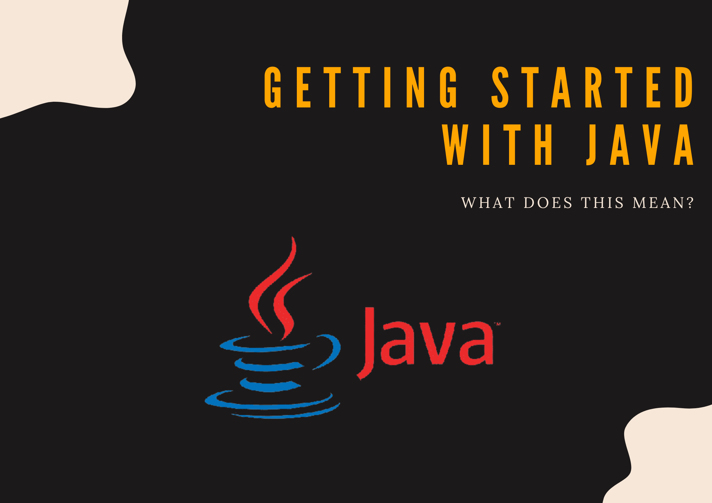

In the [previous article](/03_java/01_installation_and_quick_start.md), you saw how you can set your development environment for Java. The quickstart guide highlighted a simple Java program that prints "Hello, world!" in the terminal:

```java
public class App {
    public static void main(String[] args) {
        System.out.println("Hello, world!");
    }
}
```


In this article, we are going to break down the parts of such a program in an effort to know what each name does. We can refer to this as the Java syntax. More specifically, we are going to look at [public](#public), [static](#static), [void](#void), [String[ ] args](#string--args), and [main](#main).


### Table of Contents

- [Create A Java Project](#create-a-java-project)
- [Understanding Java Main Method](#understanding-java-main-method)


## Create A Java Project

Now, to create a Java program, we need to do the following:


### Add A Project Folder

This folder can fold multiple Java programs. Below, I will show you how you can add one program to an empty folder. On your terminal, run:

```python
$ mkdir getting_started && code getting_started
```

This creates a folder called `getting_started` and opens it using VS Code. Choose a location where you want to create the folder, your Desktop, Documents etc.

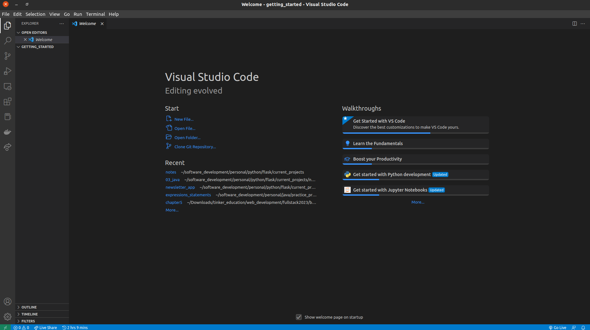


### Start A Java Project On VS Code

Click on View > Command Pallet as shown in the image below. Alternatively, press Ctrl + Shift + P.

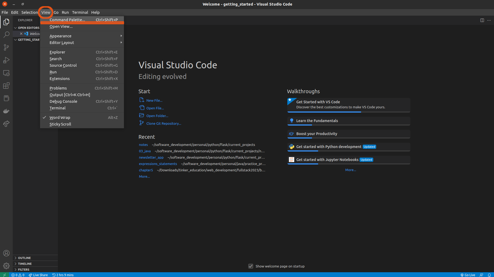

In the interactive popup, type "create java project" and then click on the dropdown command seen:

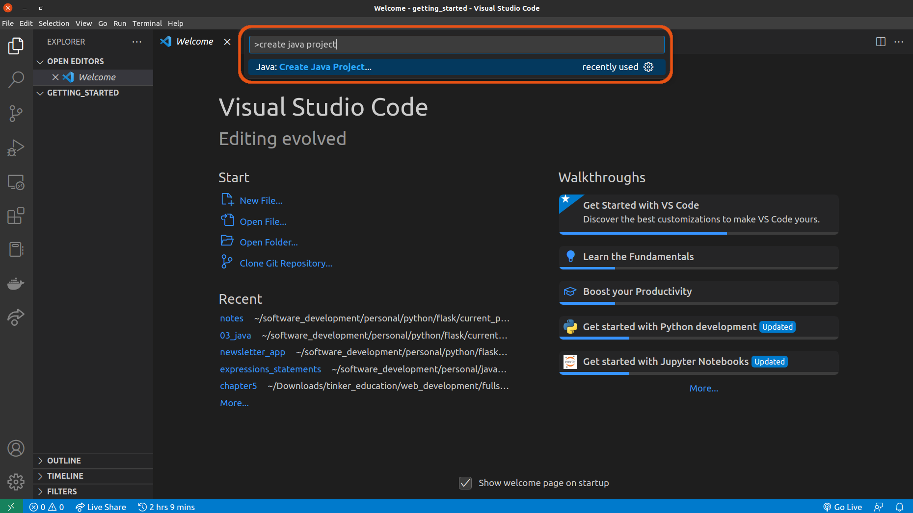

Select "No build tools" as seen below:

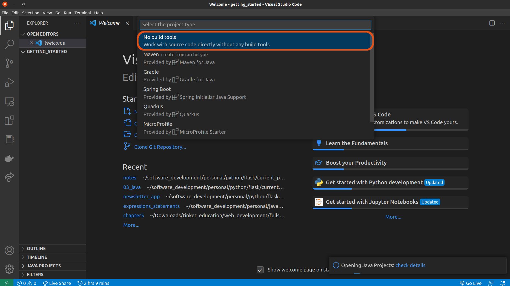

Select your project location by clicking on the green button. Notice that our directory created earlier has been selected by default.

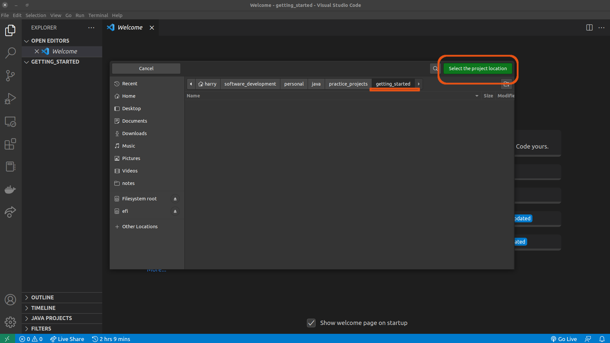

You will see another interactive popup. In it, type in a name of your choice. In my case, I have chosen "App" Then, press **Enter** on your keyboard.

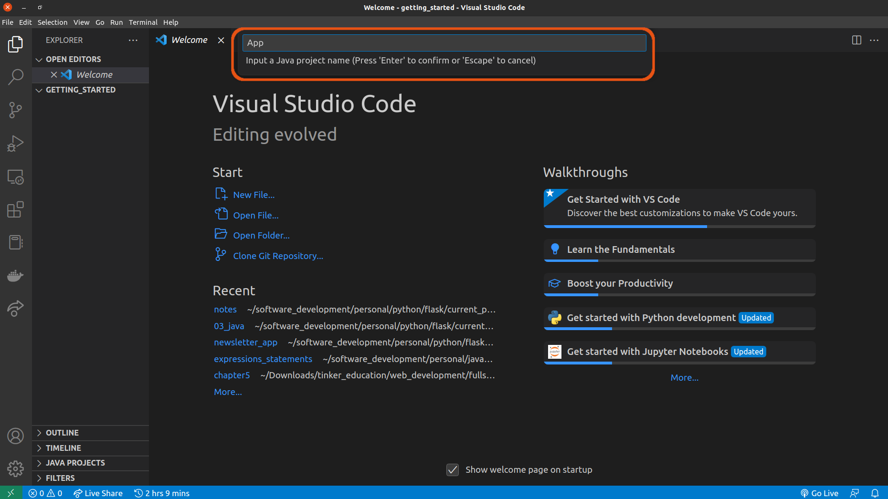


As soon as I have pressed **Enter** on my keyboard, a new Java project called `App` has been created on my `getting_started` directory.

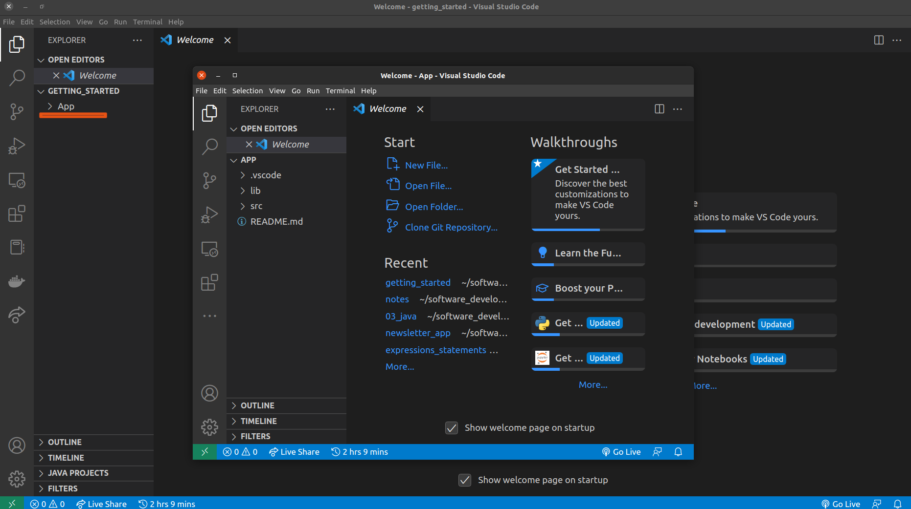

You can choose to continue with the popped up VS Code window or work with your project directory directly. Below, I will close the popup window and continue with my main project directory. Clicking on the `App` project, I am able to access my program file called `App.java`. 

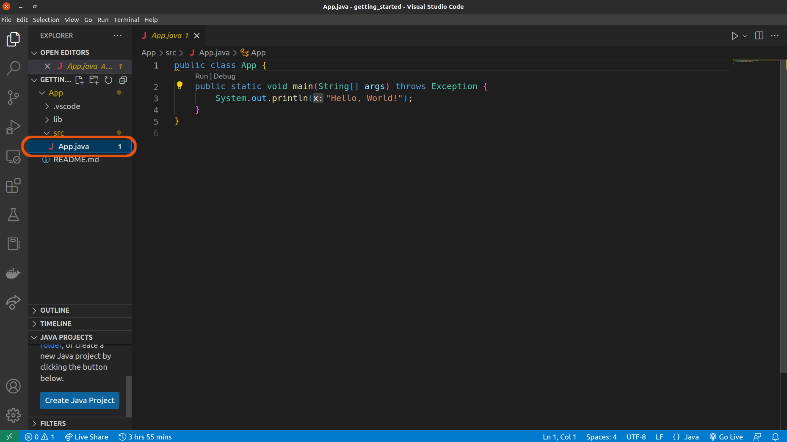

To run it, I can either click the **Play** icon at the top-right of the window or right-click inside the `App.java` file. 

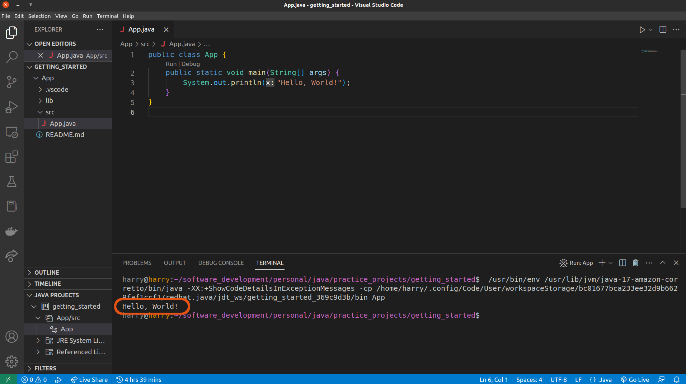

Either way, you should see the text "Hello, world!" displayed on your terminal. More from VS Code's [Java Tutorial](https://code.visualstudio.com/docs/java/java-tutorial).


## Understanding Java Main Method

The Java [`main`](#main) method is the entry point for executing a Java program. It can contain code to execute or call other methods. Additionally, the `main` method can be used in another part of a program. This method is found in a class, `App` for example, as seen above. The class name does not really matter (you can call it anything), but it should contain the method `main` to become an entry point to the program.

### `public`

This is an access modifier. It gives intructions on the type of access available in the `main` method. `public` allows the `main` method to b **globally accessible**. A non-public `main` method cannot be executed by any program To see it in action, let us try to remove it from the `main` method:


Notice VS Code throws the error `Error: Main method not found. Please define the main me...`


### `static`

When we run a Java program for the first time, there is no object of the class that is present. We, therefore, need  to use `static` to instruct JVM to load the class into memory and then call `main` without creating an instance of that class.

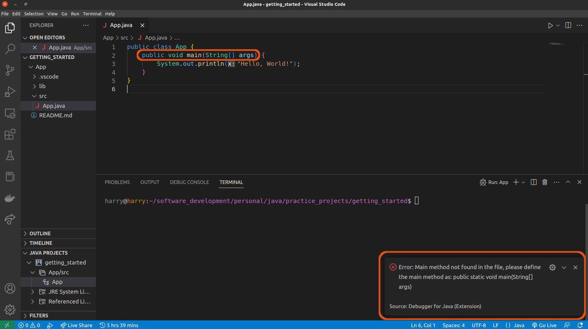

### `void`

It is intended that every Java method should have a return type, and return something. However, the `main` method doesn't return anything. As a result, we use `void` to handle this.

```java
// App.java

public class App {
    public static void main(String[] args) {
        System.out.println("Hello, World!");
    }
}
```

This method has no return type, hence the use of `void`. However, if we try to return something, then an error is raised.

```java
public class App {
    public static void main(String[] args) {
        return ("Hello, World!");
    }
}

// Error:

Void methods cannot return a value
```

To return something, we need to exclude `void` from the `main` method.

```java
// App.java

public class App {
    public static String main(String[] args) {
        return "Hello, World!";
    }
}
```

Notice that we have to specify the return type as `String` since we are returning the text "Hello, World!"


### `main`

This method has to be named as "main". When a Java program starts, it will ALWAYS look for the `main` method. If this method does not exist, then we get an error.

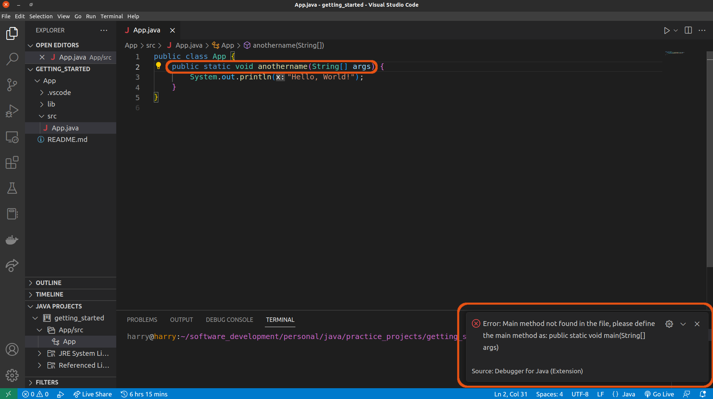


### `String [] args`

In the terminal, you can run a Java file by using the command `java` followed by the filename, which becomes the second argument:

```java
$ java App.java
```

The `main` method accepts a single argument of type `String` array. Each string in the array is a commandline argument that we can use to either affect a program or pass in data at runtime.

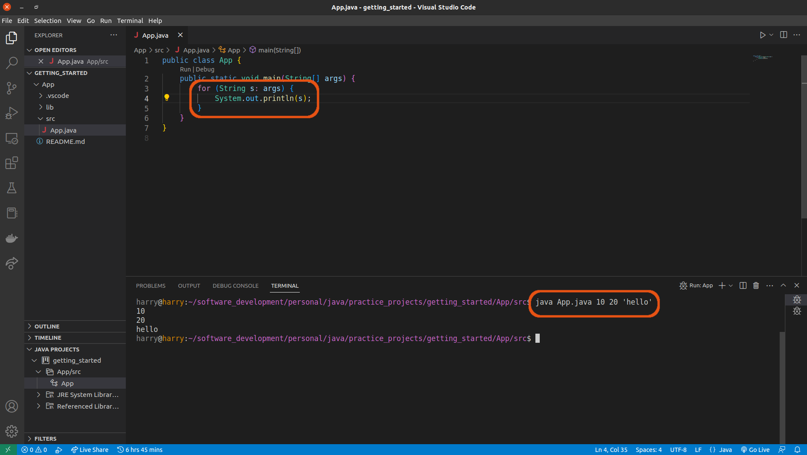

Notice that in the terminal, I have passed in additional arguments. These arguments are space-separated, and get printed.