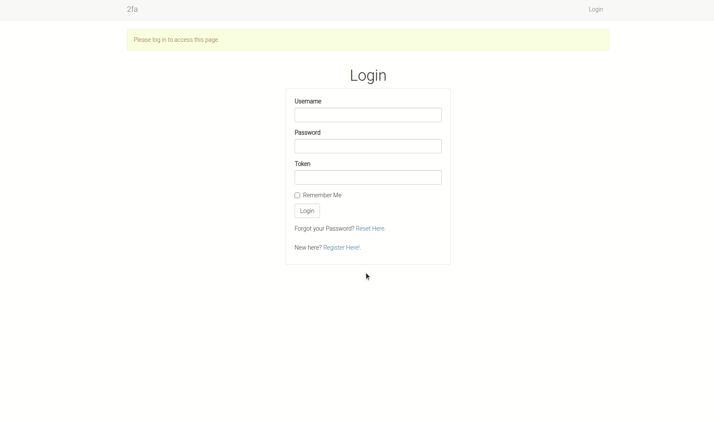
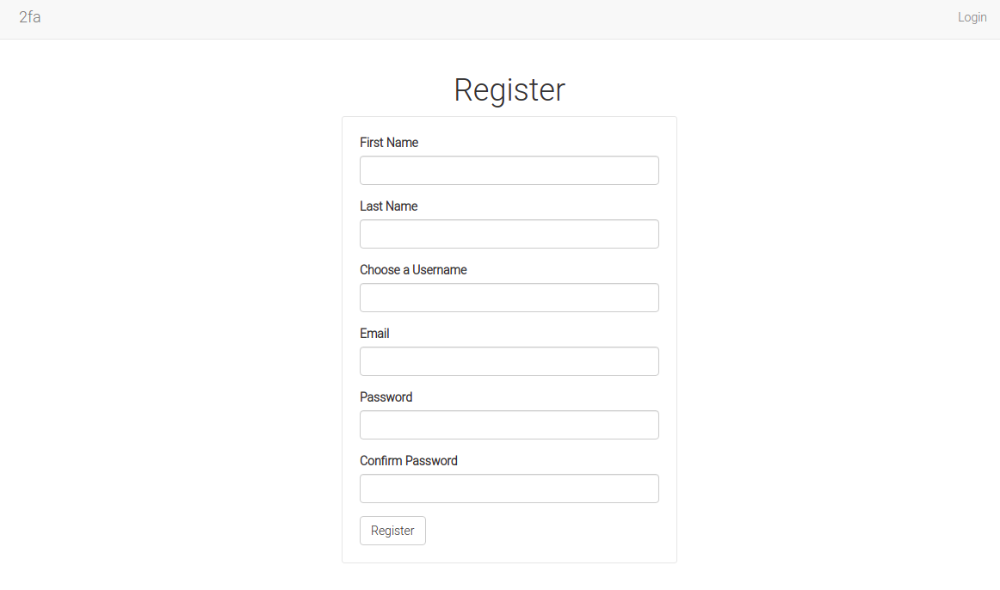
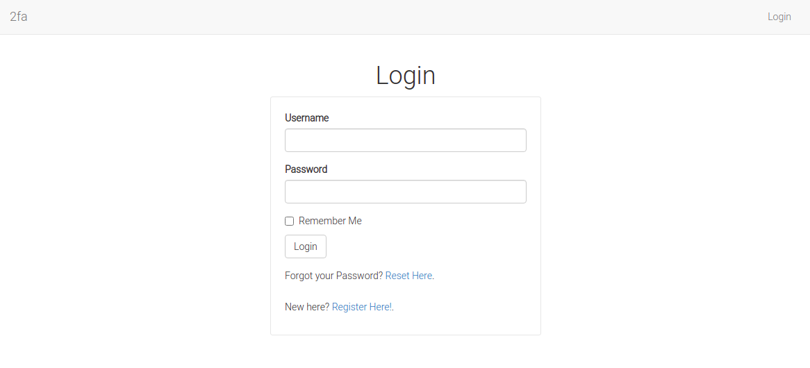
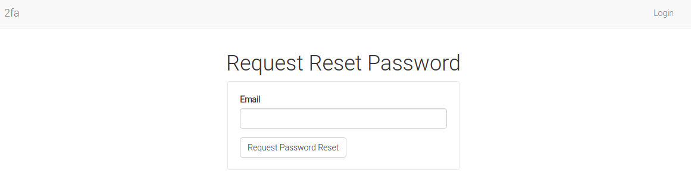

# Enable Time-based Two-factor Authentication in Flask



### Overview

Two-factor authentication is basically a method that requires a user of an application to provide two forms of identification before being allowed to use the application. These two methods may include:

1. Regular password
2. One-time token

In the event that the user's account is compromised, then an attacker will find it a bit hard to access the user's token, which is different every time, say withing 30 minute intervals.

The application requires all users to use two-factor authentication.

### Project Requirements

1. A smartphone 
2. Access to Google Playstore or App Store

Search for either of these two TOTP apps:

* [FreeotOTP Authenticator](https://play.google.com/store/apps/details?id=org.fedorahosted.freeotp&hl=en)
* [Google Authenticator](https://play.google.com/store/apps/details?id=com.google.android.apps.authenticator2&hl=en)

You are not limited to these two. You can use any other if you like. Why these apps? We will need them to scan the application's QR Code when we try to register a new user. The apps will consistently generate 30-seconds one-time passwords for us.


### Testing

If you would like to test this project out, consider checking the [hosted application](https://simple-2fa.herokuapp.com/) or [test it locally](https://github.com/GitauHarrison/how-to-implement-time-based-two-factor-auth-in-flask).

To make the project a bit more complete, I have added features such as _password resets_ and _email verification_, though they have nothing to do with what we want to do in this article.


### Generall Rules About Passwords

1. Never store a password in the database; rather store its hash
2. Always use secure `HTTP` to transmit passwords
3. Compare a user's password against its hash in the database when authenticating a user


### Create project structure

This is the structure we will follow:

```python
project_folder
    |------- .flaskenv
    |------- .env
    |------- .env.template
    |------- config.py
    |------- app.py
    |------- requirements.txt
    |------- .gitignore
    |------- app/
              |------- __init__.py
              |------- routes.py
              |------- models.py
              |------- forms.py
              |------- errors.py
              |------- email.py
              |------- static/
                        |------- images/
                        |------- css/styles.css
              |------- templates/
                        |------- base.html
                        |------- home.html
                        |------- login.html
                        |------- register.html
                        |------- 404.html
                        |------- 500.html
                        |------- reset_password_request.html
                        |------- reset_password.html
                        |------- two_factor_setup.html
                        |------- email/
                                   |----- reset_password.html
                                   |----- reset_password.txt

```

You can create theis structure using the `mkdir` and `touch` terminal commands:

```python
$ mkdir project_folder # creates an empty directory called project_folder
$ touch project_folder/config.py # creates an empty config.py file inside project_folder
```

Once you have completed this project structure, move into `project_folder`:

```python
$ cd project_folder
```

Make it a `git` repository by running:

```python
$ git init
```

We will use `git` to host our application in both GitHub and Heroku. If you have not set up `git` in your computer, learn how to do that [here](install_git.md). `git` allows you to work with both of GitHub's `ssh` and `http`. Find out what they are and how to use it [here](github_ssh.md).

### Activate Virtual Environment

While working on multiple prjects, it is recommended that you isolate the requirements of each project from that running in your Operating System. Virtual environments are for this purpose; they create a virtual environment that allows you to work on multiple and independent projects.

To create and activate your virtual environment, run:

```python
$ mkvirtualenv totp
```

The `mkvirtualenv` command creates and activates the virtual environment called `totp` for you. Here, I have used `virtualenvwrapper` to help me manage my workflow. Virtualenvwrapper has many more commands that makes it easier to work with virtual environments. Follow [this guide](virtualenvwrapper_setup.md) to learn how to set up your machine to use `virtualenvwrapper`.

### Application Dependencies

This project will use several dependencies:

* [flask](https://flask.palletsprojects.com/en/1.1.x/)
* [flask-sqlalchemy](https://flask-sqlalchemy.palletsprojects.com/en/2.x/)
* [flask-boostrap](https://pythonhosted.org/Flask-Bootstrap/)
* [flask-login](https://flask-login.readthedocs.io/en/latest/)
* [flask-wtf](https://flask-wtf.readthedocs.io/en/stable/)
* [flask-mail](https://pythonhosted.org/Flask-Mail/)
* [flask-migrate](https://flask-migrate.readthedocs.io/en/latest/)
* [python-dotenv](https://pypi.org/project/python-dotenv/)
* [pyjwt](https://pyjwt.readthedocs.io/en/stable/)
* [pyngrok](https://pypi.org/project/pyngrok/)
* [pyqrcode](https://pypi.org/project/PyQRCode/)
* [email-validator](https://pypi.org/project/email-validator/)

To install all of them at once, run:

```python
(totp)$ pip3 install flask flask-sqlalchemy flask-bootstrap # Add all the other dependencies within this same line
```

From your root directory (project_folder), update your `requirements.txt` to contain all the installed dependencies:

```python
(totp)$ pip3 freeze > requirements.txt
```

### Build Project

Let's begin by creating an instance of our application:

#### Application Instance

`__init__.py: Application Instance`

```python
from flask import Flask
from flask_bootstrap import Bootstrap
from flask_login import LoginManager
from flask_sqlalchemy import SQLAlchemy
from flask_migrate import Migrate
from flask_mail import Mail
from config import Config

app = Flask(__name__)
app.config.from_object(Config)
bootstrap = Bootstrap(app)
login = LoginManager(app)
login.login_view = 'login'
db = SQLAlchemy(app)
migrate = Migrate(app, db)
mail = Mail(app)


def start_ngrok():
    from pyngrok import ngrok

    url = ngrok.connect(5000)
    print('* Tunnel: ', url)


if app.config.get("ENV") == "development" and app.config["START_NGROK"]:
    start_ngrok()

from app import routes, models, errors

```

I have created an instance of the flask application. Additionally, I have instantiated dependencies we have installed in the previous section. 

`ngrok` is a tool that will provide us with free public URLs that redirect to our service. This will be especially useful when we want to test our application running on `localhost` on other devices, say a smartphone or another computer. For security reasons, our computers are configured with firewalls, and are therefore inaccessible. If our application is running locally, then we need to find a way to by-pass this. This is where `ngork` excels at. What I have done here is I have set up ngork to run as soon as we fire up our flask server.

Our other modules are imported at the botton of the application instance to avoid importing circular dependencies.

#### Application Configuration

Let us now configure our application. From the application instance section, you have seen `app.config["START_NGROK"]`. All of the configurations needed to run our applications are found in the `config.py` file. 

`config.py: Add Application Configurations`
```python
import os
from dotenv import load_dotenv

basedir = os.path.abspath(os.path.dirname(__file__))
load_dotenv(basedir, '.env')


class Config(object):
    # Form security
    SECRET_KEY = os.environ.get('SECRET_KEY') or 'you-will-never-guess'

    # Database configuration
    SQLALCHEMY_DATABASE_URI = os.environ.get('DATABASE_URL') or \
        'sqlite:///' + os.path.join(basedir, 'app.db')
    SQLALCHEMY_TRACK_MODIFICATIONS = False

    # Localhost testing
    START_NGROK = os.environ.get('START_NGROK') is not None and \
        os.environ.get('WERKZEUG_RUN_MAIN') is not 'true'

    # Email configurations
    MAIL_SERVER = os.environ.get('MAIL_SERVER')
    MAIL_PORT = int(os.environ.get('MAIL_PORT') or 25)
    MAIL_USE_TLS = os.environ.get('MAIL_USE_TLS') is not None
    MAIL_USERNAME = os.environ.get('MAIL_USERNAME')
    MAIL_PASSWORD = os.environ.get('MAIL_PASSWORD')
    ADMINS = os.environ.get('ADMINS')

```
Our configurations are set up as secret environment variables. The `os.environ` is used to fetch our environment variables. This method of obtaining environment variables is extremely safe as the actual values of the environment variables are preserved, especially from version control.

We uses Python's `dotenv` package to load our enviroment variables.

`.env` file is used to store our actual environment variables. The `.`(dot) preceding the file means that it is hidden. If you try to run the command `ls` in your root directory you will notice that the files starting with the `.` do not show up. However, to list every file, including the hidden files, you can run `ls -a`.

Let us update `.env` file with our secret configurations:

`.env: Environment Configurations`
```python
SECRET_KEY='<put-here-you-hard-to-guess-key>'
MAIL_SERVER='smtp.gmail.com'
MAIL_PORT='587'
MAIL_USE_TLS='True'
MAIL_USERNAME='<your-email-address>'
MAIL_PASSWORD='<password-to-the-email-above>'
ADMINS=['<another-email-address-that-will-be-used-as-admin>']
```

This file should never be commited to version control because it contains sensitive data such as passwords and other secret keys. To provide guidance to people who would like to clone your project, the `.env.template` (a text-based file) is used as a guide, where no values are put.

`.env.template: Show .env template`

```python
SECRET_KEY=
MAIL_SERVER=
MAIL_PORT=
MAIL_USE_TLS=
MAIL_USERNAME=
MAIL_PASSWORD=
ADMINS=
```
We will need to register our application in the top-level file `app.py`. This will be the entry point to our application.

`app.py: Application Entry Point`

```python
from app import app
```

Flask expects certain variables to be set before the server can be fired up. These variables need to stored in the `.flaskenv` file in the top-level directory. They are the flask environment variables.

`.flaskenv: Add Flask Environment Variables`

```python
FLASK_APP=app.py
FLASK_ENV=development
FLASK_DEBUG=True
START_NGROK=1
```

Our application is in development so we have set our flask environment to development. Every time we make changes to the application, flask's debugger actively detects those changes and loads them immediately due to the setting `FLASK_DEBUG=True`.

#### Working with Database

This application involves adding and loading a user from a database. we will now set up a database table called `User` to handle a user's data/

`models.py: Create database model`

```python
from app import db, login, app
from werkzeug.security import generate_password_hash, check_password_hash
from flask_login import UserMixin


class User(UserMixin, db.Model):
    id = db.Column(db.Integer, primary_key=True)
    first_name = db.Column(db.String(64), index=True, unique=True)
    last_name = db.Column(db.String(64), index=True, unique=True)
    username = db.Column(db.String(64), index=True, unique=True)
    email = db.Column(db.String(120), index=True, unique=True)
    password_hash = db.Column(db.String(128))

    def __repr__(self):
        return '<User {}>'.format(self.username)

    def set_password(self, password):
        self.password_hash = generate_password_hash(password)

    def check_password(self, password):
        return check_password_hash(self.password_hash, password)


@login.user_loader
def load_user(id):
    return User.query.get(int(id))

```

Our database contains five entries. These will be filled using a web form, seen in sections below. As I had mentioned earlier it is safe practice to store a user's password as a hash rather than the actual password. Above, I am using `generate_password_hash` and `check_password_hash` from [Werkzeug](http://werkzeug.pocoo.org/) to handle all the hashing needs of the application.

Look at his example run from a Python interpreter:

```python
>>> from werkzeug.security import generate_password_hash
>>> hash = generate_password_hash('foobar')
>>> hash
'pbkdf2:sha256:50000$vT9fkZM8$04dfa8f6a9c0s676acf7e788a1b5b3c35e217c78dc04539d295f011jfaosf96adfs68asf9a'
```

The password `foobar` is transformed into a long encoded string which makes it hard for anyone who gains access to the password hash to use it. Hashing the same password mutliple times gives a different result, making it even harder to know if two users have the same password.

To verify a user's password, we use `check_password_hash`:

```python
>>> from werkzeug.security import check_password_hash
>>> check_password_hash(hash, 'foobar')
True
>>> check_password_hash(hash, 'trippin')
False
```

In an actual application, this is how it will look like:

```python
>>> u = User(username='rahima', email='rahima@email.com')
>>> u.set_password('rahima')
>>> u.check_password('nassir')
False
>>> u.check_password('rahima')
True
```

#### Web Forms

The user registers for an account by providing their names, username and password.



Other forms we will need include the _Password Request_, _Password Reset_ and _Login_. Flask-wtf allows for form creation as seen below:

`forms.py: Capture User Input`

```python
from flask_wtf import FlaskForm, RecaptchaField
from wtforms import StringField, PasswordField, SubmitField, BooleanField
from wtforms.validators import Email, DataRequired, EqualTo, ValidationError
from app.models import User


class LoginForm(FlaskForm):
    username = StringField('Username', validators=[DataRequired()])
    password = PasswordField('Password', validators=[DataRequired()])
    remember_me = BooleanField('Remember Me')
    submit = SubmitField('Login')


class RegistrationForm(FlaskForm):
    first_name = StringField('First Name', validators=[DataRequired()])
    last_name = StringField('Last Name', validators=[DataRequired()])
    username = StringField('Choose a Username', validators=[DataRequired()])
    email = StringField('Email', validators=[DataRequired(), Email()])
    password = PasswordField('Password', validators=[DataRequired()])
    confirm_password = PasswordField('Confirm Password',
                                     validators=[DataRequired(),
                                                 EqualTo('password')
                                                 ]
                                     )
    submit = SubmitField('Register')

    def validate_username(self, username):
        user = User.query.filter_by(username=username.data).first()
        if user is not None:
            raise ValidationError('Please use a different username')

    def validate_email(self, email):
        user = User.query.filter_by(email=email.data).first()
        if user is not None:
            raise ValidationError('Please use a different email address')


class ResetPasswordRequestForm(FlaskForm):
    email = StringField('Email', validators=[DataRequired(), Email()])
    submit = SubmitField('Request Password Reset')


class ResetPasswordForm(FlaskForm):
    password = PasswordField('Password', validators=[DataRequired()])
    password2 = PasswordField('Repeat Password',
                              validators=[DataRequired(), EqualTo('password')]
                              )
    submit = SubmitField('Request Password Reset')

```

#### Handling User Data

We will update our `routes.py` file with functions that handle each data group from the user.

`routes.py: Handle User Data`

```python
from flask import render_template, redirect, url_for, flash, request
from werkzeug.urls import url_parse
from flask_login import login_user, logout_user, current_user, login_required
from app import db, app
from app.models import User
from app.forms import LoginForm, RegistrationForm, ResetPasswordRequestForm,\
    ResetPasswordForm
from app.email import send_password_reset_email


@app.route('/')
@app.route('/home')
@login_required
def home():
    return render_template('home.html', title='Home')


@app.route('/login', methods=['GET', 'POST'])
def login():
    if current_user.is_authenticated:
        return redirect(url_for('home'))
    form = LoginForm()
    if form.validate_on_submit():
        user = User.query.filter_by(username=form.username.data).first()
        if user is None or not user.check_password(form.password.data):
            flash('Invalid username or password')
            return redirect(url_for('login'))
        login_user(user, remember=form.remember_me.data)
        next_page = request.args.get('next')
        if not next_page or url_parse(next_page).netloc != '':
            next_page = url_for('home')
        return redirect(next_page)
    return render_template('login.html',
                           title='Login',
                           form=form
                           )


@app.route('/logout')
def logout():
    logout_user()
    return redirect(url_for('login'))


@app.route('/register', methods=['GET', 'POST'])
def register():
    if current_user.is_authenticated:
        return redirect(url_for('home'))
    form = RegistrationForm()
    if form.validate_on_submit():
        user = User(first_name=form.first_name.data,
                    last_name=form.last_name.data,
                    username=form.username.data,
                    email=form.email.data
                    )
        user.set_password(form.password.data)
        db.session.add(user)
        db.session.commit()
        flash('Registration successful. Login to continue')
        return redirect(url_for('login'))
    return render_template('register.html',
                           title='Register',
                           form=form
                           )


@app.route('/reset_password_request', methods=['GET', 'POST'])
def reset_password_request():
    if current_user.is_authenticated:
        return redirect(url_for('home'))
    form = ResetPasswordRequestForm()
    if form.validate_on_submit():
        user = User.query.filter_by(email=form.email.data).first()
        if user:
            send_password_reset_email(user)
        flash('Check your email for the instructions to reset your password')
        return redirect(url_for('login'))
    return render_template('reset_password_request.html',
                           title='Reset Password',
                           form=form
                           )


@app.route('/reset_password/<token>', methods=['GET', 'POST'])
def reset_password(token):
    if current_user.is_authenticated:
        return redirect(url_for('home'))
    user = User.verify_reset_password_token(token)
    if not user:
        return redirect(url_for('home'))
    form = ResetPasswordForm()
    if form.validate_on_submit():
        user.set_password(form.password.data)
        db.session.commit()
        flash('Your password has been reset.')
        return redirect(url_for('login'))
    return render_template('reset_password.html', form=form)

```

Every time a user is authenticated, they are redirected to the home page. Otherwise, the application checks and verifies the information from the database before issueing appropriate redirects.

At this point, we need to complete setting up email support for our applicaiton. Our _route_ module has imported functions from the _email_ module which does not exist yet.

#### Email Support

This is where we use `flask-mail`, already installed and imported at the beginning of this article. We will use it to allow users to request for password resets.

The _Login_ page will have a link to request for a password reset.



`email.py: Add Email Support`

```python
from flask_mail import Message
from app import mail, app
from flask import render_template
from threading import Thread


def send_async_email(app, msg):
    with app.app_context():
        mail.send(msg)


def send_email(subject, sender, recipients, text_body, html_body):
    msg = Message(subject, sender=sender, recipients=recipients)
    msg.body = text_body
    msg.html = html_body
    Thread(target=send_async_email, args=(app, msg)).start()


def send_password_reset_email(user):
    token = user.get_reset_password_token()
    send_email('[2fa] Reset Your Password',
               sender=app.config['ADMINS'][0],
               recipients=[user.email],
               text_body=render_template('email/reset_password.txt',
                                         user=user, token=token),
               html_body=render_template('email/reset_password.html',
                                         user=user, token=token))

```

When the _ResetPasswordRequest_ form is validated (seen from the routes module), the user is searched for in the database using the email they provided in the form. 



`send_password_reset_email()` function is used to send a password reset email. Email to be sent is found in the _email_ templates folder. A flash message is shown regardless of whether the user is known or unknown. This is to prevent any user from figuring out who is or is not a member.

The password reset links will have a secure token in them. To generate these tokens, we will use [JSON Web Tokens](https://jwt.io/), already installed as `pyjwt`. The tokens belong to the users, hence we will need to update our _User_ model to generate and validate these tokens.

`models.py: Generate and Verify User Tokens`

```python
# Previous imports
from time import time
import jwt
from app import app

class User(UserMixin, db.Model):
    # ...

    def get_reset_password_token(self, expires_in=600):
        return jwt.encode(
            {'reset_password': self.id, 'exp': time() + expires_in},
            app.config['SECRET_KEY'], algorithm='HS256')

    @staticmethod
    def verify_reset_password_token(token):
        try:
            id = jwt.decode(token, app.config['SECRET_KEY'],
                            algorithms=['HS256'])['reset_password']
        except:
            return
        return User.query.get(id)
```

The `get_reset_password_token()` function returns a JWT token as a string, which is generated directly by the `jwt.encode()` function. Upon token verification, if the token is valid, then the value of the `reset_password` key from the token's payload is the ID of the user, so we can load the user and return it.

#### Template Pages

Note how we are using flask's `render_template` to return the `html` files that display our pages.

These are the files' content:

`base.html: Base template`
```python


<!-- Title Section -->

    
        2fa | {{ title }}
    
        Flask Auth
    


<!-- Head Section -->

    {{ super() }}
    <link rel="icon" type="image/png" href="{{url_for('static', filename = 'images/auth.png')}}">
    <link rel="preconnect" href="https://fonts.gstatic.com">
    <link href="https://fonts.googleapis.com/css2?family=Roboto:wght@300&display=swap" rel="stylesheet">


<!-- Link Styles -->

    {{ super() }}
    <link type="text/css" rel="stylesheet" href="{{ url_for('static', filename = 'css/styles.css') }}">


<!-- Navbar Section -->

<nav class="navbar navbar-default">
    <div class="container">
        <div class="navbar-header">
            <button type="button" class="navbar-toggle collapsed" data-toggle="collapse" data-target="#bs-example-navbar-collapse-1" aria-expanded="false">
                <span class="sr-only">Toggle navigation</span>
                <span class="icon-bar"></span>
                <span class="icon-bar"></span>
                <span class="icon-bar"></span>
            </button>
            <a class="navbar-brand" href="{{ url_for('home') }}">2fa</a>
        </div>
        <div class="collapse navbar-collapse" id="bs-example-navbar-collapse-1">            
            <ul class="nav navbar-nav navbar-right">  
                
                    <li><a href=" {{ url_for('login') }} ">Login</a></li>
                                                      
                <li><a href=" {{ url_for('logout') }} ">Logout</a></li>
                
            </ul>                       
        </div>
    </div>
</nav>


<!-- Blog Content Goes Here -->

    <div class="container">
        
            
                
                    <div class="alert alert-warning" role="alert"> {{ message }} </div>
                
            
        

        
        
        
    </div>


```
If the user is anonymous, a link to log into the application. If the user is authenticated, a logout link is shown.

`login.html: Login Page`

```python




        <div class="row">
            <div class="col-sm-12 col-md-12 col-lg-12 col-xl-12 text-center">
                <h1>Login</h1>                                              
            </div>
        </div>
        <div class="row">
            <div class="col-sm-12 col-md-4 col-lg-4 col-xl-4">                
                              
            </div>
            <div class="col-sm-12 col-md-4 col-lg-4 col-xl-4 my-form">                                   
                {{ wtf.quick_form(form) }}
                <p>
                    Forgot your Password? <span><a href="{{ url_for('reset_password_request') }}">Reset Here</a></span>.
                </p>
                <p>
                    New here? <span><a href="{{ url_for('register') }}">Register Here!</a></span>.
                </p>                                            
            </div>
            <div class="col-sm-12 col-md-4 col-lg-4 col-xl-4">                
                           
            </div>
        </div>
        


```

The login page contains links to the _Register_ page as well as _Request Password Reset_ form.

`register.html: Captures User's Data`

```python




    <div class="row">
        <div class="col-sm-12 col-md-12 col-lg-12 col-xl-12 text-center">
            <h1>Register</h1>                                              
        </div>
    </div>
    <div class="row">
        <div class="col-sm-12 col-md-4 col-lg-4 col-xl-4">                
                          
        </div>
        <div class="col-sm-12 col-md-4 col-lg-4 col-xl-4 my-form">                                  
            {{ wtf.quick_form(form) }}                                                       
        </div>
        <div class="col-sm-12 col-md-4 col-lg-4 col-xl-4">                
                       
        </div>
    </div>

```

If registration is successful, the user will be redirected to the home page to continue into the app.

`reset_password_request.html: User can request for a password reset`

```python




    <div class="col-sm-12 col-md-12 col-lg-12 col-xl-12 text-center">
        <h1>Request Reset Password</h1>        
    </div>
    <div class="row">
        <div class="col-sm-12 col-md-4 col-lg-4 col-xl-4">                
            <!-- Empty div -->
        </div>
        <div class="col-sm-12 col-md-4 col-lg-4 col-xl-4 my-form">                                  
            {{ wtf.quick_form(form) }}                                                       
        </div>
        <div class="col-sm-12 col-md-4 col-lg-4 col-xl-4">                
            <!-- Empty div -->
        </div>
    </div>

```
A registration email used is needed to send a password reset email. If this user exists, the email is sent, otherwise, no email is sent.

`reset_password.html: Form to set new password`

```python




    <div class="col-sm-12 col-md-12 col-lg-12 col-xl-12 text-center">
        <h1>Reset Password</h1>        
    </div>
    <div class="row">
        <div class="col-sm-12 col-md-4 col-lg-4 col-xl-4">                
            <!-- Empty div -->
        </div>
        <div class="col-sm-12 col-md-4 col-lg-4 col-xl-4 my-form">                                  
            {{ wtf.quick_form(form) }}                                                       
        </div>
        <div class="col-sm-12 col-md-4 col-lg-4 col-xl-4">                
            <!-- Empty div -->
        </div>
    </div>

```

This new password will be added to the database to be used by the user in subsequent logins.

`emails/reset_password.html: Email template`

```python
<p>Dear {{ user.username }},</p>
<p>
    To reset your password
    <a href="{{ url_for('reset_password', token=token, _external=True) }}">
        click here
    </a>.
</p>
<p>Alternatively, you can paste the following link in your browser's address bar:</p>
<p>{{ url_for('reset_password', token=token, _external=True) }}</p>
<p>If you have not requested a password reset simply ignore this message.</p>
<p>Sincerely,</p>
<p>The 2fa Team</p>
```

This is how the email sent to the user will look like.

`emails/reset_password.txt: Email template`

```python
Dear {{ user.username }},

To reset your password click on the following link:

{{ url_for('reset_password', token=token, _external=True) }}

If you have not requested a password reset simply ignore this message.

Sincerely,

The 2fa Team
```

A text version of the email template

#### Testing the Application

With the application setup complete (we have not yet added two-factor authentication), we can test its functionality. On your terminal, run:

```python
(totp)$ flask run
```

You should be able to access localhost on http://127.0.0.1:5000/. Click this link or paste it a new tab to see the output.

