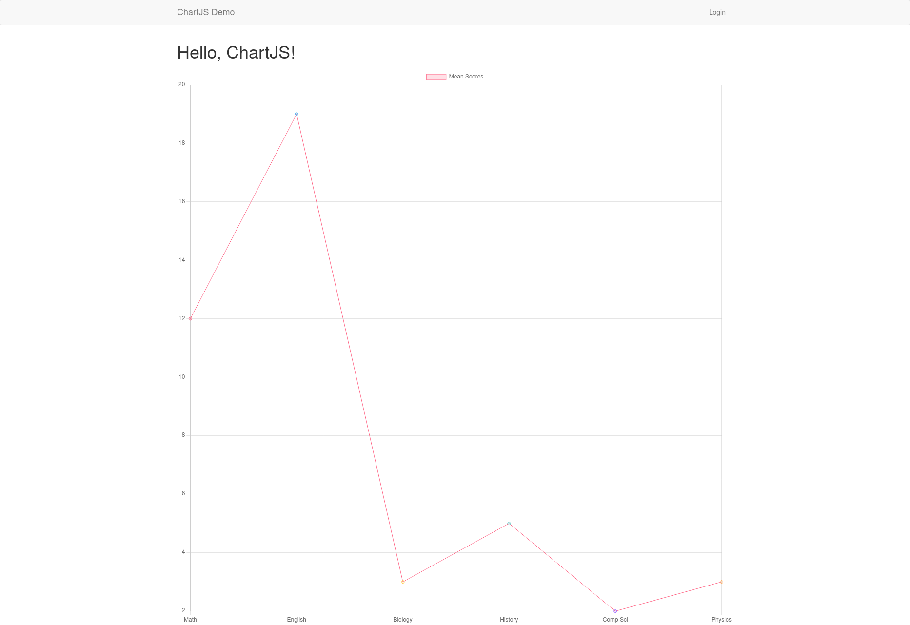
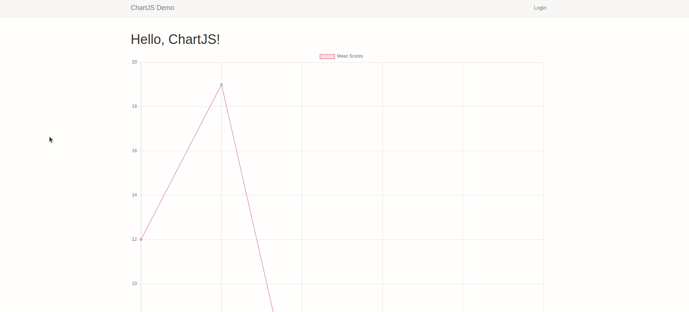
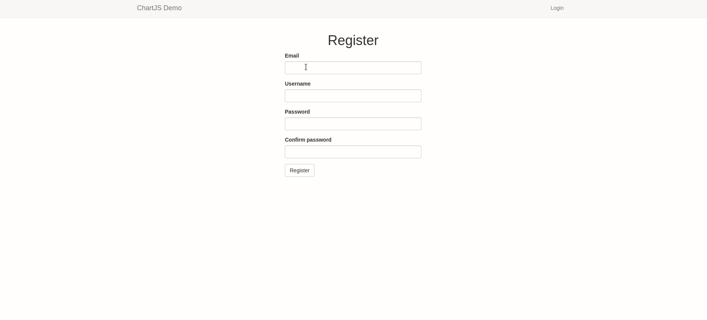
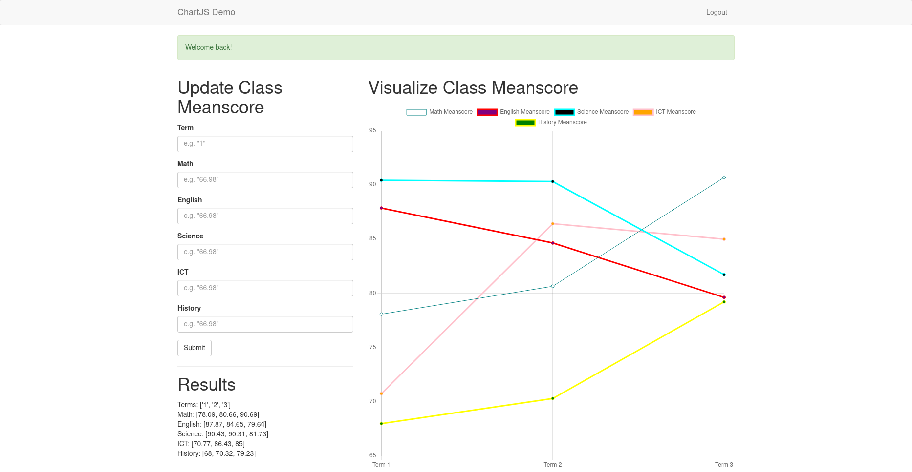

# Visualize Data in Your Flask App Using ChartJS

You can tell very powerful stories using data. 



Should you want to 'see' or understand deeply the data generated in your application, there are a handful of libraries that can help. One of them is ChartJS, the focus of this article. [ChartJs](https://www.chartjs.org/docs/latest/) is a free JavaScript library for creating charts in the browser (HTML-based charts). It is very easy to use, though basic understanding of JavaScript is required.

## What We Will Do?

We will build a simple flask application for a class teacher to record the mean scores of all the subjects in a class throughout a 3-term year. Example data we will need may include the following:

* **Subjects**: Math, English, Science, History, and Computer Science
* **Mean Scores**: [70, 80, 90, 100, 95]
* **Term**: [1, 2, 3]

We will assume that the teacher has already calculated the mean scores of each subject, so we don't need to stress about it.

The completed application can be found in this [GitHub repository](https://github.com/GitauHarrison/data-visualization-using-chartjs).

## Table of Contents

1. [Create a simple flask app](#create-a-simple-flask-app)
2. [Add web forms to the app](#add-web-forms-to-the-app)
3. [Add data to the app](#add-data-to-the-app)
4. [Enable user login](#enable-user-login)
5. [Improve user experience](#improve-user-experience)
6. [Display the mean scores of each subject per term](#display-the-mean-scores-of-each-subject-per-term)
7. [Show meanscore chart](#show-meanscore-chart)

### Create a simple flask app

I have already created a simple flask app for you. You can refer to it in [this Github repository](https://github.com/GitauHarrison/starting-a-flask-server). If you are new to flask and would like to start with the basics, check out the [starting-a-flask-server
](https://github.com/GitauHarrison/notes/blob/master/start_flask_server.md) tutorial.

### Add web forms to the app

Flask provides the [wtf](https://flask-wtf.readthedocs.io/en/latest/) library for creating web forms. This library is helps create forms that are used to collect data from a user, in our case, it will be the classroom teacher. To create a form, we will need to:

- Create a _forms_ module to define all the forms we will need (login, register and meanscore)
- Create templates for each form (login.html, register.html)
- Create a _views_ module to render our forms

In the terminal, install `flask-wtf` in your virtual environment:

```python
(venv)$ pip install flask-wtf
```

#### Forms module

This module (`forms.py`) will contain all the forms we will need. We will use classes to define all the fields we want in the forms.

`forms.py: Define login and register forms`
```python
from flask_wtf import FlaskForm
from wtforms import StringField, SubmitField, TextAreaField, PasswordField, BooleanField
from wtforms.validators import DataRequired, Length, Email, Regexp, EqualTo


class LoginForm(FlaskForm):
    email = StringField('Email', validators=[DataRequired(), Length(1, 64), Email()])
    password = PasswordField('Password', validators=[DataRequired()])
    remember_me = BooleanField('Keep me logged in')
    submit = SubmitField('Log In')


class RegistrationForm(FlaskForm):
    email = StringField('Email', validators=[DataRequired(), Length(1, 64), Email()])
    username = StringField('Username', validators=[
        DataRequired(), Length(1, 64),
        Regexp('^[A-Za-z][A-Za-z0-9_.]*$', 0,
               'Usernames must have only letters, numbers, dots or '
               'underscores')])
    password = PasswordField('Password', validators=[
        DataRequired(), EqualTo('password2', message='Passwords must match.')])
    password2 = PasswordField('Confirm password', validators=[DataRequired()])
    submit = SubmitField('Register')
```

Here, we want to capture a teacher's email, username and their password to protect their account. A few arguments are used to validate a teacher's credentials. For example:

- `DataRequred` ensures that the field is not empty. 
- `Length` ensures that the field is at least 1 character long and at most 64 characters long. 
- `Email` ensures that the field has a valid email address. 
- `Regexp` ensures that the field only contains letters, numbers, dots or underscores. 
- `EqualTo` ensures that the password fields match.

`Email()` requires that we install `email-validator`, so remember to do so in the terminal (`pip3 install email-validator`).



For the web forms to work, we will need to configure our application such that we provide a SECRET_KEY to help protect our forms from CSRF attacks. 

`config.py: Configure the SECRET_KEY`
```python
import os


class Config:
    SECRET_KEY = os.environ.get('SECRET_KEY') or 'hard to guess string'

```

This variable will be sourced from the environment. In the event the variable does not exist in the environment, we will use a hard-coded string. This is a safe fall-back to ensure that our application does not crash.

### Add data to the app

Just like web forms, we will also use classes to create a database model to store a user's data. `flask-sqlalchemy`, a flask-friendly wrapper to SQLAlchemy, will translate the classes objects and methods to tables and SQL. Intentionally, I will use the SQLite database since it does not require a server to run.

To install Flask-SQLAlchemy, run:

```python
(venv)$ pip install flask-sqlalchemy
```

Every time we create a new model, we need apply those changes to our database. Same goes to when we update the structure/schema of our database. This action is called `migrating` the database. Database migrations are easily handled by `flask-migrate`.

To install Flask-Migrate, run:

```python
(venv)$ pip install flask-migrate
```

We need to further configure the application to accommodate the database. This is done in the `config.py` file.

`config.py: Database configuration`
```python
import os

basedir = os.path.abspath(os.path.dirname(__file__))


class Config:
    SECRET_KEY = os.environ.get('SECRET_KEY') or 'hard to guess string'
    SQLALCHEMY_DATABASE_URI = os.environ.get('DATABASE_URL') or \
        'sqlite:///' + os.path.join(os.path.dirname(__file__), 'data.sqlite')
    SQLALCHEMY_TRACK_MODIFICATIONS = False

```

Once again, the database URL is sourced from the environment. Should the `DATABASE_URL` variable not exist, we default to using the file-based database called _data.sqlite_ which will be located in the root directory of the application. `SQLALCHEMY_TRACK_MODIFICATIONS` is set to `False` to prevent SQLAlchemy from tracking changes to the database. 

That is all for the configuration! We now should create instances of the database and the migrations in the app. This is normally done in `__init__.py`.

`app/__init__.py: Initialize the database and migrations`

```python
from flask import Flask
from flask_bootstrap import Bootstrap
from config import Config
from flask_migrate import Migrate # < --- new update
from flask_sqlalchemy import SQLAlchemy


app = Flask(__name__)
app.config.from_object(Config)


bootstrap = Bootstrap(app)
db = SQLAlchemy(app) # < --- new update
migrate = Migrate(app, db) # < --- new update

from app import routes, models
```

We can now create a `User` table in `models.py` within `app/` folder.

`app/models.py: Create the User table`
```python
from app import db
from werkzeug.security import generate_password_hash, check_password_hash


class User(db.Model):
    id = db.Column(db.Integer, primary_key=True)
    username = db.Column(db.String(64), unique=True, index=True)
    email = db.Column(db.String(64), unique=True, index=True)
    password_hash = db.Column(db.String(128))

    def set_password(self, password):
        self.password_hash = generate_password_hash(password)

    def check_password(self, password):
        return check_password_hash(self.password_hash, password)
```

We have created three columns in our table. The columns will store every user's username, email and password. The `password_hash` column will store the hashed version of the user's password. This is an additional security measure to secure users' data in the event the database is compromised.

This is a new structure. We need to apply these changes and create a brand new database table. To do so, we will run the commands below:

```python
(venv)$ flask db init # creates migrations folder
(venv)$ flask db migrate -m "user table" # creates a new migration file
(venv)$ flask db upgrade # applies the new migration file
```

You should be able to see a new __data.sqlite__ file in the root directory of the application.

### Add a user to the database

To update the database with new data, our application will use the registration form to create a new user. To do this, let us add a few logic to the `routes.py` file.

`app/routes.py: Register a new user`
```python
from app import db
from flask import url_for, flash, redirect, render_template
from app.models import User


@app.route('/register', methods=['GET', 'POST'])
def register():
    form = RegistrationForm()
    if form.validate_on_submit():
        user = User(email=form.email.data, username=form.username.data)
        user.set_password(form.password.data)
        db.session.add(user)
        db.session.commit()
        flash('Successfully registered! You can now log in.')
        return redirect(url_for('login'))
    return render_template('register.html', title='Register', form=form)
```

We store a user's information in a variable called `user`. Of interest her is to note that we do not pass a user's password data into this variable. Instead, we hash the password using the helper function `set_password()` as seen in `models.py`. Thereafter, we add the user to the database.

### Enable user login

After a user has registered, we redirect them to the login page. This is a good way to ensure that the user has successfully registered. To add this functionality, we will need to add some login logic to the `login()` view functions.

User login in flask is easily handled by `flask-login` package. We need to first install it and then create an instance of it in the app.

```python
(venv)$ pip install flask-login
```

`app/__init__.py: Initialize the login manager`
```python
# ...
# from flask_login import LoginManager

# ...
login = LoginManager()
```

Since our database has no clue about user sessions, we need to modily it slightly. 

`app/models.py: Modify the User table`
```python
# ...
from app import login
from flask_login import UserMixin


@login.user_loader
def load_user(id):
    return User.query.get(int(id))


class User(UserMixin, db.Model):
    # ...
```

We first ensure that a particular user is accessed using their _id_ and returned during the login process. Flask-Login provides certain properties and methods to work with a database user. For example, the _is_authenticated_ and _is_anonymous_. To implement these properties, the _UserMixin_ class from flask-login is used.

We can now update our `login()` view function to use the `login_user()` method from flask-login.

`app/routes.py: Login a user`

```python
from flask_login import login_user


@app.route('/login', methods=['GET', 'POST'])
def login():
    if current_user.is_authenticated:
        return redirect(url_for('index'))
    form = LoginForm()
    if form.validate_on_submit():
        user = User.query.filter_by(email=form.email.data).first()
        if user is None or not user.check_password(form.password.data):
            flash('Invalid username or password')
            return redirect(url_for('login'))
        login_user(user, remember=form.remember_me.data)
        return redirect(url_for('index'))
    return render_template('login.html', title='Login', form=form)
```

To show this change, it would be nice and necessary to change the _Login_ link in the navigation bar to _Logout_. This will give a user the chance to protect their account by logging out whenever they are done using it. We will implement this by first creating a new `Logout` view function.

`app/routes.py: Logout a user`

```python
@app.route('/logout')
def logout():
    logout_user()
    return redirect(url_for('login'))
```

We will then update our _base.html_ template to include a conditional statement to determine the state of the user.

`app/templates/base.html: Log user out`

```html
<! -- ... -- >


        <div class="collapse navbar-collapse" id="bs-example-navbar-collapse-1">            
            <ul class="nav navbar-nav navbar-right">
                
                    <li><a href="{{ url_for('logout') }}">Logout</a></li>
                
                    <li><a href=" {{ url_for('login') }} ">Login</a></li>
                
            </ul>                       
        </div>


<! -- ... -- >
```

A quick reload will reveal the state of a user. If the user is logged in, then the link will change to _logout_. Upon logout, the user will be redirected to the login page.

### Improve user experience

__Flash Message__

To improve the user experience, we will add a flash message every time a user registers or logs into their account. This can be achieved by adding the following to the _base.html_ file.

`app/templates/base.html: Flash message`

```html
<! -- ... -- >


    <div class="container">
        
            
                
                    <div class="alert alert-success">
                        {{ message }}
                    </div>
                
            
        
        
        
    </div>


<! -- ... -- >
```




__Duplicate registration__

To further improve a user's experience during registration, we will do the following:

`app/forms.py: Improve User Experience During Registration`

```python
from wtforms.validators import ValidationError
from app.models import User


def RegistrationForm(FlaskForm):
    # ...

    def validate_email(self, field):
        if User.query.filter_by(email=field.data).first():
            raise ValidationError('Email already registered.')
    

    def validate_username(self, field):
        if User.query.filter_by(username=field.data).first():
            raise ValidationError('Username already in use.')

```

Every time a new user tries to user an already existing email address or username, we will raise a validation error and provide useful information as to why the registration process does not work.


### Display the mean scores of each subject per term

This is the most crucial step in the data visualization process. To begin, we need to provide the classroom teacher with a form to record the mean score of each subject per term. The class below will define the form.

`app/forms.py: Define Mean Score Per Term Form`
```python
class MeanScore(FlaskForm):
    term = StringField(
        'Term',
        validators=[DataRequired()],
        render_kw={"placeholder": 'e.g. "1"'})
    math = StringField(
        'Math',
        validators=[DataRequired()],
        render_kw={"placeholder": 'e.g. "66.98"'})
    english = StringField(
        'English',
        validators=[DataRequired()],
        render_kw={"placeholder": 'e.g. "66.98"'})
    science = StringField(
        'Science',
        validators=[DataRequired()],
        render_kw={"placeholder": 'e.g. "66.98"'})
    ict = StringField(
        'ICT',
        validators=[DataRequired()],
        render_kw={"placeholder": 'e.g. "66.98"'})
    history = StringField(
        'History',
        validators=[DataRequired()],
        render_kw={"placeholder": 'e.g. "66.98"'})
    submit = SubmitField('Submit')
```

We will show this form in the index page. So, let us update the index template to include this form.

`app/templates/index.html: Display Mean Score Per Term Form`

```html



    <div class="row">
        <div class="col-md-4">
            <h1>Update Class Meanscore</h1>
            {{ wtf.quick_form(form) }}            
        </div>
        <div class="col-md-8">
            <h1>Visualize Class Meanscore</h1>
            <canvas id="myChart" width="400" height="400"></canvas>
        </div>
    </div>

```

We need to update the `index()` view function to accommodate this form.

`app/routes.py: Handling the meanscore form`

```python
from app.forms import MeanScore


@app.route('/', methods=['GET', 'POST'])
def index():
    form = MeanScore()
    if form.validate_on_submit():
        # ...
        return redirect(url_for('index'))
    return render_template('index.html', form=form)
```

The form should be on display in the index template after refreshing the page. To story the data, we need to create a MeanScore model. This model will store the following data: term, math, english, science, ict, and history.

`app/models.py: MeanScore Model`

```python
class User(UserMixin, db.Model):
    # ...
    meanscores = db.relationship('Meanscore', backref='author', lazy='dynamic')


class Meanscore(db.Model):
    id = db.Column(db.Integer, primary_key=True)
    term = db.Column(db.String(64))
    math = db.Column(db.Integer)
    english = db.Column(db.Integer)
    science = db.Column(db.Integer)
    ict = db.Column(db.Integer)
    history = db.Column(db.Integer)
    user_id = db.Column(db.Integer, db.ForeignKey('user.id'))
```

The _User_ and the _Meanscore_ tables are related by the _user_id_ column. This means that each user will have a list of meanscores. To apply the changes we need to once again run the commands below:

```python
(venv)$ flask db migrate -m 'meanscore table'
(venv)$ flask db upgrade
```

Finally, we need to add a bit of logic on the form to ensure that the data is processed and stored in the new database.

`app/routes.py: Meanscore Form Logic`

```python
# ...


@app.route('/', methods=['GET', 'POST'])
@login_required
def index():
    teacher = User.query.filter_by(email=current_user.email).first()
    form = MeanScore()
    if form.validate_on_submit():
        meanscore = Meanscore(
            term=form.term.data,
            math=form.math.data,
            english=form.english.data,
            science=form.science.data,
            ict=form.ict.data,
            history=form.history.data,
            author=current_user)
        db.session.add(meanscore)
        db.session.commit()
        flash('Your mean score has been recorded.')
        return redirect(url_for('index'))
    return render_template('index.html', form=form, teacher=teacher)

# ...
```

To display the results, we will need to update the index template.

`app/templates/index.html: Display Mean Score Per Term`

```html

<div class="row">
    <div class="col-md-4">
        <h1>Update Class Meanscore</h1>
        {{ wtf.quick_form(form) }}
        <hr>
        <h1>Results</h1>
        Terms: {{ terms }}<br>
        Math: {{  math }}<br>
        English: {{ english }}<br>
        Science: {{ science }}<br>
        ICT: {{ ict }}<br>
        History: {{ history }}
    </div>
</div>

```

Every time new data is entered, the output will be updated.

### Show meanscore chart

A [quick overview of ChartJS](https://www.chartjs.org/docs/latest/) reveals that in order for us to use this library, we need to get the latest version. We will add the line below in our base template to get started.

`app/templates/base.html: Add ChartJS`

```html

    {{  super() }}
    <script src="https://cdn.jsdelivr.net/npm/chart.js"></script>
    
    

```

ChartJS requires that we create a canvas element in our template. This element will be used to display the chart.

`app/templates/index.html: Add Chart Canvas`

```html

<div class="row">
    <div class="col-md-4"><!-- form/results --></div>
    <div class="col-md-8">
        <h1>Visualize Class Meanscore</h1>
        <canvas id="myChart" width="400" height="400"></canvas>
    </div>
</div>

```

A simple chart can be created as follows:

```js
<script>
    const ctx = document.getElementById('myChart').getContext('2d');
    const myChart = new Chart(ctx, {
        type: 'bar',
        data: {
            labels: ['Red', 'Blue', 'Yellow', 'Green', 'Purple', 'Orange'],
            datasets: [{
                label: '# of Votes',
                data: [12, 19, 3, 5, 2, 3],
                backgroundColor: [
                    'rgba(255, 99, 132, 0.2)',
                    'rgba(54, 162, 235, 0.2)',
                    'rgba(255, 206, 86, 0.2)',
                    'rgba(75, 192, 192, 0.2)',
                    'rgba(153, 102, 255, 0.2)',
                    'rgba(255, 159, 64, 0.2)'
                ],
                borderColor: [
                    'rgba(255, 99, 132, 1)',
                    'rgba(54, 162, 235, 1)',
                    'rgba(255, 206, 86, 1)',
                    'rgba(75, 192, 192, 1)',
                    'rgba(153, 102, 255, 1)',
                    'rgba(255, 159, 64, 1)'
                ],
                borderWidth: 1
            }]
        },
        options: {
            scales: {
                y: {
                    beginAtZero: true
                }
            }
        }
    });
</script>
```

The most important elements for our chart will be the label, and the datasets. The label will be the lesson meanscores in any given term, and the datasets will be the actual mean scores. You can get the graph as a bar chart, a line chart, a pie chart, or a radar chart. We will stick with the basic line chart.

As you can see, the values needed for the chart are primarily sourced from a list. We need to figure out a logic to get the data from the database and dislplay it in a simple list. This changes will be applied to the `index()` view function.

`app/routes.py: List meanscores`

```python
@app.route('/', methods=['GET', 'POST'])
@login_required
def index():
    # ...

    term_meanscore = teacher.meanscores.all()
    terms = []
    math = []
    english = []
    science = []
    ict = []
    history = []
    for term in term_meanscore:
        terms.append(term.term)
        math.append(term.math)
        english.append(term.english)
        science.append(term.science)
        ict.append(term.ict)
        history.append(term.history)
    return render_template(
        'index.html',
        terms=terms,
        math=math,
        english=english,
        science=science,
        ict=ict,
        history=history)
```

Here, I have looped through the results stored in the database as filled by a particular teacher. The `teacher.meanscores.all()` method returns a list of all the meanscores for a particular teacher. The result is subsequrently appended to relevant lists. This lists will then be used in the index template to display the results.

`app/templates/index.html: Display Mean Score Per Term`

```html

    <script>
        var ctx = document.getElementById('myChart').getContext('2d');
        var myChart = new Chart(ctx, {
            type: 'line',
            data: {
                labels: [
                    
                        'Term {{ term }}',
                    
                ],
                datasets: [{
                    label: 'Math',
                    data: [
                        
                            {{ math_score }},
                        
                    ],
                    backgroundColor: ['white'],
                    borderColor: ['teal'],
                    borderWidth: 1
                }, {
                    label: 'English',
                    data: [
                        
                            {{ english_score }},
                        
                    ],
                    backgroundColor: ['purple'],
                    borderColor: ['red'],
                }, {
                    label: 'Science',
                    data: [
                        
                            {{ science_score }},
                        
                    ],
                    backgroundColor: ['black'],
                    borderColor: ['cyan'],
                }, {
                    label: 'ICT',
                    data: [
                        
                            {{ ict_score }},
                        
                    ],
                    backgroundColor: ['orange'],
                    borderColor: ['pink'],
                }, {
                    label: 'History',
                    data: [
                        
                            {{ history_score }},
                        
                    ],
                    backgroundColor: ['green'],
                    borderColor: ['yellow'],
                }]
            },
            options: {
                scales: {
                    yAxes: [{
                        ticks: {
                            beginAtZero: true
                        }
                    }]
                }
            }
        });
    </script>

```

Notice how I once again loop through individual meanscore lists to retrieve the data we want. Intentionally, we use several dictinaries in our dataset list to display all the meanscores in one graph. Background color and border color are used to differentiate the different datasets.



That is all for this tutorial. We have covered the basics of chartjs.