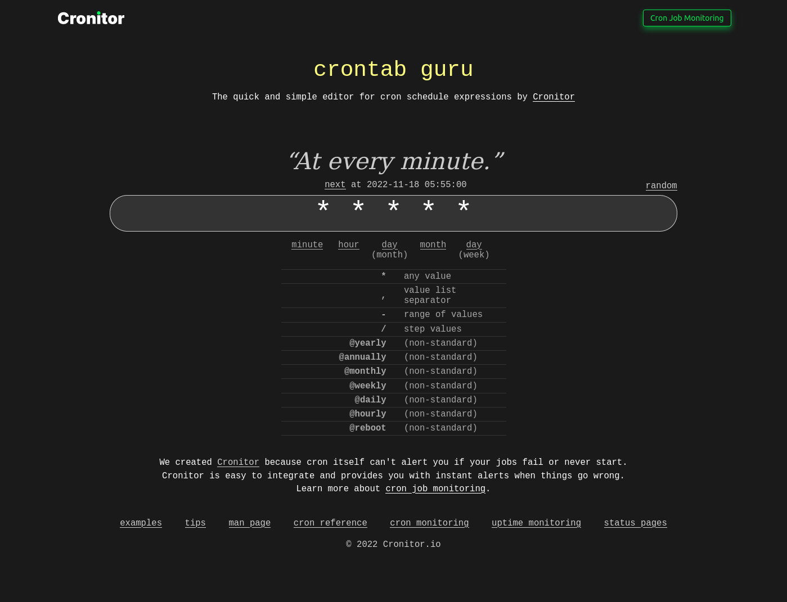

# Cron Jobs In Flask


Cron comes from the Greek word 'cron' which means 'time'. 'tab' is short for 'table'. Crontab, therefore, means 'time table'. Cron is a Linux utility feature that allows tasks to run in the background automatically at regular intervals. 

It is common for web applications to run background tasks. This could be to import new data from other sources or remove unnecessary files that could be created over time. This article covers how you can schedule your flask web applications to send out emails to the database users at regular intervals.

### Table of Contents

The approach I will take is to divide the entire process into three:

- **The task**: what needs to be done
- **The application context**: allows for access to all application features
- **The scheduling**: time to send


## Email Configurations

The assumption here is that your Flask application has the email feature enabled. You probably have your email configurations clearly defined. This could be in the `config` module:

```python
# config.py

import os


class Config(object):
    # Email configurations
    MAIL_SERVER = os.environ.get('MAIL_SERVER')
    MAIL_PORT = int(os.environ.get('MAIL_PORT') or 25)
    MAIL_USE_TLS = os.environ.get('MAIL_USE_TLS') is not None
    MAIL_USERNAME = os.environ.get('MAIL_USERNAME')
    MAIL_PASSWORD = os.environ.get('SENDGRID_API_KEY')
    MAIL_DEFAULT_SENDER = os.environ.get('MAIL_DEFAULT_SENDER')
    ADMINS = ['ADMINS']
```

My configurations above utilize Twilio's SendGrid API to work with emails, especially on a production server. It still works locally though. If you are not familiar with Twilio SendGrid, check out [this tutorial](/twilio_sendgrid/00_overview.md) to learn more. Alternatively, you can use Google's `smtp` for this. Learn how to work with Google's `smtp` [here](email_support_in_flask.md).

Since these variables are sourced from the environemnt, it is best practice to add them in a secret `.env` file which should never be committed to version control.

```python
# .env

MAIL_SERVER=
MAIL_PORT=
MAIL_USE_TLS=
MAIL_USERNAME=
MAIL_PASSWORD=
MAIL_DEFAULT_SENDER=
ADMINS=
```

With the configurations in place, we can now create a function that will be responsible for sending emails. All the codes can be in an `email` module.

```python
# email.py

from flask_mail import Message
from app import mail
from flask import current_app
from threading import Thread


def send_async_email(app, msg):
    with app.app_context():
        mail.send(msg)

def send_email(subject, sender, recipients, text_body, html_body):
    msg = Message(subject, sender=sender, recipients=recipients)
    msg.body = text_body
    msg.html = html_body
    Thread(
        target=send_async_email,
        args=(current_app._get_current_object(), msg)).start()

```

The helper function `send_email()` is a generic way of sending emails. It will be used below when we want to send actual emails. The entire email feature is added as a thread to ensure that the flask application does not slow down due to the execution of this function. Typically, sending emails will take a few seconds to complete.


## Creating Tasks

Now that email support is in place, we can create a task that we can schedule to happen at period intervals. 


### Updating the Database To Support Cronjobs

A user's model could define only their email address. All that an application accepts is a user's email address.

```python
# app/models.py

class Client(db.Model):
    id = db.Column(db.Integer, primary_key=True)
    email = db.Column(db.String(128), index=True, unique=True, nullable=False)
    email_confirmed_at = db.Column(db.DateTime, default=datetime.utcnow, nullable=False)
    # Checks if the user is subscribed or not
    active = db.Column(db.Boolean, nullable=False, default=True)
    # Used to whether a newsletter has been sent out or not
    num_newsletter = db.Column(db.Integer, nullable=False)

    def __repr__(self):
        return f'Email: {self.email}'
```

The model has an additional column called `num_newsletter` whose integer values will be used to determine if a user has received an email newsletter or not. Additionally, this column will be used to determine what email newsletter needs to be sent out.

It is good practice to respect user's contact information. The fact that a user has shared an email address with us does not give the opportunity to spam them. Hence, if a user wishes to opt out of the subscription, they can do so. The application will remember their subscription state using the value in `active` column. 

### Email template

Here is a sample method used to send out an email.

```python
# app/emails.py

def send_async_email(app, msg):
    # ...

def send_email(subject, sender, recipients, text_body, html_body):
    # ...

# Week 1

def send_week1newsletter(client_email, client_username):
    """Client receives week1 newsletter"""
    send_email(
        'Sample Subject Line',
        sender=current_app.config['MAIL_DEFAULT_SENDER'],
        recipients=[client_email],
        text_body=render_template(
            '/emails/client/week1.txt',
            client_email=client_email,
            client_username=client_username),
        html_body=render_template(
            '/emails/client/week1.html',
            client_email=client_email,
            client_username=client_username))
```

The `send_week1_newsletter()` function uses both text and HTML content to send out the email. This is similar to the `render_template()` function from flask. It is always advisable to have the text template in the event the email server does not entirely parse the HTML content or there is an unexpected issue.


### Sending An Email

As mentioned, the function `send_week1_newsletter()` is only used when invoked to send an email. For a subscription newsletter service, a web application would email all its subscribed users found in the database. Below is a simple function that invokes the sending of emails:

```python
# app/emails.py


# ...


def week1_newsletter():
    """Send week1 newsletter"""
    clients = Client.query.all()
    for client in clients:
        # Get client details
        client_email = client.email
        client_username = client.email.split('@')[0].capitalize()
        # Check if the client is subscribed
        if client.active is not False:
            # Check if the client has received any newsletter before
            if client.num_newsletter == 0:
                send_week1_newsletter(client_email, client_username)
                # Update client newsletter status
                client.num_newsletter = 1
                db.session.commit()


def week2_newsletter():
    """Send week2 newsletter"""
    clients = Client.query.all()
    for client in clients:
        # Get client details
        client_email = client.email
        client_username = client.email.split('@')[0].capitalize()
        # Check if the client is subscribed
        if client.active is not False:
            # Check if the client has received the first newsletter
            if client.num_newsletter == 1:
                # If so, then send week 2 newsletter
                send_week2_newsletter(client_email, client_username)
                # Update client newsletter status
                client.num_newsletter = 2
                db.session.commit()
```

Notice that the two functions begin by checking of a user is still subscribed to receive emails. The starting value to know what email needs to be sent out is 0. This value is added to the database when the user is being registered.

```python
if form.validate_on_submit():
    user = User(email=form.email.data, num_newsletter=0)
    db.session.add(user)
    db.session.commit()
```

0 means that this user is newly registered. If so, then week 1 email newsletter will be sent out to them. As soon as this email is sent out, their status changes to 1, meaning, they should not receive any week 1 newsletter. They are now qualified to receive week 2 newsletter.


## Application Context

You have probably come across the command `flask shell`. "Shell" is a command from flask. There is also `flask run` which is used to start the flask server. And many more. It is also possible to create custom commandline operations that suite our needs. 

In the context of sending periodic email newsletters, we are going to create a command which will run in the application's context such that every time it is invoked, not only will it send out an email, but it will also allow for access to the application's resources such as the database, which me mostly need here.


### Create a Custom Command

Following the principle of separation of concerns, a new module called `cli` will define all that we need for our commandline operations.

```python
# app/cli.py

from app.models import Client
from datetime import datetime
from app.emails import week1_newsletter, week2_newsletter


def register(app):
    @app.cli.group()
    def send_newsletter_email():
        """Send periodic emails to individual clients"""
        pass


    @send_newsletter_email.command()
    def week1():
        """Send week 1 newsletter"""
        week1_newsletter()
        print(str(datetime.utcnow()), 'Week 1 emails sent to all subscribed clients\n\n')

    @send_newsletter_email.command()
    def week2():
        """Send week 2 newsletter"""
        week2_newsletter()
        print(str(datetime.utcnow()), 'Week 2 emails sent to all subscribed clients\n\n')
```

Flask uses [Click](https://click.palletsprojects.com/) for all commandline operations. In the example above, I have created a root command called `send-newsletter-email` from whom subcommands are derived. These sub-commands are created via `app.cli.group` decorator. All that the subcommands do is to invoke the necessary functions used to send out an email. To ensure that I know when the emails were sent out, I have added a `print()` statement.


### Test Access to Custom Commands

Now, on the terminal, I can run `flask send-newsletter-email --help` to list all the custom commands I have created.

```python
(venv)$ flask send-newsletter-email --help

# Output

Usage: flask send-newsletter-email [OPTIONS] COMMAND [ARGS]...

  Send email to individual clients

Options:
  --help  Show this message and exit.

Commands:
  week1       Send week 1 newsletter
  week2       Send week 2 newsletter
```

### Register Commandline Commands

If not using the factory function, then the entry point file needs to be updated to include the `cli` module:

```python
# main.py

from app import cli
```

However, if a factory function is being used, the application's blueprint needs to be considered.

```python
# main.py

from app import create_app, db, cli
from app.models import User


app = create_app()
cli.register(app)


@app.shell_context_processor
def make_shell_context():
    return dict(db=db, User=User)
```

Now, we can run `flask send-newsletter-email week1` to send the week1 newsletter.


## Scheduling

Once the job is written and tested, we can now implement the scheduling part. Here is where [cron](https://en.wikipedia.org/wiki/Cron) comes in. Every user in a Unix-based system to set up cronjobs. The crontab file can be opened by running this command in the terminal:

```python
(venv)$ crontab -e
```

Here, I am running the `crontab` command under my computer's user, who is typically the same user that runs the flask application. This ensures that the task runs with the correct permissions. It is advisable to not run this command as a root user.

Once the file is opened, you will notice that it comes with commented out instructions. These instructions offer guidance on how to go about scheduling a task.

```python
# ┌───────────── minute (0 - 59)
# │ ┌───────────── hour (0 - 23)
# │ │ ┌───────────── day of the month (1 - 31)
# │ │ │ ┌───────────── month (1 - 12)
# │ │ │ │ ┌───────────── day of the week (0 - 6) (Sunday to Saturday;
# │ │ │ │ │                                   7 is also Sunday on some systems)
# │ │ │ │ │
# │ │ │ │ │
# * * * * * <command to execute>
```

Each line in a crontab file represents a job in the syntax `* * * * * <command to execute>`. There are five fields which represent the time to execute a command, followed by a shell command itself.


### Understanding A Cron Expression

To run a job once a minute, put five stars separated by spaces, followed by the command to run:

```python
* * * * * command
```

In our case, we want to run `flask send-newsletter-email week1`. As a command line command, we can paste this command in the terminal, and press "Enter" to send out "Week1" newsletters. But what we want to do is to send it out as a cron service. These are the things we need to pay attention to when running it as a cron service:

- **Current directory**: We need to `cd` into the project's specific directory in the cronjob, by specifying its absolute path.
- **Environment variables**: Flask uses the `.env` and the `.flaskenv` files to automatically access an application's environment variables
- **Virtual environment**: Because it is a flask command, it is best to activate a virtual envronment in the process, or else, run a Python executable located inside the virtualenv directory.
- **Logging**: It is best to ensure that by sending the output to a logfile.

To configure the `flask send-newsletter-email week1` command as a cron service, I can schedule week 1 emails to be sent out once every minute as follows:

```python
* * * * * cd /home/harry/newsletter_app && venv/bin/flask send-newsletter-email week1 >> logs/scheduled_email.log 2>&1
```

I have used `&&` to include multiple commands in a single line. I have began by navigating into the directory containing the project. Instead of activating a virtual environment, I decided to locate the `flask` command inside the `venv/bin/` subdirectory which achieves the same effect as activating the environment.

The `flask` command is immediately followed by my custom CLI commands. As soon as that is executed, the output is redirected and appended to the file `scheduled_email.log` for logging purposes. This helps to know if the job was done successfully or if there was an error. Otherwise, it would be very difficult to know what happened, especially in the event there is an unexpected error.

The last part involves applying the same redirection for `stderr` that was configured for `stdout`.The "2" and the "1" reference the file handle numbers for `stderr` and `stdout` respectively.

Ensure you save the changes by pressing "Ctrl + X" then type "y" for "yes" before pressing "Enter".

Once this job is executed, there will be a new file inside the `logs` sub-folder to show the status of the execution.

|        Task         | Description   |
| ------------------  | ------------- |
| 0 * * * * command   | Run the command at the 0th minute of every hour   |
| 5 * * * * command   | Run the command at the 5th minute of every hour   |
| 5 4 * * * command   | Run the command daily at 4.05 am    |
| 5 16 * * * command  | Run the command daily at 4.05 pm   |
| 5 4 * * 2 command   | Run the command every Tuesday at 4.05 am   |
| 5 4 * * 1-5 command   | Run the command every weekday at 4.05 am  except the weekends |
| 0-59/2 * * * command   | Run the command daily every even minute of the hour   |
| 1-59/2 * * * command   | Run the command daily every odd minute of the hour   |

You can schedule the commands to fit your own liking. To test out the executed time a command should be sent, you can use the [crontab.guru](https://crontab.guru/) site.



