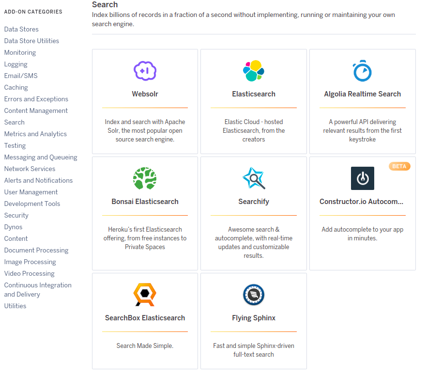
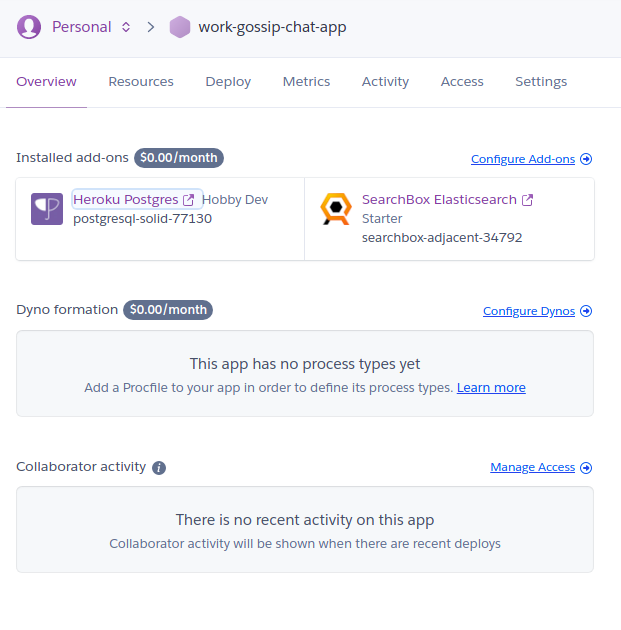
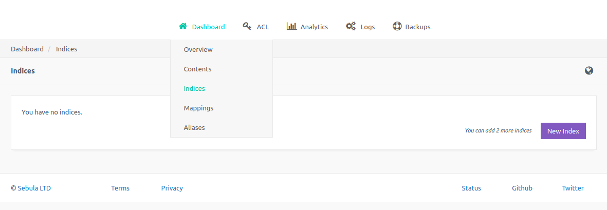

# How to Deploy Your Flask App to Heroku

###### Things to know beforehand
* `git`: Deploying to Heroku is done through `git` version control tool
* `Procfile`: Heroku looks for a file called `Procfile` in the application's root directory for instructions on how to start the application
* `requirements.txt`: For python projects(initially, Heroku was built for Ruby related projects), you will need a `requirements.txt` which lists all the packages that are required to build and run your application.


###### Procedure:

1. Create an account at [Heroku](https://www.heroku.com/). It is free.
2. Install the [Heroku CLI](https://devcenter.heroku.com/articles/heroku-cli)
3. Set up `git`
4. Create a Heroku Application
5. Deploy Your Application
6. Deploy Application Updates


#### Create Heroku account

Before you can deploy your application to Heroku, you will need to have an account with them. Visit [heroku.com](https://www.heroku.com/) and sign up for free. Your applications will be listed on your dashboard whenever you log in.

#### Install Heroku CLI

To interact with Heroku services, you will need to use their commandline tool called [Heroku CLI](https://devcenter.heroku.com/articles/heroku-cli). It is available for Linux, Mac OS X and Windows. 

To install it, run the command below:
```python
$ sudo snap install --classic heroku
```

You can read the full [Heroku CLI documention](https://devcenter.heroku.com/categories/command-line) for more information. Once installed, you need to log in to your account:

```python
$ heroku login
```

Heroku CLI will open in your default browser and ask you to enter your email address and your account password. Your authentication details will be remembered in subsequent commands.

#### Setting Up Git

`git` is core to the deployment of your applications to Heroku. You will need to install it on your system. Learn how to install it [here](./install_git.md)

The reason why you need `git` is because Heroku expects your project to be in a git repository. If you had your project on [GitHub](https://github.com/), clone it to your local machine:

```python
$ git clone git@github.com:GitauHarrison/work_gossip_chat_app.git
```
OR
```python
$ git clone https://github.com/GitauHarrison/work_gossip_chat_app.git
```

Whenever you use `https`, you will be required to always enter your _username_ and _password_ to access your resources. `ssh` on the other hand is _password-less_. Learn how to set up your `git` to use `ssh` [here](/github_ssh.md).

>Everything should be done within  a virtual environment. In the case where you are cloning a project from GitHub, remember to install the project's dependancies that are found in the `requirements.txt` file. To do so, run the command below:

```python
$ pip3 install -r requirements.txt
```


#### Create a Heroku Application

Heroku uses the command `apps:create` to register new applications. You will need to run the command below from the root directory of your application.

```python
$ heroku apps:create work-gossip-chat-app
```
`work-gossip-chat-app` is a unique name. When you try to use the same name, it will be unavailable. You need to use another name which has not been used yet.

The output of this command will include the URL Heroku assigned to your application, together with a `git` repository. Your local `git` repository will be configured to now include a second from Heroku called `heroku`. To check all the available remotes, run:

```python
$ git remote -v
```

#### Postgres Database for Heroku

Heroku's database offering is based on the Postgres database. You interact with it using its CLI tool.

First, we will begin by creating a database on the free version account:

```python
heroku addons:add heroku-postgresql:hobby-dev
```
You will see this kind of result on your terminal:
```python
Creating heroku-postgresql:hobby-dev on ⬢ work-gossip-chat-app... free
Database has been created and is available
 ! This database is empty. If upgrading, you can transfer
 ! data from another database with pg:copy
Created postgresql-solid-77130 as DATABASE_URL
Use heroku addons:docs heroku-postgresql to view documentation
```
`DATABASE_URL` environment variable (as seen in the output above) stores the URL for the newly created database, which will be available when the application runs. The application will look for the database URL in that variable.

To find out the exact URL associated with your database, run this command:

```python
$ heroku config:get DATABASE_URL
```
To check the status of your database, run:
```python
$ heroku pg:info DATABASE

=== DATABASE_URL
Plan:                  Hobby-dev
Status:                Available
Connections:           1/20
PG Version:            12.4
Created:               2020-10-05 01:07 UTC
Data Size:             7.9 MB
Tables:                0
Rows:                  0/10000 (In compliance)
Fork/Follow:           Unsupported
Rollback:              Unsupported
Continuous Protection: Off
Add-on:                postgresql-solid-77130
```

#### Logging to `stdout`

Logging allows for the writing of status messages to a file or any other output streams. The log files contain all the information on which part the code is executed and what problems may have arisen. Learn more on Python logging [here](https://realpython.com/python-logging/).

Heroku expects applications to log directly to `stdout`. Every time you want to check your application logs, you can type the command below to see all the details:

```python
$ heroku logs --tail
```

As always, we will create our application-wide variables in `config.py` and register it in the `application factory` as seen below:

_`config.py: Log to stdout`_
```python
class Config(object):
    #
    LOG_TO_STDOUT = os.environ.get('LOG_TO_STDOUT')
```
_`app/__init__.py: Add stream handler`_
```python
def create_app(config_class=Config):
    # ...
    if not app.debug and not app.testing:
        # ...

        if app.config['LOG_TO_STDOUT']:
            stream_handler = logging.StreamHandler()
            stream_handler.setLevel(logging.INFO)
            app.logger.addHandler(stream_handler)
        else:
            if not os.path.exists('logs'):
                os.mkdir('logs')
            file_handler = RotatingFileHandler('logs/tinker_app.log', maxBytes=10240, backupCount=10)
            file_handler.setFormatter(logging.Formatter(
                '%(asctime)s %(levelname)s: %(message)s [in %(pathname)s:%(lineno)d]'
            ))
            file_handler.setLevel(logging.INFO)
            app.logger.addHandler(file_handler)

        app.logger.setLevel(logging.INFO)
        app.logger.info('Microblog startup')

    return app
```
Now, set your `LOG_TO_STDOUT` environment variable in Heroku:
```python
$ heroku config:set LOG_TO_STDOUT=1
```
This variable is set to `1` and it will be used at runtime.

#### Adding Search functionality in Heroku

Unlike Postgres which is provided by Heroku, a service such as Elasticsearch is provided by third parties that partner with Heroku to provide add-ons. There are a number of search addons you can choose from. Find more [addons here](https://elements.heroku.com/addons).




Let us try [SearchBox](https://elements.heroku.com/addons/searchbox)

```python
$ heroku addons:create searchbox:starter

Creating searchbox:starter on ⬢ work-gossip-chat-app... free
Created searchbox-adjacent-34792 as SEARCHBOX_SSL_URL, SEARCHBOX_URL
Use heroku addons:docs searchbox to view documentation
```

A connection URL is created for the service in the `SEARCHBOX_SSL_URL` or `SEARCHBOX_URL` variables associated with your application.

To make use of these third-party addons and add their functionality to your application, you will need to provide your credit card info even though you are on the free tier. So, add this information to your billing. You will not be charged while you are on the free tier.

In your Heroku dashboard, among your installed addons, click on SearchBox Elasticsearch to find the URL associated with `SEARCHBOX_URL` variable.



Similarly, you can run the command below to find the URL:
```python
$ heroku config:get SEARCHBOX_URL
```

The URL displayed in your terminal is your Elasticsearch connection URL. Configure it to your Heroku application's `ELASTICSEARCH_URL` variable as shown below:

```python
$ heroku config:set ELASTICSEARCH_URL=<displayed-url-from-the-command-above>
```

To make searching of keywords in your app, you will need to **create** an index within the _SearchBox Elasticseach_ dashboard as seen in the image below. By extension, this will allow you to post comments in your home page.


**Note:**
If you are using `SEARCHBOX_SSL_URL`, then you should not have the trouble of indices not being created automatically by the server. 

<br>

#### Updating your Dependancies

Heroku will use the listed dependancies to run your application. Additionally, it will need you to add 2 more dependancies to the `requirements.txt` file.

###### `gunicorn`

Since Flask's development server is not robust enough for use in production, you will need to add this server which is recommended by Heroku for Python applications:

```python
$ sudo apt install gunicorn
```
###### `psycopg2`

Our application will also be connecting to a Postgres database, and for that it requires this package to be installed. 

`psycopg2` library is built as a wrapper around `libpq`. It requires some `PostgreSQL` binaries and headers requried for building 3rd-party applications for `PostgreSQL`. 

```python
$ sudo apt install python3-dev libpq-dev
```
The main goal of the command above is to provide all requirements for building `psycopg2`. To install the latest package in your system, use `pip`:

```python
$ pip3 install psycopg2
```
<br>

#### The Procfile

Heroku needs to know how to execute your application. For that, you need a `Procfile` which is created in the root directory. So, fo ahead and create an empty `Procfile` file:

```python
$ touch Procfile
```

Then, update your `Procfile` with this info:

_`Procfile: Application execution`_
```python
web: flask db upgrade; flask translate compile; gunicorn tinker:app
```
Parts of a `Procfile`

* Process name
* Colon
* Commands that start the process

The Procfile begins with a process name (in our case, since we are builing a web application, we will use `web`). After the colon, you will need to define the commands you need. Finally, you need to declare your server.

In our example, since we are using the `flask` command, we need to add the `FLASK_APP` environment variable:

```python
$ heroku config:set FLASK_APP=tinker.py
```

**Our application has other environment variables listed in our `config.py` file. Configure them with Heroku as shown above.**

#### Deploying Application

`git push` is used to deploy the application to Heroku's servers, similarly to how you would push changes from your local git repository to GitHub or any other remote server.

First, you need to save your changes and commit them:
```python
$ git commit -a -m 'Make changes for heroku deployment'
```

Then, start your deployment:

```python
git push heroku master

Enumerating objects: 1170, done.
Counting objects: 100% (1170/1170), done.
Delta compression using up to 4 threads
Compressing objects: 100% (391/391), done.
Writing objects: 100% (1170/1170), 691.88 KiB | 43.24 MiB/s, done.
Total 1170 (delta 760), reused 1148 (delta 750)
remote: Compressing source files... done.
remote: Building source:
remote: 
remote: -----> Python app detected
remote: -----> Installing python-3.6.12
remote: -----> Installing pip 20.1.1, setuptools 47.1.1 and wheel 0.34.2
remote: -----> Installing SQLite3
remote: -----> Installing requirements with pip
# ...
remote: -----> Discovering process types
remote:        Procfile declares types -> web
remote: 
remote: -----> Compressing...
remote:        Done: 59.3M
remote: -----> Launching...
remote:        Released v18
remote:        https://work-gossip-chat-app.herokuapp.com/ deployed to Heroku
remote: 
remote: Verifying deploy... done.
To https://git.heroku.com/work-gossip-chat-app.git
 * [new branch]      master -> master
```

If you want to see the log entries for your application, run the command:

```python
$ heroku logs --tail
```

###### Database Error

Chances are that when you try to log into your app or even try to register a new user you will come across an error such as:

```python
sqlalchemy.exc.ProgrammingError: (psycopg2.errors.UndefinedTable) relation "user" does not exist
LINE 2: FROM "user"
[SQL: SELECT "user".id AS user_id, "user".username AS user_username, "user".email AS user_email, "user".password_hash AS user_password_hash, "user".about_me AS user_about_me, "user".last_seen AS user_last_seen
FROM "user"
WHERE "user".username = %(username_1)s
LIMIT %(param_1)s]
[parameters: {'username_1': 'harry', 'param_1': 1}]
(Background on this error at: http://sqlalche.me/e/f405)    
```

This is a database error. Your application cannot read your database tables. Check that your Heroku database has tables in it by running the command `heroku pg:info DATABASE`. This will show you the status of your database, something similar to the output below:

```python
=== DATABASE_URL
Plan:                  Hobby-dev
Status:                Available
Connections:           1/20
PG Version:            12.4
Created:               2020-10-13 01:23 UTC
Data Size:             8.0 MB
Tables:                0        # <--------------------------------  No tables
Rows:                  0/10000 (In compliance)
Fork/Follow:           Unsupported
Rollback:              Unsupported
Continuous Protection: Off
Add-on:                postgresql-crystalline-47645
```

You can see that from the output, my databse has no tables, yet locally, I may have the database working well. To fix this, we need to update our database to include the tables created in your `models.py` file. In this case, as you can see from our `Procfile`, we will run:

```python
$ heroku run flask db upgrade # add heroku run
```


#### Application Updates

Make changes to your applicatin and save it. You will need to `add` and `commit` them using `git`. Push the changes to Heroku:

```python
$ git add .
$ git commit -a -m 'Message about your new changes'
$ git push heroku master
```

#### Removing addons and variables in Heroku

If at some point you would like to remove a config var, consider running:

```python
$ heroku config:unset <VAR_NAME>=<value>
```

To remove an addon, do:

```python
$ heroku addons:destroy <name-of-addon>
```