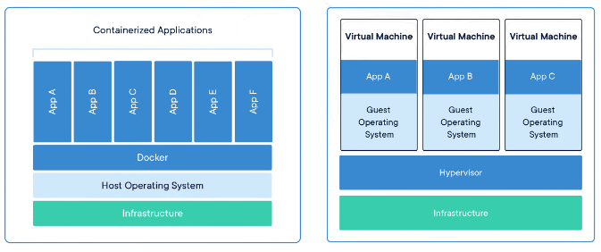

# How To Deploy a Flask App on Docker Containers

Containers are built on a lightweight virtualization technology that allows an application, along with its dependencies and configuration to run in complete isolation, but without the need to use a full blown virtualization solution such as virtual machines, which need a lot more resources and can sometimes have a significant performance degradation in comparison to the host. A system configured as a container host can execute many containers, all of them sharing the host's kernel and direct access to the host's hardware. This is in contrast to virtual machines, which have to emulate a complete system, including CPU, disk, other hardware, kernel, etc.



In spite of having to share the kernel, the level of isolation in a container is pretty high. A container has its own file system, and can be based on an operating system that is different than the one used by the container host. For example, you can run containers based on Ubuntu Linux on a Fedora host, or vice versa. While containers are a technology that is native to the Linux operating system, thanks to virtualization it is also possible to run Linux containers on Windows and Mac OS X hosts. This allows you to test your deployments on your development system, and also incorporate containers in your development workflow if you wish to do so.

While Docker isn't the only container platform, it is by far the most popular. There are two editions of Docker, a free community edition (CE) and a subscription based enterprise edition (EE). In this tutorial, Docker CE will be sufficient.

To work with Docker CE, you first have to install it on your system. There are installers for Windows, Mac OS X and several Linux distributions available at the [Docker website](https://www.docker.com/community-edition). If you are working on a Microsoft Windows system, it is important to note that Docker CE requires Hyper-V. The installer will enable this for you if necessary, but keep in mind that enabling Hyper-V prevents other virtualization technologies such as VirtualBox from working. Learn how to install `docker` [here](how_to_install_docker.md).

## Building a Container Image

The first step in creating a container for our app is to _build an **image**_ for it. A container image is a template that is used to create a container. It contains a complete representation of the container file system, along with various settings pertaining to networking, start up options, etc.

I will show you how to generate a container through a script. 

The command that creates scripted container images is `docker build`. This command reads and executes build instructions from a file called `Dockerfile`, which I will need to create. The Dockerfile is basically an installer script of sorts that executes the installation steps to get the application deployed, plus some container specific settings.

Dockerfile: Script installer
```python
FROM python:3.8-apline

RUN adduser -D practice_blog

WORKDIR /home/python/flask_tutorial/practice_blog

COPY requirements.txt requirements.txt
RUN python3 -m venv practice_blog
# Upgrade pip below
RUN practice_blog/bin/python3 -m pip install --upgrade pip
RUN practice_blog/bin/pip3 install requirements.txt
RUN practice_blog/bin/pip3 gunicorn

COPY app app
COPY migrations migrations
COPY blog.py config.py boot.sh ./
RUN chmod +x boot.sh

ENV FLASK_APP blog.py

RUN chown -R practice_blog:practice_blog ./
USER practice_blog

EXPOSE 5000
ENTRYPOINT ["./boot.sh"]
```
Each line in the `Dockerfile` is a command. The `FROM` command specifies the base container image on which the new image will be built. The idea is that you start from an existing image, and or change some things, and you end up with a derived image. Images are referenced by a _name_ and a _tag_, separated by a _colon_. The tag is used as a versioning mechanism, allowing an image to provide more than one variant. Above, the image used is `python`, which is the official Docker image for Python. The tags for this image allow you to specifiy the interprter versioin and the base operating system. The `3.8-alpine` tag selects a Python 3.8 interpreter installed on Alpine Linux. The Alpine Linux distribution is often used instead of the more popular ones such as Ubuntu because of its small size. You can see what tags are available for the Python image in the [Python Image Reposistory](https://hub.docker.com/_/python?tab=tags).

The `RUN` command executes an arbitrary command in the context of the container. This would be similar to you typing the command in a shell prompt. The `adduser -D practice_blog` command creates a new user named `practice_blog`. Most container images have `root` as the default user, but it is not a good practice to run an application as `root`, so we need to create our own user.

The `WORKDIR` command sets a default directory where the application is going to be installed. When I created the `practice_blog` user above, a home directory was created, so now I'm we are making that directory the default. The new default directory is going to apply to any remaining commands in the `Dockerfile`, and also later when the container is executed.

The `COPY` command transfers files from your machine the container file system. This command takes two or more arguments, the _source_ and the _destination_ files or directories. The source files must be relative to the directory where the Dockerfile is located. The destination can be an absolute path, or a path relative to the directory set in a previous `WORKDIR` command. Above, we are copying the `requirements.txt` file to the `practice_blog` user's home directory path in the container file system.

With `requirements.txt` in the container file system, we can create a virtual environment using `RUN` command. Above, I have created a virtual environment called `practice_blog` in which I install all the requirements needed for our application. It is also possible to explictly install packages in your container. In our example, we are installing `gunicorn` which we are going to use as a web server. Altenatively, you can have `gunicorn` added to the `requirements.txt` file.

The `COPY` commands that follow install the application to the container, by copying the `app` package, the `migration` repository with the database migrations and the top-level files `blog.py` and `config.py`. Additionally, We are also copying a new file `boot.sh`.

The `RUN chmod` command ensures that this `boot.sh`  file is set as an executable file. If you are in a Unix based file system and your source file is already marked as executable, then the copied file will also have the executable bit set. I added an explicit set because on Windows it is harder to set executable bits. If you are working on Mac OS X or Linux you probably don't need this statement, but it does not hurt to have it anyway.

The `ENV` command sets an environment variable inside the container. We need to set `FLASK_APP` which is required to use the `flask` command.

The `RUN chown` command sets the owner of all the directories and files that were stored in _/home/python/flask_tutorial/practice_blog_ as the new `practice_blog` user. Even though we created the this user near the top level of the Dockerfile, the default user for all the commands remain the `root` user. So, all the files need to be switched to the `practice_blog` user so that this user can work with them when the container is started.

The `USER` command in the next line makes the new `practice_blog` user the default for any subsequent instructions, and also for when the container is started.

The `EXPOSE` command configures the port that the container will be using for its server. This is necessary so that Docker can configure the network in the container appropriately. We have chosen the standard flask port `5000`, but this can be any port.

The `ENTRYPOINT` command defines the default command that should be executed when the container is started. This is the command that will start the web server. To keep things well organized, we will now make a separate `boot.sh` script file:

boot.sh: Docker container start up script
```python
#!/bin/sh
source practice_blog/bin/activate
flask db upgrade
flask translate compile
exec gunicorn -b :5000 --access-logfile - --error-logfile - practice_blog:app
```
Above, we activate the virtual environment, upgrade the database through the database migration framework, compile the language translations, and finally run the server with `gunicorn`.

In a shell script, `exec` triggers the process running the script to be replaced with the command given, instead of starting it as a new process. This is important because Docker assiciates the life of the container to the first process that runs on it. In cases like this one where the start up process is not the main process of the container, we need to make sure that the main process takes the place of that first process to ensure that the container is not terminated by Docker.

In Docker, anything that container writes to `stdout` or `stderr` will be captured and stored in the logs for the container. For that reason, the `--access-logfile` and `--error-logfile` are both configured with a `-`, which sends the log to the standard output so that they are stored as logs by Docker.

With the Dockerfile created, now we can build a container image:
```python
$ docker build -t practice_blog:latest .
```

The `-t` argument in `docker build` command sets the name and tag for the new image. The `.` indicates the base directory where the container is to be built. This is the directory where the _Dockerfile_ is located. The build process is going to evaluate all the commands in the Dockerfile and create the image, which will be stored on our own machine.

To obtain a list of all the images that you have locally, run the `docker images` command:

```python
$ docker images

# Output
REPOSITORY          TAG                 IMAGE ID            CREATED             SIZE
practice_blog       latest              39fa5cda1776        10 seconds ago      206MB
python              3.8-alpine          8744555ae7bb        6 days ago          42.3MB
```
The listing will include your image as well as the base image on which it was built. **Any time you make changes to the application, you can update the container image by running the command again**.