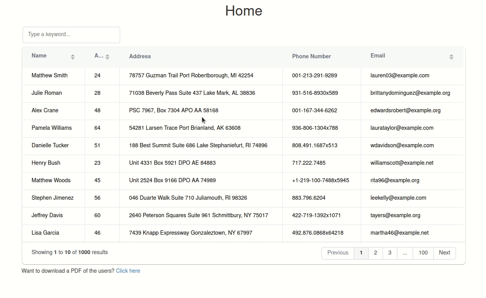
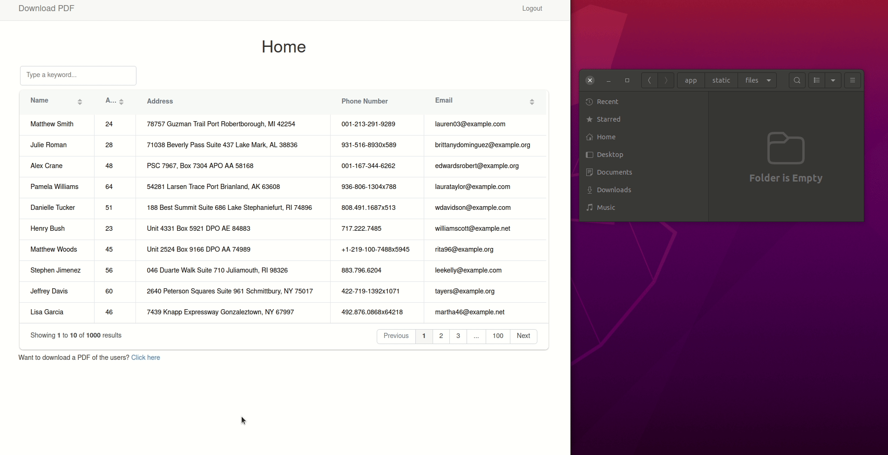

# Download Encrypted PDF Copy of Database Data using Python and Flask


With a software application capable of storing user data in a database, a user may want to download a copy of their data. Partly inspired by the MPesa technology, you will learn how to download an encrypted copy of the database data.


## Background Story

> [M-Pesa](https://www.safaricom.co.ke/personal/m-pesa) is a mobile phone-based money transfer service, payments, and micro-financing service, launched in 2007 by Vodafone and Safaricom, the largest mobile network operator in Kenya.

Safaricom allows its MPesa users to send and receive money from Safaricom and other mobile network users in Kenya. One feature that all MPesa, just like banks, users enjoy, is the provision of a transactions statement. An Mpesa user can request a copy of their transactions statement from the Safaricom MPesa app. On the web, a user can download a copy whereas, on mobile, the user will receive a copy of the statement via email. See the image below.


Before a user can open the document, MPesa requires that they identify themselves, usually by providing their national identification number. This is an attempt to curb the rampant MPesa fraud. As of this writing, Safaricom not only requires a user to provide their national ID number, but also a one-time token sent to their phones in the format `ID-token`.

This tutorial does not intend to reproduce a clone of the MPesa statement, but rather to show how to download an encrypted copy of the data found in a database. You will learn how to collect users' data, store it in the database, and then download an encrypted copy of that data.

## Things We Will Do

1. [Create a simple flask application](#create-a-simple-flask-application)
2. [Add a database table to store user data](#add-a-database-table-to-store-user-data)
3. [Create fake users and store them in the database](#create-fake-users-and-store-them-in-the-database)
4. [Display a tabular list of all fake users](#display-a-tabular-list-of-all-fake-users)
5. [Download a copy of the database data](#download-a-copy-of-the-database-data)
6. [Encrypt the PDF copy](#encrypt-the-pdf-copy)

The completed project used to demonstrate the above steps is available [here on GitHub](https://github.com/GitauHarrison/download-encrypted-pdf-copy-of-user-data).
## Create a simple flask application

To begin, we can utilize a minimalist flask structure such as this:

```python
project
   | --- main.py
   | --- config.py
   | --- .gitignore
   | --- app/
          | --- __init__.py
          | --- routes.py
          | --- models.py
          | templates
              | --- base.html
              | --- index.html
```

We will need the `flask-bootstrap` package to quickly style our application across all viewports. Notice how I instantiate `bootstrap` in the `__init__.py` file.

`app/__init__.py`: Instantiate packages

```python

from flask import Flask
from flask_bootstrap import Bootstrap

app = Flask(__name__)
Bootstrap(app)

from app import routes, models

```

The `base.html` template will hold the reusable structure we will need throughout the application. The `index.html` template inherits the `base.html` template and will be used to display all the users' data. You can refer to the shared repository for more information.


## Add a database table to store user data

Intentionally, I will use the  SQLite database engine. The first thing to do when creating a schema for a database is to figure out what data you want to store. In this case, I will store the user's name, email, age, address, and phone number.

### Needed Packages


`flask-sqlalchemy` is a fantastic [Object Relational Mapping (ORM)](https://en.wikipedia.org/wiki/Object%E2%80%93relational_mapping) package that will allow us to interact with the database. It uses high-level classes, objects, and methods to map rows and columns found in a database. It is a wrapper around the [SQLAlchemy](https://www.sqlalchemy.org/) library.

We will need to install it in our virtual environment. A virtual environment helps to isolate the needs of one project from the needs of another.

```python
(venv)$ pip3 install flask-sqlalchemy
```

Once the schema is developed, we will need to create a database by applying the necessary migrations. Since this is the first time we are creating our database, we will need to make only one migration. If we want to add more data to our database, we will need to update the schema and apply the new changes. `flask-migrate` is another useful package we can utilize to create database migrations.

```python
(venv)$ pip3 install flask-migrate
```


### Instantiate the database


Both these packages will need to be instantiated in the `__init__.py` file.


`app/__init__.py`: Instantiate packages

```python

# ...
from flask_sqlalchemy import SQLAlchemy
from flask_migrate import Migrate

# ...


db = SQLAlchemy(app)
migrate = Migrate(app, db)


# ...

```


### Define the database schema


At this point, we can define our database schema.


`app/models.py`: Create database schema

```python


from app import db


class User(db.Model):
    id = db.Column(db.Integer, primary_key=True)
    name = db.Column(db.String(64), index=True)
    age = db.Column(db.Integer, index=True)
    address = db.Column(db.String(256))
    phone = db.Column(db.String(20))
    email = db.Column(db.String(120), index=True)

    def __repr__(self):
        return f'User {self.username}'


```

The built-in function `__repr__` is used to display the object when we print it. This is useful for debugging purposes. In a flask shell, which runs the Python interpreter in the context of the application, you can run the following command to see the output:


```python

(venv)$ flask shell


>>> user = User(name='John Doe', age=30, address='123 Main St', phone='555-555-5555', email='johndoe@email.com')
>>> db.session.add(user)
>>> db.session.commit()
>>> user

# Output

User: John Doe

```

### Configure the database


To complete the setup of our database, we need to set some configurations which Flask expects. Most importantly, we need to configure the database URI. Following the principle of separation of concerns, we will need to configure the database URI in the `config.py` file.

`config.py`: Database configurations

```python


import os


basedir = os.path.abspath(os.path.dirname(__file__))


class Config(object):
    SQLALCHEMY_DATABASE_URI = os.environ.get('DATABASE_URL') or \
        'sqlite:///' + os.path.join(basedir, 'app.db')
    SQLALCHEMY_TRACK_MODIFICATIONS = False

```

`DATABASE_URL` is a variable whose value is set in the `.env` file. Should this value not be set, we will use a disk-based database appropriately called `app.db`. This fallback plan ensures that should one option fail, then the other should work. As soon as we run our migrations, shown below, you will notice that this file will be created and located in the top-level directory of the project.


Flask expects these configurations to be registered in the application's instance. We can do this by instantiating the `Config` class in the `__init__.py` file.


`app/__init__.py`: Instantiate packages

```python

# ...
from Config import Config


app = Flask(__name__)
app.config.from_object(Config)

# ...

```


### Run database migrations


Run the commands below to create the database and migrate the schema:

```python


(venv)$ flask db init
(venv)$ flask db migrate -m "user table"
(venv)$ flask db upgrade

```


You will see a _migrations_ folder created in the application's root directory. Inside the folder, there is a subfolder called _versions_ which contains the migration files. At this point, the migration version of the database currently available will be `xxxx_user_table.py`.


## Create fake users and store them in the database


The application will need a lot of users, in the hundreds or even thousands. It will be cumbersome to manually add this number of users to the database one at a time. We will use the [faker](https://faker.readthedocs.io/) package to generate a large number of fake users. These users will automatically be added to the database. Begin by installing the `faker` package.

```python

(venv)$ pip3 install faker
```

The logic used to create the fake users will be in a separate file. This module will be imported into the `app/routes.py` file to display a tabular list of all fake users. First, let us create this module:


```python

(venv)$ touch app/create_fake_users.py
```

Using the `faker` package to generate fake user data, we can now update the module.


`app/create_fake_users.py`: Create fake users

```python


from faker import Faker
from app import db
from random import randint
from app.models import User


def fake_users(n):
    fake = Faker()
    for i in range(n):
        user = User(
            name=fake.name(),
            age=randint(18, 65),
            address=fake.address(),
            phone=fake.phone_number(),
            email=fake.email())
        db.session.add(user)
    db.session.commit()

```


The `fake_users` function will create an `n` number of fake users. During each iteration, we create and add a new user object to the database. If you are interested in quickly testing out the `fake_users` function, consider updating the module above with this:


```python

# ...
import sys


def fake_users(n):
    # ...


if __name__ == '__main__':
    if len(sys.args) <= 1:
        print('Usage: python create_fake_users.py <number of users>')
        sys.exit(1)
    else:
        n = int(sys.args[1])
        fake_users(n)
        print(f'Created {n} fake users')

```


Then in your terminal, run the following command:

```python
(venv)$ python3 create_fake_users.py 100
```

Here, you will create 100 fake users. The number of arguments in the command line is `2` because the first argument is the name of the script and the second argument is the number of users to create. This validates the `else` block in the `if` statement.


## Display a tabular list of all fake users


The template `index.html` will be used to display all the fake users. This template will also include a link to download the list of fake users as a PDF file.



Notice how the table is styled. It has an impressive user interface with a search bar, it is paginated, and its content can be sorted by clicking on the column headers.


### Render the template


Before we create this template, let us first create a view function that will render it.


`app/routes.py`: Render the index page

```python
from app import app
from app.create_fake_users import fake_users
from app.models import User


def limit_num_fake_users():
    users = User.query.count()
    if users > 1000:
        db_users = User.query.limit(1000)
    else:
        fake_users(100)
        flash('Created 100 fake users')
    return db_users


@app.route('/')
@app.route('/index')
def index():
    all_users = limit_num_fake_users()
    return render_template('index.html', all_users=all_users)
```

I have implemented here a little constraint logic to limit the total number of fake users that can be stored in the database to only 1000. This is to prevent the database from becoming too large, especially during hosting. The function `limit_num_fake_users()` is called in the `index` view function each time the resource is requested.


### Display template data


At this point, we are ready to render the ``index.html`` template. If you are curious as to how the table looks like that, I would like to introduce you to [Grid.js](https://gridjs.io/). It is a JavaScript table plugin that allows you to display a table in a grid-like fashion. To use it, all you need to do is to include its JavaScript and CSS files in your template. 

`app/templates/base.html`: Add Grid.js

```html


    {{ super() }}
    <link href="https://unpkg.com/gridjs/dist/theme/mermaid.min.css" rel="stylesheet" />



    {{ super() }}
    <script src="https://unpkg.com/gridjs/dist/grid.min.js"></script>
    


```

The reason I have chosen to add these files in the `base.html` template is that I want all Grid.js JavaScript and CSS files to be inherited by the `index.html` template (which currently is the only child template). The `gridjs_scripts` block will be used only in the `index.html` template.

`app/templates/index.html`: Define user table

```html



<div class="row">
    <div class="col-md-12">
      <h1 class="text-center">{{ title }}</h1>
        <div id="table"></div>
        <p>
            Want to download a PDF of the users?
            <a href=" {{ url_for('download_users') }} ">Click here</a>
        </p>
    </div>  
</div>



<script>
    new gridjs.Grid({
      columns: [
        { id: 'name', name: 'Name' },
        { id: 'age', name: 'Age' },
        { id: 'address', name: 'Address', sort: false },
        { id: 'phone', name: 'Phone Number', sort: false },
        { id: 'email', name: 'Email' },
      ],
      data: [
        
          {
            name: '{{ user.name }}',
            age: {{ user.age }},
            address: '{{ user.address }}',
            phone: '{{ user.phone }}',
            email: '{{ user.email }}'
          },
        
      ],
      search: true,
      sort: true,
      pagination: true,
    }).render(document.getElementById('table'));
  </script>

```

So, what exactly is going on here? To use Grid.js, all we need to do is pass an `id` selector to an element we want to display in our table. In this case, it is the `div` element. Typically, we would have to define a parent `table` element with all its `tr` and `td` elements. However, Grid.js takes care of that for us.

We begin by initializing a Grid object. This object has a [columns](https://gridjs.io/docs/config/columns/) option as well as a [data](https://gridjs.io/docs/config/data/) option. Each column has an `id` and a `name`. The `id` is the identifier of the column and the `name` is the name that appears in the column header. The `data` option is an array of objects that will be used to populate the table. Each value in the data array is configured to use a key matching the `id` of the column. 

There are a handful more options that can be used to customize the table. I have used the `search` option to enable a search bar. The `sort` option is used to enable sorting by clicking on the column header. The `pagination` option is used to enable pagination where you can see the buttons at the bottom right of the table.

Finally, we render the table using the `render` method. This method takes a selector as an argument. The selector is the `id` of the element where the table will be displayed.

The table I am displaying here is a very basic table, useful when table data is minimal. However, if you would like to work with large amounts of data, this table is not the best choice. Users spanning in the hundreds of thousands and even millions will cause a considerable lag between the time the resource is requested and the time it is finally displayed. If you would like to learn more on how to create the best user experiences when working with varying amounts of data in a table, check out the [interactive flask tables with Grid.js tutorial](flask_tables/gridjs.md).


## Download a copy of the database data


The view function `download_users` as seen in `index.html` will download a copy of the database data.


`app/routes.py`: Download the database data

```python
# ...
from app.download_users_pdf import download_users_data


# ...


@app.route('/download-users-pdf')
def download_users():
    download_users_data()
    return redirect(url_for('index'))

```

`download_users_data()` function will be called every time the download link on the home page is clicked. This function is found in a new module called `download_users_pdf.py`. Once again, I have separated the logic used to handle the download of the database data from the rest of the application in a bid to improve scalability should the application grow. Ensure that you create this module within the ``app`` directory.


```python
(venv)$ touch app/download_users_pdf.py
```

### Understanding fpdf

We will utilize the [fpdf](https://pyfpdf.readthedocs.io/en/latest/) package to create a PDF file. To understand how it works, let us look at this minimal example:

```python


from fpdf import FPDF

pdf = FPDF()
pdf.add_page()
pdf.set_font('Arial', 'B', 16)
pdf.cell(40, 10, 'Hello World!')
pdf.output('hello.pdf', 'F')
```

You need to make sure that you have installed the package in your virtual environment.

```python
(venv)$ pip3 install fpdf
```

We begin by creating a `pdf` object from the `fpdf` package. We then add a page to the document using `pdf.add_page()`. Whatever we are going to write will go to a blank page, and therefore, it makes sense to first create a canvas. If the page is already present, this method will call the [footer](https://pyfpdf.readthedocs.io/en/latest/reference/footer/index.html) method to output the footer, usually a page number. Content will be displayed from the top left margin before the [header](https://pyfpdf.readthedocs.io/en/latest/reference/header/index.html) method is called.

The `set_font()` method begins by defining the font type we would like to use, and the font size. The `B` indicates that we would like to use a bold font. If you prefer not to use bold or italics, you can leave this option blank.

Contents are normally printed in rectangular boxes called [cells](https://pyfpdf.readthedocs.io/en/latest/reference/cell/index.html). The `cell()` method takes three arguments: the width of the cell, the height of the cell, and the text to be displayed. If you would like a border around a cell, you can optionally add "1" to the end of the arguments.

The document is finally closed using the `output()` method. This method takes two arguments: the name of the file to be created, and the destination. The destination can be either `F` for a file or `S` for a string.

### Creating a PDF file

Now what we know how to utilize PyPDF2 to create a PDF file, let us update our `download_users_data()` function.

```python
from fpdf import FPDF
from app.models import User

users = User.query.all()

def download_users_data():
    PDF()


class PDF(FPDF):
    def header(self):
        # Logo
        self.image('app/static/images/logo.jpg', 180, 8, 12)
        self.set_font('Arial', 'B', 15)
        # Move to the right
        self.cell(80)
        # Title
        self.cell(50, 10, 'Fake Users Demo', 1, 0, 'C')
        # Line break
        self.ln(20)

    def footer(self):
        # Position at 1.5 cm from bottom
        self.set_y(-15)
        # Arial italic 8
        self.set_font('Arial', '', 8)
        self.set_text_color(128)
        # Page number
        self.cell(0, 10, 'Page ' + str(self.page_no()) + '/{nb}', 0, 0, 'C')

    def table(self):
        # Colors, line width and bold font
        self.set_font('Arial', 'B', 16)
        self.set_fill_color(255, 0, 0)
        self.set_text_color(255)
        self.set_draw_color(128, 0, 0)
        self.set_line_width(.3)
        self.set_font('', 'B')
        # Header
        self.cell(25, 10, 'Name', 1, 0, 'C', 1)
        self.cell(10, 10, 'Age', 1, 0, 'C', 1)
        self.cell(75, 10, 'Address', 1, 0, 'C', 1)
        self.cell(40, 10, 'Phone', 1, 0, 'C', 1)
        self.cell(45, 10, 'Email', 1, 0, 'C', 1)
        self.ln()
        # Data
        self.set_text_color(0)
        self.set_font('Arial', '', 8)
        for user in users:
            self.cell(25, 10, user.name, 1, 0, 'C')
            self.cell(10, 10, str(user.age), 1, 0, 'C')
            self.cell(75, 10, user.address, 1, 0, 'C')
            self.cell(40, 10, user.phone, 1, 0, 'C')
            self.cell(45, 10, user.email, 1, 1, 'C')
        # Closing line
        self.cell(0, 10, '', 0, 1)

    def __init__(self):
        super().__init__(format='A4')
        self.alias_nb_pages()
        self.add_page()
        self.set_font('Arial', '', 12)
        self.table()
        self.output('app/static/files/users.pdf', 'F')

```

I think everything is self-explanatory. Notice how the output file is created in the `app/static/files` directory. Since PDF is a class, I have used the method `download_users_data()` to call it and create the PDF file. This is the method passed to the `download_users()` view function in the routes module.


## Encrypt the PDF copy

Encryption is a way to protect the PDF file from being read by anyone. Do not be frightened by the word. It is easy to encrypt a pdf. The last package we are going to use is the [PyPDF2](https://pyfpdf.readthedocs.io/en/latest/Tutorial/index.html).

```python
(venv)$ pip3 install PyPDF2
```

After a successful installation, we need to create an `encrypted_pdf.py` file to define the logic for the encryption.

```python
(venv)$ touch app/encrypted_pdf.py
```

We can then update this module as follows:

`app/encrypted_pdf.py`: Encryption logic

```python

from PyPDF2 import PdfFileWriter, PdfFileReader


def encrypt_pdf(input_pdf, password):
    pdf_writer = PdfFileWriter()
    pdf_reader = PdfFileReader(input_pdf)

    for page in range(pdf_reader.numPages):
        pdf_writer.addPage(pdf_reader.getPage(page))

    pdf_writer.encrypt(password, use_128bit=True)

    with open(input_pdf, 'wb') as f:
        pdf_writer.write(f)

    f.close()
```

`encrypt_pdf()` takes in two arguments: the name of the input PDF file, and the password to be used for encryption. It then opens a file reader and writer and loops through the pages of the input PDF. Adding each page to the writer, it encrypts the PDF using the password. Finally, it closes the file reader and writer.

This encryption function will then be called in the `download_users()` view function to immediately password-protect the just downloaded file.

`app/routes.py`: Call the encryption function

```python
# ...
from app.encrypted_pdf import encrypt_pdf


@app.route('/download_users')
def download_users():
    download_users_data()
    encrypt_pdf(
        input_pdf='app/static/files/users.pdf',
        password='password')
    return redirect(url_for('index'))
```

I am passing in the password as a simple string. In a production environment, you would want to store the password more securely or use other user identification methods such as their phone number.

