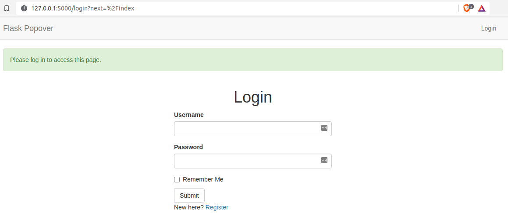

# Add Popovers To Your Flask App

On Twitter, you often see that when you hover your mouse over a user's username, the person's profile is displayed in a tiny popover. This is true for Facebook and LinkedIn as well. In this tutorial, we will learn how to add popovers to our Flask app.


You can find the completed project on this [flask popovers](https://github.com/GitauHarrison/flask-popovers) github repository.

## What We Will Do

1. Create a simple web application
2. Display user comments
3. Add user profile
4. Integrate popovers on username links

## Create a Simple Application

I have already created a simple application that we will further build on. You can follow through by checking the [start flask server](start_flask_server.md) tutorial.

## Project Requirements

We will take advantage of the following packages to build this application:

* Python3 for programming
* Flask framework
* Flask-WTF for web form creation
* Flask-Bootstrap for styling (already used)
* Flask-SQLAlchemy for database integration
* Flask-Migrate for database migrations
* Flask-Moment for displaying timestamps
* Python-dotenv for loading environment variables
* Email validator for email validation
* Flask-Login for user authentication

## Web Forms

Web forms are one of the most basic building blocks of web applications. They are used to collect data from a user and send it to the server. We will begin by installing the following package:

```python
(venv) $ pip install flask-wtf
```
This package is a simple integration of [Flask](https://flask.palletsprojects.com/en/2.0.x/) and [WTForms](https://wtforms.readthedocs.io/en/3.0.x/), including CSRF, file upload, and reCAPTCHA.

The forms we intend to create will be used to "register" and "login" users. Let us do so within the `/app` subdirectory.

```python
(venv) $ cd app
(venv) $ touch forms.py # Create an empty file
```

### Configure Environment Variables

At this point, the application is very basic and we do not have to worry about configurations. However, to work with web forms, Flask expects the `SECRET_KEY` variable to be set. We will set it to a random string.

`config.py`: Secret key for protection against CSRF
```python
import os


class Config(object):
    SECRET_KEY = os.environ.get('SECRET_KEY') or 'you-will-never-guess'
```

I have set the value of `SECRET_KEY` to be sourced from an existing environment variable. If this variable does not exist,then I provide a safe fallback value. This is to ensure that the application does not crash.

To set the value of `SECRET_KEY`, you can run the following command to generate a random value:

```python
(venv) $ python -c "import os; print(os.urandom(24))"
```

Paste the result of the above command into the `.env` file, located in the top-level directory. If you do not have a `.env` file, you can create one by running the command `touch .env`.

`.env` file: Environment variables
```txt
SECRET_KEY=b'\x11\xc40\x02ax\x1ed\x88\xc9-\xb0\xb1\xe9\xde\xef'
```
We will then need to tell our application to load the environment variables. This is done in the `__init__.py` file.

`app/__init__.py`: Register the configuration object
```python
from flask import Flask
from config import Config # < --- new


app = Flask(__name__)
app.config.from_object(Config) # < --- new


from app import routes
```

The application still needs help to load this environment variable, even though the configuration is registered in the application instance. This is done by installing the `python-dotenv` package.

```python
(venv) $ pip3 install python-dotenv
```

### Create Forms

Following the principle of _separation of concerns_, we will create a forms module that will define all the forms we want. Create an empty `forms.py` file in the `app` subdirectory.

```python
(venv) $ cd app
(venv) $ touch forms.py
```
Ensure that you are in the `app` subdirectory before creating the file.

#### Registration Form


`app/forms.py`: User registration form
```python
from flask_wtf import FlaskForm
from wtforms import StringField, PasswordField, SubmitField
from wtforms.validators import DataRequired, Email, Length, EqualTo

class RegistrationForm(FlaskForm):
    username = StringField('Username', validators=[DataRequired()])
    email = StringField('Email', validators=[DataRequired(), Email()])
    password = PasswordField(
        'Password', validators=[DataRequired(), Length(min=8, max=30)])
    confirm_password = PasswordField(
        'Confirm Password',
        validators=[
            DataRequired(), Length(min=8, max=30), EqualTo('password')
            ])
    submit = SubmitField('Submit')
```
I have used the `RegistrationForm()` class to define all the fields we want to use in our form. The `username`, `email`, `password` and `confirm_password` fields are required before submission. The `password` fields must be at least 8 characters long. The `confirm_password` field must match the `password` field.

With the `email` field in place, we have used `Email()` to validate the data entered by a user. Flask expects `email-validator` package to be installed for this validation to work. To install it, run the following command:

```python
(venv) $ pip3 install email-validator
```

To display this form, we will do so in `register.html` file. Our application currently has all templates in the `templates` subdirectory. Create an empty `register.html` file in the `templates` subdirectory.

```python
(venv) $ cd templates
(venv) $ touch register.html
```

Flask-Bootstrap provides for a quick method to create and display formatted forms using the `quick_form()` function.

`app/templates/register.html`: User registration form
```html




<div class="row">
    <div class="col-md-12 text-center">
        <h1>{{title}}</h1>
    </div>  
</div>
<div class="row">
    <div class="col-sm-4">
        <!-- Empty column -->
    </div>
    <div class="col-sm-4 my-form">
        {{ wtf.quick_form(form) }}
    </div>
    <div class="col-sm-4">
        <!-- Empty column -->
    </div>
</div>

```

With the registration template ready for display, we will create a new route to render the registration form.

`app/routes.py`: Register route
```python
from app.forms import RegistrationForm
from flask import render_template

# ...


@app.route('/register', methods=['GET', 'POST'])
def register():
    form = RegistrationForm()
    return render_template(
        'register.html',
        title='Register',
        form=form)

```

The `register()` view function is used to render the registration form. The `form` object is passed to the `quick_form()` method, without which the form won't be displayed.

Navigate to the URL `http://localhost:5000/register` to see the registration form.


#### Login Form

To authenticate users, all we will want a user to do is enter their username and password. We will create a login form where they will fill in their credentials.

`app/forms.py`: User login form
```python
# ...
from wtforms import BooleanField


class LoginForm(FlaskForm):
    username = StringField('Username', validators=[DataRequired()])
    password = PasswordField(
        'Password', validators=[DataRequired(), Length(min=8, max=30)])
    remember_me = BooleanField('Remember Me')
    submit = SubmitField('Submit')
```

Again, we need to create a `login.html` file to display the login form.

```python
(venv) $ cd templates # skip this if you are in templates/
(venv) $ touch login.html
```
Update the `login.html` file with the following:

`app/templates/login.html`: User login form
```html




<div class="row">
    <div class="col-md-12 text-center">
        <h1>{{title}}</h1>
    </div>  
</div>
<div class="row">
    <div class="col-sm-4">
        <!-- Empty column -->
    </div>
    <div class="col-sm-4 my-form">
        {{ wtf.quick_form(form) }}
    </div>
    <div class="col-sm-4">
        <!-- Empty column -->
    </div>
</div>

```
Notice how similar the design of the login template is to that of the registration template. To render it, we will create another view function to handle the login form.

`app/routes.py`: Login route
```python
# ...
from app.forms import LoginForm


@app.route('/login', methods=['GET', 'POST'])
def login():
    form = LoginForm()
    return render_template(
        'login.html',
        title='Login',
        form=form)
```

Navigate to the URL `http://localhost:5000/login` to see the login form.


To improve a user's experience when navigating through the application, let us attach a link to the registration page within the login form.

`app/templates/login.html`: Login form with link to registration page
```html




<div class="row">
    <div class="col-md-12 text-center">
        <h1>{{title}}</h1>
    </div>  
</div>
<div class="row">
    <div class="col-sm-4">
        <!-- Empty column -->
    </div>
    <div class="col-sm-4 my-form">
        {{ wtf.quick_form(form) }}
        <p>
            New here?
            <a href="{{ url_for('register') }}">Register</a>
        </p>
    </div>
    <div class="col-sm-4">
        <!-- Empty column -->
    </div>
</div>

```
Now, instead of appending "register" to the URL, a user can simply click the "Register" link to sign up.


## Working With A Database

When a user registers, we need to store their username, email and password in a database. We will also want to retrieve a user's information from a database to authenticated them before they can access their account. Flask-sqlalchemy makes it possible to work with databases in Flask. We need to install it in our virtual environment before we can create our database.

```python
(venv) $ pip3 install flask-sqlalchemy
```

I am going to use the SQLite database engine for the convinience of this tutorial. It is perfect for small applications, as each database is stored in a single file on a disk and there is no need to run a database server like MySQL and PostgreSQL.

### Configure Flask-SQLAlchemy

All our configurations are in the `config` module. We will update this module with two new items:

`config.py`: Database configuration
```python
import os

basedir = os.path.abspath(os.path.dirname(__file__))


class Config(object):
    # Form security
    SECRET_KEY = os.environ.get('SECRET_KEY') or 'you-will-never-guess'

    # Database
    SQLALCHEMY_DATABASE_URI = os.environ.get('DATABASE_URL') or \
        'sqlite:///' + os.path.join(basedir, 'app.db')
    SQLALCHEMY_TRACK_MODIFICATIONS = False
```

Flask-sqlalchemy extension takes the location of the database from `SQLALCHEMY_DATABASE_URI` environement variable. If this variable does not exist, I have provided a default database named `app.db` which will be located in the application's main directory.

Now we area ready to begin creating our application's database. Note that very time we make changes to the database, we need to run some _migrations_ to effect the changes. 
For example, if we decide that we want to add a new column to the `User` table to store the user's first name, we will need to create a new migration file. This new file will contain the new schema for the table.

The `flask_migrate` extension helps us do this. Ensure that you have installed it in your virtual environment.

```python
(venv) $ pip3 install flask-migrate
```

The database is going to represented in the application by a database instance. This is done in `__init__.py` file.

`app/__init__.py`: Database instance
```python
# ...
from flask_sqlalchemy import SQLAlchemy
from flask_migrate import Migrate

# ...
db = SQLAlchemy(app)
migrate = Migrate(app, db)

from app import routes, models
```

The structure of the database is defined in the `models` module.

### Database Models

The data that will be stored in the database will be represented by a collection of classes, usually called _models_. The ORM layer within SQLAlchemy will do the translations required to map objects created from these classes into rows in the database tables. Each model represents a single table in the database. In our case, we want to create a `User` model which will have columns such as `username`, `email` and `password`.


`app/models.py`: User model
```python
from app import db


class User(db.Model):
    id = db.Column(db.Integer, primary_key=True)
    username = db.Column(db.String(64), index=True, unique=True)
    email = db.Column(db.String(120), index=True, unique=True)
    password_hash = db.Column(db.String(128))

    def __repr__(self):
        return f'User: {self.username}'
```
The `__repr__()` method is used to print the objects of this class.

### Create Migration

With the schema in place, we need to create this table and apply the changes to the database.

```python
(venv) $ flask db init

# Output

Creating directory /home/harry/software_development/python/practice_projects/start_flask_server/migrations ...  done
Creating directory /home/harry/software_development/python/practice_projects/start_flask_server/migrations/versions ...  done
Generating /home/harry/software_development/python/practice_projects/start_flask_server/migrations/script.py.mako ...  done
Generating /home/harry/software_development/python/practice_projects/start_flask_server/migrations/alembic.ini ...  done
Generating /home/harry/software_development/python/practice_projects/start_flask_server/migrations/README ...  done
Generating /home/harry/software_development/python/practice_projects/start_flask_server/migrations/env.py ...  done
Please edit configuration/connection/logging settings in '/home/harry/software_development/python/practice_projects/start_flask_server/migrations/alembic.ini' before proceeding.
```

This command creates a _migrations_ folder in the application's main directory. All database files will be stored in this folder. If you inspect this folder, you will notice that it comes with a _versions_ subfolder. All changes we make to the database will be recorded as "versions" and they will be stored in this folder.

_Note that the `flask` command relies on the `FLASK_APP` environment variable to locate the application. Ensure that you have set it in the `.flaskenv` file._

Next, let us create our first database migration which will include a user's table that maps to our `User` model in the database.

```python
(venv) $ flask db migrate -m "user table"

# Output

INFO  [alembic.runtime.migration] Context impl SQLiteImpl.
INFO  [alembic.runtime.migration] Will assume non-transactional DDL.
INFO  [alembic.autogenerate.compare] Detected added table 'user'
INFO  [alembic.autogenerate.compare] Detected added index 'ix_user_email' on '['email']'
INFO  [alembic.autogenerate.compare] Detected added index 'ix_user_username' on '['username']'
  Generating /home/harry/software_development/python/practice_projects/start_flask_server/migrations/versions/ac423ee17380_user_table.py ...  done
```

Since this is the first migration, this command will add the entire `User` model to the migration script. Notice how Alembic has named this file `ac423ee17380_user_table.py`. This is the name of the migration.

The `flask-migrate` command does not make any changes to the database; it only generates the migration script. To apply these changes, we need to run the `flask db upgrade` command.

```python
(venv) $ flask db upgrade


# Output

INFO  [alembic.runtime.migration] Context impl SQLiteImpl.
INFO  [alembic.runtime.migration] Will assume non-transactional DDL.
INFO  [alembic.runtime.migration] Running upgrade  -> ac423ee17380, user table
```

The application we want to build will allow a user to post comments in the form of a chat conversation. The user will be the author of the comment. Each post will have the author's image, their username, the time they posted the comment, and the comment itself.


Let us expand the database to include a `Post` model and show the relationship it has with the `User` model.

`app/models.py`: Post model
```python
from app import db
from datetime import datetime


class User(db.Model):
    __table_name__ = 'users'
    id = db.Column(db.Integer, primary_key=True)
    username = db.Column(db.String(64), index=True, unique=True)
    email = db.Column(db.String(64), index=True, unique=True)
    password_hash = db.Column(db.String(128))
    posts = db.relationship('Post', backref='author', lazy='dynamic') # < --- relationship

    def __repr__(self):
        return f'Body: {self.username}'


class Post(db.Model):
    id = db.Column(db.Integer, primary_key=True)
    body = db.Column(db.String(140))
    timestamp = db.Column(db.DateTime, index=True, default=datetime.utcnow)
    user_id = db.Column(db.Integer, db.ForeignKey('user.id')) # < --- author

    def __repr__(self):
        return f'Body: {self.body}'

```

The `user_id` field is initialized as a foreign key to the `user.id` field of the `User` model, referencing the `id` field of the `User` model. Technically, this is a one-to-many relationship where one user can author several posts in the application.

> It is an unfortunate inconsistency that in some instances such as in a `db.relationship()` call, the model is referenced by the model class, which typically starts with an uppercase character, while in other cases such as this `db.ForeignKey()` declaration, a model is given by its database table name, for which SQLAlchemy automatically uses lowercase characters and, for multi-word model names, snake case.

Since we have updates in the application models, we need to generate new database migrations.

```python
(venv) $ flask db migrate -m "post table"


# Output


INFO  [alembic.runtime.migration] Context impl SQLiteImpl.
INFO  [alembic.runtime.migration] Will assume non-transactional DDL.
INFO  [alembic.autogenerate.compare] Detected added table 'post'
INFO  [alembic.autogenerate.compare] Detected added index 'ix_post_timestamp' on '['timestamp']'
  Generating /home/harry/software_development/python/practice_projects/start_flask_server/migrations/versions/3179c8a31797_post_table.py ...  done
```

This migration needs to be applied to the database:

```python
(venv) $ flask db upgrade


# Output

INFO  [alembic.runtime.migration] Context impl SQLiteImpl.
INFO  [alembic.runtime.migration] Will assume non-transactional DDL.
INFO  [alembic.runtime.migration] Running upgrade ac423ee17380 -> 3179c8a31797, post table
```

### Shell Context

You can test the applicaton by running some commands on the terminal. Since we have a database, we can create a context of the application such that we have access to the database. Typically, on a normal Python interpreter, we will have to do the following:

```python
(venv) $ python3
Python 3.8.10 (default, Nov 26 2021, 20:14:08) 
[GCC 9.3.0] on linux
Type "help", "copyright", "credits" or "license" for more information.

# Access configurations

>>> from app import app
>>> app.config['SECRET_KEY']
'you-will-never-guess'

# Access database

>>> from app import db
>>> db
<SQLAlchemy engine=sqlite:////home/harry/software_development/python/practice_projects/start_flask_server/app.db>

# Access User model

>>> from app.models import User
>>> user = User.query.all()
>>> user
[]
```
Everything will work fine but you have to explicitly import `app`, `db` and `User` model. If you try to run the above commands without properly importing the `app`, `db` and `User` model, you will get an error.

```python
(venv) $ python3
Python 3.8.10 (default, Nov 26 2021, 20:14:08)
[GCC 9.3.0] on linux
Type "help", "copyright", "credits" or "license" for more information.

# Example of error

>>> import db
Traceback (most recent call last):
  File "<stdin>", line 1, in <module>
ModuleNotFoundError: No module named 'db'
```

This is where the shell context comes in. It makes testing things out a lot easier. To begin, you have to make a shell context in your application's entry point. In the case of this tutorial, the entry point is `my_app.py`. Let us upate this file to include the following:

`my_app.py`: Flask shell context
```python
from app import app, db
from app.models import User, Post


@app.shell_context_processor
def make_shell_context():
    return dict(
        db=db,
        User=User,
        Post=Post
    )
```
The `app.shell_context_processor` decorator is a function that returns a dictionary of variables (and not a list) that will be available in the shell session every time `flask shell` is run.

Now, to easily access the database, you can run the following command in the terminal:

```python
(venv) $ flask shell

Python 3.8.10 (default, Nov 26 2021, 20:14:08) 
[GCC 9.3.0] on linux
App: app [development]
Instance: /home/harry/software_development/python/practice_projects/start_flask_server/instance

# db object

>>> db
<SQLAlchemy engine=sqlite:////home/harry/software_development/python/practice_projects/start_flask_server/app.db>

# User model

>>> user = User.query.all()
>>> user
[]
```

## User Login

A user can access their account upon registration by providing their username and password. It is very important that a user's password is kept secret at all times. Even the admin of the application should not be able to know the password of a user. It is recommended that we use a hashing algorithm to hash the password instead of storing it in plain text. A hash is a representation of a string (a user's password in this case) that is not easily decoded.

The entire hashing logic can be implemented in our `User` model.

`app/models.py`: Password hashing
```python
# ...
from werkzeug.security import generate_password_hash, check_password_hash


class User(db.Model):
    # ...

    def set_password(self, password):
        self.password_hash = generate_password_hash(password)

    def check_password(self, password):
        return check_password_hash(self.password_hash, password)
```
This methods provide a secure password verification without the application storing a user's password in its original form.

### Manage User Sessions

Flask's functionality is extended by the `flask-login` package which allows us to manage the state of a user. Before implementing the login functionality, we need to install this package:

```python
(venv) $ pip3 install flask-login
```
Then instantiate it in the application's instance, as you have seen in the previous section:

`app/__init__.py`: Login object
```python
# ...
from flask_loign import LoginManager

app = Flask(__name__)
app.config.from_object(Config)

# ...
login = LoginManager(app)
login.login_view = 'login'

# ...
```
Flask login can restrict access to certain pages to only logged in users. When this is implemented, I want a user to be redirected to the login page if they try to access a page that requires login. This is done by setting the `login_view` property of the `login` object to the name of the view function that handles the login, which in this case is `login`.


### Preparing the User Model

Since our user is found in the `User` model, we need to prepare it. Flask-login provides a mixin class called _UserMixin_ that includes generic implementations that are used by the `User` model.

`app/models.py`: Usermixin
```python
from flask_login import UserMixin


class User(UserMixin, db.Model):
    # ...
```

To keep track of a logged in user, we need to store the user's ID in the user's session. The application expects that we will configure a user loader function that can be called to load a user (by their ID).

`app/__init__.py`: User loader
```python
# ...
from app import login


@login.user_loader
def load_user(id):
    return User.query.get(int(id))
```

### Login logic

With the `User` model ready, we can now implement the login functionality.

`app/routes.py`: User login
```python
# ...
from flask import render_template, flash, redirect, url_for
from flask_login import login_user, logout_user, current_user
from app.models import User


@app.route('/login', methods=['GET', 'POST'])
def login():
    if current_user.is_authenticated:
        return redirect(url_for('index'))
    form = LoginForm()
    if form.validate_on_submit():
        user = User.query.filter_by(username=form.username.data).first()
        if user is None or not user.check_password(form.password.data):
            flash('Invalid username or password')
            return redirect(url_for('login'))
        login_user(user, remember=form.remember_me.data)
        flash(f'Welcome {user.username}')
        return redirect(url_for('index'))
    return render_template('login.html', title='Login', form=form)
```

First, I check if the user is already logged in. If so, I redirect them to the index page. Otherwise, I check if the data given through the form is valid. If the username entered does not exist in the database or the password entered does not match the password stored in the database, I flash an error message and redirect the user to the login page. However, if the user's data is accurate, I log them in and authorize access to the index page.


### Log the User Out

If user wants to logout, flask login provides a logout function that easily logs this user out of their account to protect their data.

`app/routes.py`: User logout
```python
# ...


@app.route('/logout')
def logout():
    logout_user()
    return redirect(url_for('login'))
```

To expose these links to the user, we need to update the base template's navigation bar.

```html
<div class="collapse navbar-collapse" id="bs-example-navbar-collapse-1">            
    <ul class="nav navbar-nav navbar-right">
        
            <li><a href=" {{ url_for('logout') }} ">Logout</a></li>
        
            <li><a href=" {{ url_for('login') }} ">Login</a></li>
        
    </ul>                       
</div>
```
I have used a conditional statement to check if the user is authenticated or not. You have already seen this in the `head` section of the base template. If the user is authenticated, I display the logout link. Otherwise, I display the login link.


### Flash Messages

To restrict a page, as mentioned earlier, `flask-login` provides a `login_required` decorator. This decorator is used to protect a view function from unauthorized and anonymous access. We can require a user to log in to their account before accessing the index page by adding this decorator.

`app/routes.py`: Login required
```python
# ...
from flask_login import login_required


@app.route('/')
@app.route('/index')
@login_required
def index():
    return render_template('index.html', title='Home')
```
For a better user experience, it would be nice if a message is displayed to the user telling them that they need to login first before accessing the index page. You have already seen me use the `flash()` method from flask when logging in a user. To do this, we will update our base template such that this messge is visible to all parent templates.

`app/templates/base.html`: Flash message
```html
<!-- Previous content -->


    <div class="container">
        <!-- Flash message -->
        
            
                
                    <div class="alert alert-success" role="alert">
                        {{ message }}
                    </div>
                
            
        
        <!-- End of flash message -->
        
        
    </div>


<!-- Previous content -->
```
If you click on "Flask Popover" which is a link to the index page, you will see a nice message telling the user that they first need to login in before accessing the page. And appropriately enough, the user is automatically redirected to the login page.

Notice how the login URL is appended with _?next=%2Findex_ such that the new URL becomes http://127.0.0.1:5000/login?next=%2Findex. This, by itself, if good since the user can know that the next page they will be redirected to is the index page.



### User Registration

To create a user, we first need to register them. All that is left to do now it to add the registration logic in our routes.

`app/routes.py`: User registration
```python
from app import db


@app.route('/register', methods=['GET', 'POST'])
def register():
    if current_user.is_authenticated:
        return redirect(url_for('index'))
    form = RegistrationForm()
    if form.validate_on_submit():
        user = User(
            username=form.username.data,
            email=form.email.data)
        user.set_password(form.password.data)
        db.session.add(user)
        db.session.commit()
        flash('Congratulations! Login to continue.')
        return redirect(url_for('login'))
    return render_template(
        'register.html',
        title='Register',
        form=form)
```
The user's data in appropriately stored in the database by adding him to the database session and committing the changes. The user is then redirected to the login page for authentication.


When authenticated, the user will be welcomed to the index page.


