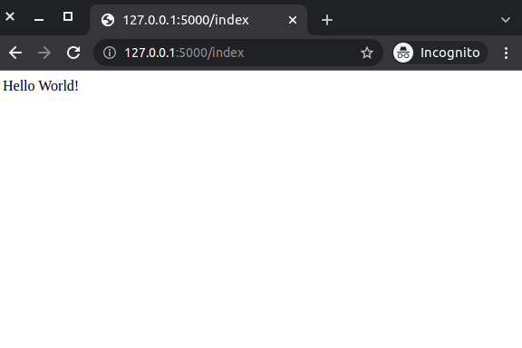
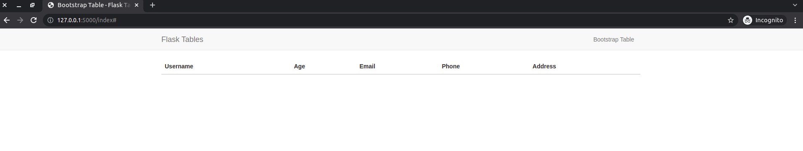
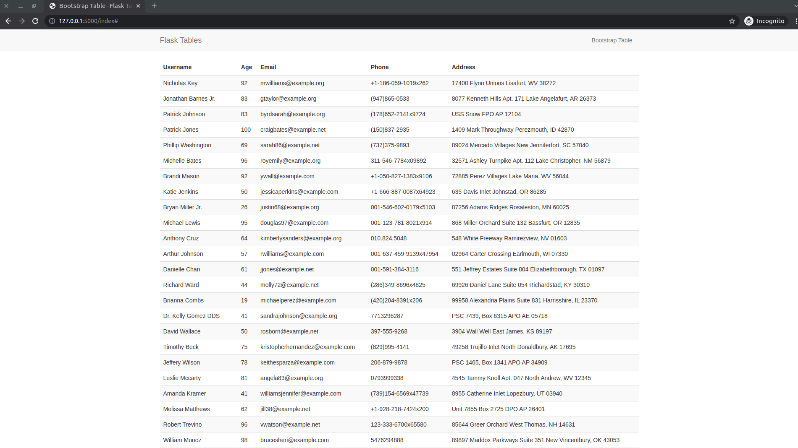

# Flask Tables

Tables are a simple way to display data in a web application. Making tables in flask templates is relatively easy. However, it becomes a bit more complicated when you want to add basic table features such as sorting, pagination and searching. These features are particularly useful when the tables contain a lot of data. In this article, I will show you how to create an interactive table. We will look at several example tables to really appreciate table interactivity.

## Basic Flask Application

Things we will do:
1. Create a basic flask application structure
2. Create and activate a virtual environment 
3. Install Flask and other extensions
4. Create a basic flask application

### Basic Flask Structure

Let us begin by creating a basic flask structure. First, we will lay out our application structure as follows:

`Application structure`
```python
tables_project
    | --- config.py
    | --- tables.py
    | --- requirements.txt
    | --- .flaskenv
    | --- app/
            | --- routes.py
            | --- models.py
            | --- errors.py
            | --- __init__.py
            | --- templates/
                    | --- base.html
                    | --- bootstrap.html
```
You can use the commands `mkdir` and `touch` to create the directory structure. For example, to create the _tables_projects_ folder, you will run the following command:

```python
$ mkdir tables_project
```

To create an empty `config.py` file in the _tables_projects_ folder, you will run the following command:

```python
$ touch tables_project/config.py 
```

### Create and Activate a Virtual Environment

With the structure out of the way, we will update our application to run a simple script that displays the classic 'Hello, World!' message. Let us activate a virtual environment and install the required packages. I will use the popular `virtualenvwrapper` to create a virtual environment.

```python
$ mkvirtualenv tables_project

# Output
(tables_project) $ 
```

The use of virtual environments helps to isolate the needs of our application from that of the rest of the system. To learn more about virtual environments and the `virtualenvwrapper`, refer to [this previous article on virtualenvwrapper](virtualenvwrapper_setup.md).

### Install Flask and Other Extensions

The extensions our application will need include Flask, and Flask-Bootstrap. To install all of them at once, we will run the following command:

```python
(tables_project) $ pip3 install flask flask-bootstrap

# Add them to the requirements.txt file
(tables_project) $ pip3 freeze > requirements.txt # From the top-level directory
```

You might be asking why aren't we using Flask SQLAlchemy for our database and Flask Migrate to handle all databse migrations? The reason for not using these is because we will create fake users. We will be able to quicky generate fake users who we can use to test our application.

### Create a Basic Flask Application

We will initialize our application in the `__init__.py` file of the `app` directory.

`__init__.py: Initialize project`
```python
from flask import Flask
from flask_sqlalchemy import SQLAlchemy
from flask_bootstrap import Bootstrap
from flask_migrate import Migrate
from config import Config


app = Flask(__name__)
app.config.from_object(Config)


db = SQLAlchemy(app)
bootstrap = Bootstrap(app)
migrate = Migrate(app, db)


from app import routes, models, errors

```

We have created objects of the extensions previously installed. One thing you may have noted is the addition of `app.config.from_object(Config)`. This is a simple way to load the configuration from the `config.py` file. We will do so below. Once everything is set up, we will import the `routes` and `models` modules. The `errors` module is used to handle errors.

Our application will have a very basic configuration setup. We will use the `Config` class to set up the configuration.

`config.py: Set up configuration`
```python
import os
basedir = os.path.abspath(os.path.dirname(__file__))


class Config(object):
    SQLALCHEMY_DATABASE_URI = 'sqlite:///' + os.path.join(basedir, 'app.db')
    SQLALCHEMY_TRACK_MODIFICATIONS = False

```

Let us now create a route to display the 'Hello, World!' message. 

`routes.py: Display message`
```python
from app import app


@app.route('/')
@app.route('/index')
def index():
    return "Hello, World!"
```

We can then create an entry point to our applicatin every time we start the flask server.

`tabes.py: Create applcation entry point`
```python
from app import app
```

Flask expects certain environment variables to be set. These variables are used when the flask server is started. The following variables are required:

`.flaskenv: Environment variables`
```python
FLASK_APP=tables.py
FLASK_ENV=development
FLASK_DEBUG=1
```

In the terminal, we can run the command `flask run` to start our flask server. You should be able to access the application at the following URL: http://127.0.0.1:5000/.



## Bootstrap Table

Displaying a table in flask is relatively easy. We will first create a base template for our application. Then we will create a template that will display the table.

`base.html: Base template`
```html



    {{  super() }}



    
        {{ title }} - Flask Tables
    
        eautiful Flask Tables
    



<nav class="navbar navbar-default">
    <div class="container">
        <div class="navbar-header">
            <button type="button" class="navbar-toggle collapsed" data-toggle="collapse" data-target="#bs-example-navbar-collapse-1" aria-expanded="false">
                <span class="sr-only">Toggle navigation</span>
                <span class="icon-bar"></span>
                <span class="icon-bar"></span>
                <span class="icon-bar"></span>
            </button>
            <a class="navbar-brand" href=" {{ url_for('index') }} ">Flask Tables</a>
        </div>
        <div class="collapse navbar-collapse" id="bs-example-navbar-collapse-1">            
            <ul class="nav navbar-nav navbar-right">
                <li><a href=" {{ url_for('index') }} ">Bootstrap Table</a></li>
            </ul>                       
        </div>
    </div>
</nav>



    <div class="container">
        
    </div>



    {{  super() }}

```

This base template defines the structure of all our pages. The `navbar` block is used to display the navigation bar. The `content` block displays the content of all the pages. If you look carefully, you can see the `app_context` blockIt is used to display the application context. This is where we will display the table upon inheriting the base template. The `scripts` block will be used to display the scripts that are required for the page (both base script and custom script in each template). The `title` block is used to display the title of the page. The `head` block is used to display the  head of the page.

### Template Inheritance

We have an empty `bootstrap.html` file within our templates sub-folder. This template will inherit all the content from the base template. We will use the `extends` tag to do so. Thereafter, we will use the `block` tag to define the content of the page, which will be our table.

`bootstrap.html: Display the table`
```html



    <div class="row">
        <div class="col-md-12">
            <table id="data" class="table table-striped">
                <thead>
                    <tr>
                        <th>Username</th>
                        <th>Age</th>
                        <th>Email</th>
                        <th>Phone</th>
                        <th>Address</th>
                    </tr>
                </thead>
                <tbody>
                    
                        <tr>
                            <td>{{ user.username }}</td>
                            <td>{{ user.age }}</td>
                            <td>{{ user.email }}</td>
                            <td>{{ user.phone }}</td>
                            <td>{{ user.address }}</td>
                        </tr>
                    
            </table>
        </div>
    </div>

```

### Displaying the Table

Within our `routes` module, we will retrieve the users from the database (which we will create and update in a section below) and display them in a table as seen in the `bootstrap.html` template.

`routes.py: Render the users table`
```python
from app import app, db
from app.models import User
from flask import render_template


@app.route('/')
@app.route('/index')
def index():
    users = User.query.all()
    return render_template('bootstrap.html', users=users, title='Bootstrap Table')
```



### Generate Content for the Table

To be able to test our application, we need to generate filler content for our table. The very first thing we will do is add a`User` model to our application.

`models.py: User table`
```python
from app import db


class User(db.Model):
    id = db.Column(db.Integer, primary_key=True)
    username = db.Column(db.String(64), index=True)
    age = db.Column(db.Integer, index=True)
    email = db.Column(db.String(120), index=True, unique=True)
    phone = db.Column(db.String(64))
    address = db.Column(db.String(256))

    def __repr__(self):
        return 'User: {}'.format(self.username)

```

This model is used by the `index` view function to display all the users in the database. `bootstrap.html` uses the `for` loop to display all users' data. At this point, however, our `User` model is empty. We will update it by generating fake users.

The [Faker](https://faker.readthedocs.io/en/master/) package is used to generate fake data. Install it in the terminal using the command `pip install faker`. Remember to add it to your `requirements.txt` file.

`create_fake_users.py: Create fake users for our database `
```python
from app import db
from app.models import User
from faker import Faker
from random import randint
import sys


def create_fake_users(total):
    fake = Faker()
    for i in range(total):
        user = User(
            username=fake.name(),
            age=randint(18, 100),
            email=fake.email(),
            phone=fake.phone_number(),
            address=fake.address()
            )
        db.session.add(user)
    db.session.commit()
    print(f'Created {total} fake users and added them to the database')


if __name__ == '__main__':
    if len(sys.argv) <= 1:
        print('Please provide the number of users as an argument')
        sys.exit(1)
    create_fake_users(int(sys.argv[1]))

```

The function `create_fake_users()` will create `total` number of users and add them to the database. This can be achieved by running the script in the terminal:

```python
(tables_project) $ python create_fake_users.py 100
```

Then you can reload your flask application on http://127.0.0.1:5000/ to see the fake users displayed in the table.



### Improving the UX of the Table

The table we have created looks nice, but with 100 fake users, it is hard to see the table. We can improve the UX of the table by adding interactive features such as pagination, sorting and searching. **Imagine if you had thousands of users do display**. This page would be a nightmare to navigate.

Welcome to [dataTable.js](https://datatables.net/). It is a great tool to create a table with a lot of features. To use it, we will update our `base.html` template to include the `dataTable.js` script.

`base.html: Add dataTables.js library`
```html



    {{  super() }}
    <link rel="stylesheet" type="text/css" href="https://cdn.datatables.net/1.10.25/css/dataTables.bootstrap5.css">



    
        {{ title }} - Flask Tables
    
        eautiful Flask Tables
    



<nav class="navbar navbar-default">
    <div class="container">
        <div class="navbar-header">
            <button type="button" class="navbar-toggle collapsed" data-toggle="collapse" data-target="#bs-example-navbar-collapse-1" aria-expanded="false">
                <span class="sr-only">Toggle navigation</span>
                <span class="icon-bar"></span>
                <span class="icon-bar"></span>
                <span class="icon-bar"></span>
            </button>
            <a class="navbar-brand" href=" {{ url_for('index') }} ">Flask Tables</a>
        </div>
        <div class="collapse navbar-collapse" id="bs-example-navbar-collapse-1">            
            <ul class="nav navbar-nav navbar-right">
                <li><a href=" {{ url_for('index') }} ">Bootstrap Table</a></li>
            </ul>                       
        </div>
    </div>
</nav>



    <div class="container">
        
    </div>



    {{  super() }}
    <script type="text/javascript" charset="utf8" src="https://code.jquery.com/jquery-3.6.0.min.js"></script>
    <script type="text/javascript" charset="utf8" src="https://cdn.datatables.net/1.10.25/js/jquery.dataTables.js"></script>
    <script type="text/javascript" charset="utf8" src="https://cdn.datatables.net/1.10.25/js/dataTables.bootstrap5.js"></script>

```

There are three scripts I have added:
- `jquery-3.6.0.min.js`: jQuery library
- `jquery.dataTables.js`: jQuery dataTables library
- `dataTables.bootstrap5.js`: jQuery dataTables library (custom logic for Bootstrap)

If you are using a different framework, you will need to change the last script accordingly.

Note that I have also added a `dataTables.bootstrap5.css` file to our `head` block. The library comes with its own custom styles.