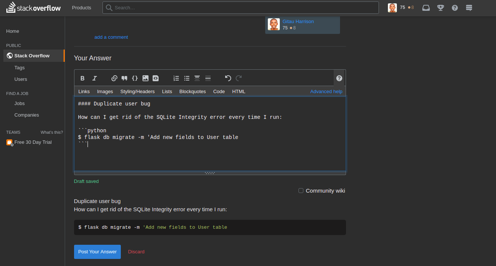
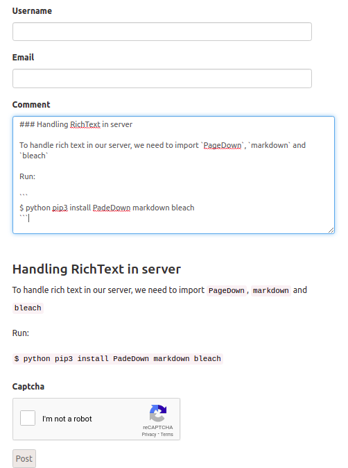

# Working with Rich Text

If you have been to [Stack Overflow](https://stackoverflow.com/), and at one point asked or answered a question, you have probaly noticed that the form used allows for markdown editing, which has a nice preview at the bottom.



You can achieve this same feature in your Flask web app. Below, you will learn how to integrate markdown preview on the client side and also how to handle rich text in the server.

### Create Your Form

Since we want to have the ability to edit a post or comment in markdown, we will need to create a Flask form. If you are not aware of how to do this, check out how you can [create one here](recaptcha.md).


### Rich Text Client Preview

> `Rich` is a Python library for writing rich text (with color and style) to the terminal, and for displaying advanced content such as tables, markdown, and syntax highlighted code.

With our form set up, there is no way that you can style your comment before it is posted. What we want to show users as they are typing their comments is something as this: 


There is a `flask-pagedown` extension we can use to enable client side markdown preview. Let us go ahead and install it:

```python
$ pip3 install flask-pagedown
```

The `flask-pagedown` extension needs to be registered in our application instance:

app/__init__.py: Register pagedown extension
```python
from flask_pagedown import PageDown

app = Flask(__name__)
pagedown = PageDown(app)
```

The Editor is supported through two Javascript files. To include these files in your HTML document, you will need to call `pagedown.html_head()` from inside the `<head>` element of your page:

app/templates/base.html: Include pagedown in template
```html

    {{ super() }}
    {{ pagedown.html_head() }}

```
The Javascript files are loaded from a CDN, the files do not need to be hosted by your application.

##### Updating Our Form wwith PageDown Field

The extesion exports a `PagDownField` which is very similar to and works exactly as `TextAreaField`:

```python
from flask_wtf import FlaskForm
from flask_pagedown.fields import PageDownField #<---------------New
from wtforms import SubmitField

class CommentForm(FlaskForm):
    username = StringField('Username', validators=[DataRequired()])
    email = StringField('Email', validators=[DataRequired(), Email()])
    comment = PageDownField('Comment', validators=[DataRequired()]) #<----------Edited
    recaptcha = RecaptchaField('Captcha')
    submit = SubmitField('Post')
```
That's it! You should be able to have a client-side comment preview right below the Comment box.

### Handling Rich Text in the Server

When the form is submitted, only the raw Markdown text is sent with the POST request; the HTML preview that is shown on the page is discarded. Sending the generated HTML preview is a security risk as an attacker can easily construct HTML sequences which don't match the markdown source and submit them. To avoid any risks, only the Markdown source text is submitted, and once in the server it is converted again to HTML using Markdown, a Python Markdown-to-HTML converter.

There are two more extensions that we can use to help us achieve this. Go ahead and install them:

```python
$ pip3 install markdown bleach
```

`bleach` allows us to sanitize the resulting HTML to ensure that only a few HTML tags are allowed. 

Comment conversion can be done in the `_comments.html` subtemplate, but it is inefficient to do it here as all comments will have to be converted every time they are rendered to a page. We get rid of this repetition by making the coversion when the data is in our database.

The HTML code for the rendered blog post is cached in a new field added to the Post model that the template can access directly. The original Markdown source is also kept in the database in case the post needs to be edited.

##### Update the Comments Table

```python
class Comment(db.Model):
    id = db.Column(db.Integer, primary_key=True)
    body = db.Column(db.String(140))
    body_html = db.Column(db.String(140)) # <----------------------------------- new
    timestamp = db.Column(db.DateTime, index=True, default=datetime.utcnow)
    user_id = db.Column(db.Integer, db.ForeignKey('user.id'))

    # new function
    @staticmethod
    def on_changed_body(target, value, oldvalue, initiator):
        allowed_tags = ['a', 'abbr', 'acronym', 'b', 'blockquote', 'code',
        'em', 'i', 'li', 'ol', 'pre', 'strong', 'ul',
        'h1', 'h2', 'h3', 'p']
        target.body_html = bleach.linkify(bleach.clean(
        markdown(value, output_format='html'),
        tags=allowed_tags, strip=True))

    def __repr__(self):
        return '<Post {}>'.format(self.body)

db.event.listen(Comment.body, 'set', Comment.on_changed_body) # <------------------new
```

The `on_changed_body()` function is registered as a listener of SQLAlchemy’s `“set”` event for body , which means that it will be automatically invoked whenever the body field is set to a new value. The handler function renders the HTML version of the body and stores it in `body_html` , effectively making the conversion of the Markdown text to HTML fully automatic.

The actual conversion is done in 3 steps:
* `markdown()` function does an initial conversion to HTML. The result is passed to `clean()` function with a list of approved HTML tags
* `clean()` function removes any tags that are not in the whitelist.
* `linkify()` function from `bleach` converts any URLs written in plain text into proper `<a>` links. Automatic link generation is not officially in the Markdown specification, but is a very convenient feature. On the client side, PageDown supports this feature as an optional extension, so linkify() matches that functionality on the server.

After these changes, we need to apply them to our database:

```python
$ flask db migrate -m 'Add new field to Comment table'
$ flask db upgrade
```

With our database updated, we will now replace `comment.body` with `comment.body_html` in the template when available:

app/templates/_comments.html: Use HTML version in post body
```html
<span> 
    
        {{ post.body_html | safe }}
    
        {{ post.body }}     
                    
</span>
```

The ` | safe` suffix when rendering the HTML body is there to tell Jinja2 not to escape the HTML elements. Jinja2 escapes all template variables by default as a security measure, but the Markdown-generated HTML was generated by the server, so it is safe to render directly as HTML.

Reload your page and try to post a new comment with markdown syntax:

