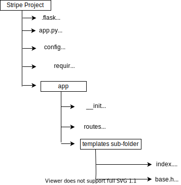
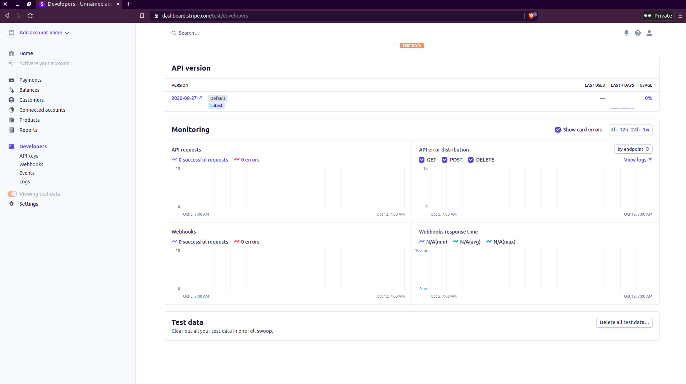
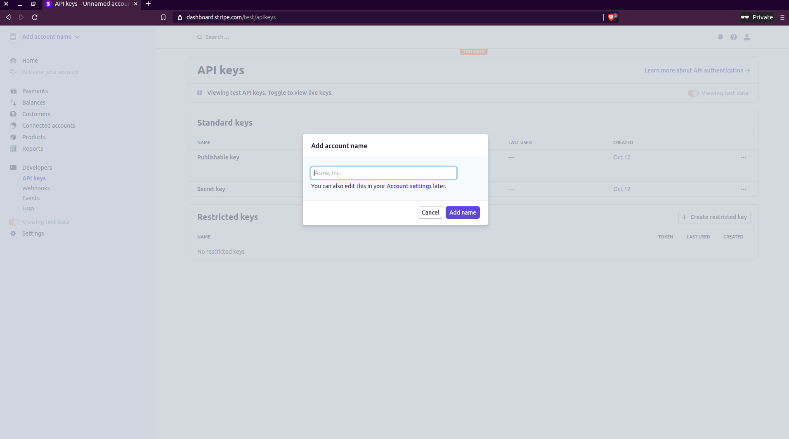
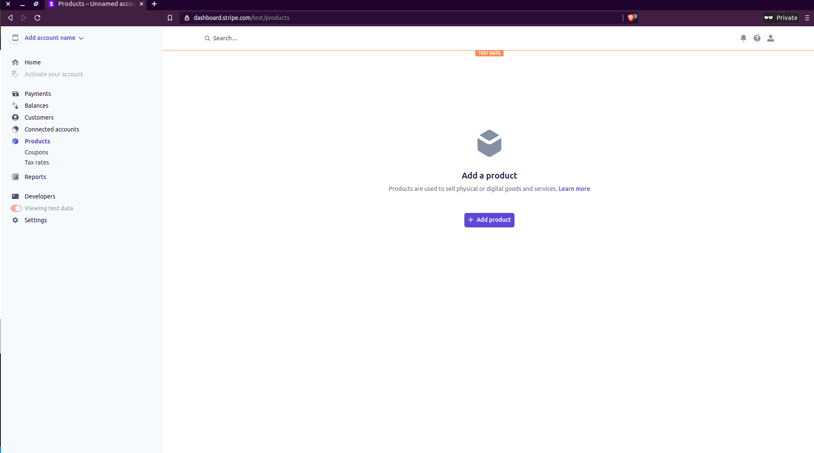
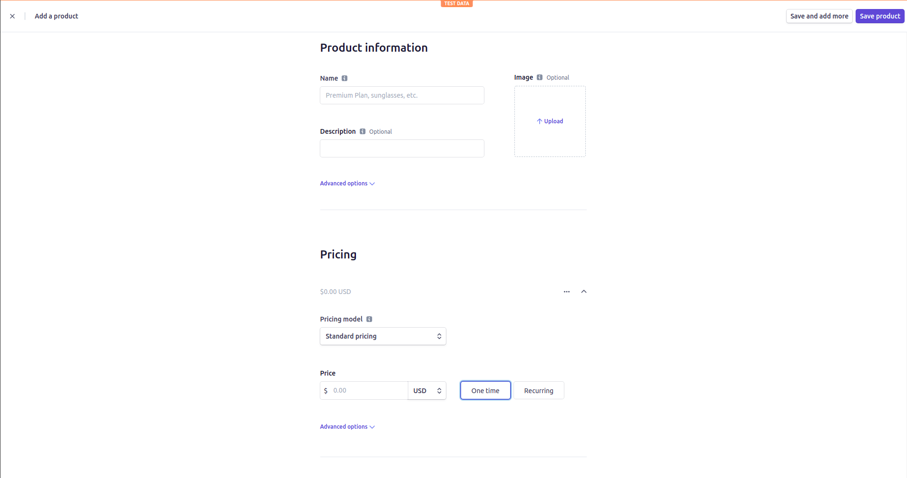
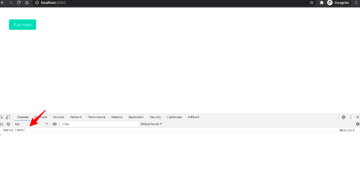
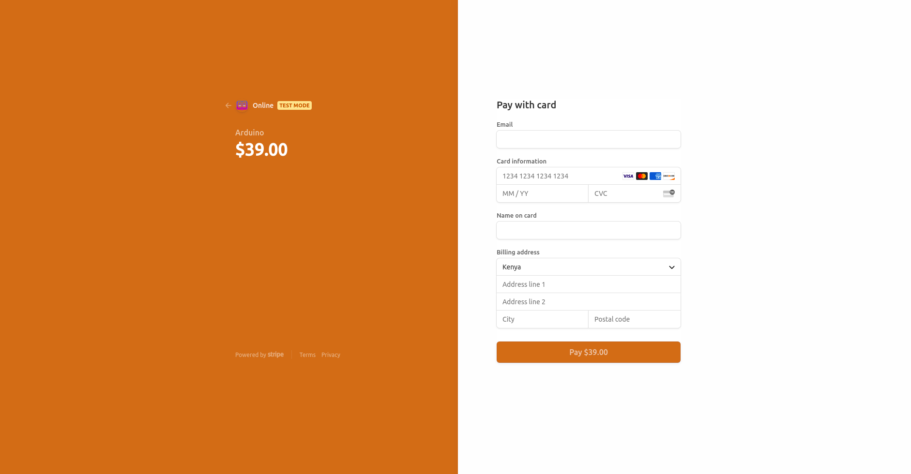
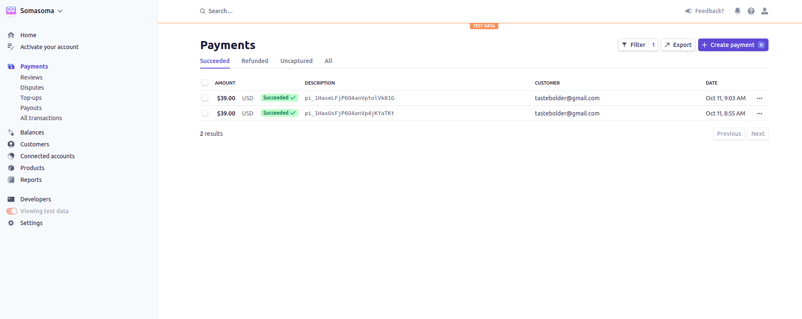
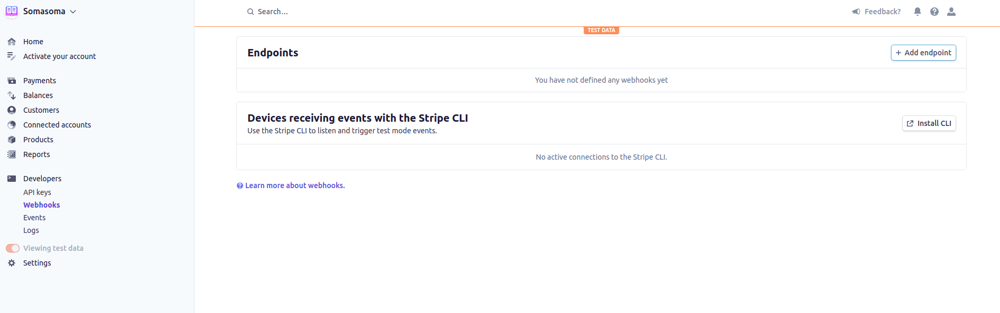

# Stripe For Payment using Python and Flask

Stripe currently has 3 payment strategies for accepting one-time payments:

1. [Charges API](https://stripe.com/docs/payments/charges-api) (legacy)
2. [Stripe Checkout](https://stripe.com/payments/checkout) (We will focus on this)
3. [Payments Intents API](https://stripe.com/docs/payments/payment-intents) 

######  Which strategy should you use?

* Use _Stripe Checkout_ if you want to get up and running fast. It provides a number of powerful features out-of-the-box, supports multiple languages, and can even be used for [recurring payments](https://stripe.com/docs/billing/subscriptions/fixed-price). Most importantly, Checkout manages the entire payment process for you, so you can begin accepting payments without even having to add a single form!
* Use the Payment Intents API (along with Elements) if you want to customize the payment experience for your end users.

###### Workflow

1. Create a project structure to hold all your project resources
2. Create a virtual environment and install `flask`
3. Initialize your app to make sure it is working well (you will display the classic 'Hello, world' message)
4. Add Stripe and its keys
5. Create a product in Stripe
6. Get your Publishable Key
7. Create a [Checkout Session](https://stripe.com/payments/checkout)
8. Redirect the user appropriately when they have checked out
9. Confirm payment with Stripe Webhooks

#### Initial SetUp

You need to create your project directory and move into it. It is important that you activate your [virtual environment](https://docs.python.org/3/tutorial/venv.html) before installing `Flask`. 

Create your project folder and move into it:

```python
$ mkdir flask-stripe-checkout && cd flask-stripe-checkout
```
Create your virtual environment:
```python
$ python3 -m venv tutorial-env
```

If you wish to use a virtualenvironment wrapper to create your virtual environment, learn how to [configure Python Environment with Virtualenvwrapper here](/virtualenvwrapper_setup.md).

Install `flask`
```python
$ pip3 install flask
```
Save your app requirements in a `requirements.txt` file as shown below
```python
$ touch requirements.txt # this will create an empyty file
$ pip3 freeze > requirements.txt
```

###### Simple Flask App Structure

So far, we already have our project folder created and it holds the `requirements.txt` file. We will add the following empty files to complete the structure for our simple app.



```python
(stripe-project)$ mkdir app
(stripe-project)$ touch app/__init__.py # This is where the application is initialized
(stripe-project)$ touch app/routes.py # All our views will be here
(stripe-project)$ touch app.py # this allows for our app to run
(stripe-project)$ touch config # all our configuration variables will be stored here
(stripe-project)$ touch .flaskenv # stores all your environment variables 
(stripe-project)$ mkdir app/templates # create a templates subfolder to hold all our template files
(stripe-project)$ touch app/templates/base.html # base structure of the app will be here
(stripe-project)$ touch app/templates/index.html # this is the primary template
```
Add the following contents to the appropriate files:

`app/__init__.py`
```python
from flask import Flask

app = Flask(__name__)

from app import routes
```

`app/routes.py`
```python
from app import app

@app.route('/')
@app.route('/index')
def index():
    return "Hello, world!"
```

`app.py`
```python
from app import app
```
###### Fire Up Your Server

**Method #1:**

Our app is set up and we need to fire our server to display _Hello, world!_. Let us set up `FLASK_APP` environment variable to import our flask app:

```python
(stripe-project)$ export FLASK_APP=app.py
(stripe-project)$ flask run

# This is what you will see:
* Serving Flask app "app"
* Running on http://127.0.0.1:5000/ (Press CTRL+C to quit)
# click on the link (or copy this http address and paste it in your browser URL bar). You should see Hello, World!
```

**Method #2:**

Since environment variables such as the one created above (I mean `FLASK_APP`) aren't remembered across terminal sessions, you may find it tedious to always have to set the `FLASK_APP` environment variable when you open a new terminal windor. 

Flask allows you to register environment variables that you want to be  automatically imported when you run `flask run` command. To use this option, you have to install the `python-dotenv` package in your activated virtual environment:

```python
(stripe-project)$ pip3 install python-dotenv
```

Register you environment variable in the top-level flaskenv file:

`.flaskenv`
```python
FLASK_APP=app.py
```
Now, all you need to do as run `flask run` and you will be able to see the output in your browser.

#### Adding Stripe

Start by installing `stripe`:

```python
(stripe-project)$ pip3 install stripe
```

[Register](https://dashboard.stripe.com/register) for a stripe account. Once you are in the dashboard, navigate to the _Developers_ menu on the left sidebar. Click on it to reveal _API Keys_.



Click on _API Keys_. 

Each Stripe account has four [API keys](https://stripe.com/docs/keys): two keys for testing and two for production. Each pair has a "secret key" and a "publishable key". Do not reveal the secret key to anyone; the publishable key will be embedded in the JavaScript on the page that anyone can see. 


Currently the toggle for "Viewing test data" in the left sidebar indicates that we're using the test keys now. That's what we want.

Now that we know where to find our API keys, we need to store them in system-wide variables within the top-level `config.py` file.

`config.py`

```python
import os

class Config(object):
    STRIPE_PUBLISHABLE_KEY=<YOUR_STRIPE_PUBLISHABLE_KEY>
    STRIPE_SECRET_KEY=<YOUR_STRIPE_SECRET_KEY>
```

Let us register our configuration in the application package:

`app/__init__.py`

```python
from flask import Flask
from config import Config # new
import stripe # new

app = Flask(__name__)
app.config.from_object(Config) # new

# new
stripe_keys = {
    "secret_key": app.config["STRIPE_SECRET_KEY"],
    "publishable_key": app.config["STRIPE_PUBLISHABLE_KEY"]
}

from app import routes
```

The configuration items can be accessed with a dictionary syntax from `app.config`. Here, you can see a quick session with the Python interpreter where I check what the value of the secret key is:

```python
>>> from app import app
>>> app.config["STRIPE_SECRET_KEY"]

# Your stripe secret key will be displayed here:
<<YOUR_STRIPE_SECRET_KEY>>
```

Finally, you will need to add an account name. Click on the top-left sidebar where it says _Add account name_. You can change the details later in your _Account settings_.



#### Create a Product

We need to create a product to sell. Click _Products_ on the left sidebar in your dashboard and _+Add Product_



Add a product name, enter your price and select _One time_, then click on _Save Product_ on the top-right corner:



#### Get Publishable Key

We will use _Javascript_. We will all a static folder which will hold our `.js` files.

```python
(stripe-project)$ mkdir app/static && mkdir app/static/js # this will create a js sub-folder in static
(stripe-project)$ touch app/static/js/main.js # empty js file
```
`app/static/js/main.js`
```js
console.log("Sanity check!") // this is just a printout
```

In your `app/routes.py`, modify the file to now render your `index.html` file. We will use the `index.html` file to display a simple _Purchase_ button:

`app/routes.py`
```python
# your previous import
from flask import render_template

@app.route('/')
def index():
    return render_template('index.html', title = 'Home')
```

Then, update your `index.html` file to contain a _Purchase_ button. You will first create a base template called `base.html` which will carry all the base presentation of your app.

`app/templates/base.html`
```html



    
        Flask-Stripe-Demo_Project | {{ title }}
     
        Welcome to Flask-Stripe-Demo_Project
    



    {{super()}}
    <link rel="icon" type="image/svg" href="{{url_for('static', filename = 'img/study.png')}}">



    {{ super() }}
    <link rel="stylesheet" type="text/css" href="{{ url_for('static', filename='css/styles.css') }}">



<!-- This is where your code will go -->



    {{ super() }}
    <script src="https://js.stripe.com/v3/"></script> 
    <script src="{{ url_for('static', filename = 'js/main.js') }}"></script>

    
```
We have linked our `main.js` file with the base template. Your actual content will go into the `block content` section in the `index.html` file.

`app/templates/index.html`
```html



  <section class="section">
    <div class="container">
      <button class="button is-primary" id="submitBtn">Purchase!</button>
    </div>
  </section>

```

Run the development server:

```python
(stripe-project)$ flask run
```

Navigate to _http://localhost:5000_, and open up the JavaScript console (ctrl +shift + I). You should see the _sanity check_:



Let us add a new route to handle the [AJAX](https://www.w3schools.com/js/js_ajax_intro.asp) request:

`app/routes.py`
```python
@app.route("/config")
def get_publishable_key():
    stripe_config = {"publicKey": stripe_keys["publishable_key"]}
    return jsonify(stripe_config)
```

##### Create an AJAX request

We will use the [Fetch API](https://developer.mozilla.org/en-US/docs/Web/API/Fetch_API) to make an AJAX request to the new route `/config` endpoint.

`app/static/main.js`

```js
// previous code

// Get Stripe publishable key
fetch("/config")
.then((result) => { return result.json(); })
.then((data) => {
  // Initialize Stripe.js
  const stripe = Stripe(data.publicKey);
});
```

A reposnse from a `fetch` request is a [ReadableStream](https://developer.mozilla.org/en-US/docs/Web/API/ReadableStream). `result.json` returns a promise, which we resolve to a Javascript object such as `data`. We use dot notation to access the `publicKey` in order to obtain the publishable key.

Now, after the page load, a call will be made to `/config`, which will respond with the Stripe publishable key. We'll then use this key to create a new instance of Stripe.js.

#### Create Checkout Session

We need to attach an event handler to the button's click event which will send another AJAX request to the server to generate a new Checkout session ID.

`app/routes.py`

```python
@app.route("/create-checkout-session")
def create_checkout_session():
    domain_url = "http://localhost:5000/"
    stripe.api_key = stripe_keys["secret_key"]

    try:
        # Create new Checkout Session for the order
        # Other optional params include:
        # [billing_address_collection] - to display billing address details on the page
        # [customer] - if you have an existing Stripe Customer ID
        # [payment_intent_data] - capture the payment later
        # [customer_email] - prefill the email input in the form
        # For full details see https://stripe.com/docs/api/checkout/sessions/create

        # ?session_id={CHECKOUT_SESSION_ID} means the redirect will have the session ID set as a query param
        checkout_session = stripe.checkout.Session.create(
            success_url=domain_url + "success?session_id={CHECKOUT_SESSION_ID}",
            cancel_url=domain_url + "cancelled",
            payment_method_types=["card"],
            billing_address_collection = 'required',
            mode="payment",
            line_items=[
                {
                    "name": "Arduino Board",
                    "quantity": 1,
                    "currency": "usd",
                    "amount": "3900",
                }
            ]
        )
        return jsonify({"sessionId": checkout_session["id"]})
    except Exception as e:
        return jsonify(error=str(e)), 403
```

* We have defined  a `domain_url` for the redirects
* Assigned the Stripe key to `stripe.api_key` so that it be sent automatically when we make a request to create a new Checkout Session
* Created the Checkout Session
* Sent the ID back in the response

`success_url` and `cancel_url` both use the `domain_url`. The user will be redirected back to those URLs in the event of a successful payment or cancellation, respectively. This will help us redirect the user appropriately.

Let us solve the `result.json` promise:

`app.static/js/main.js`

```js
console.log("Sanity check!");

// Get Stripe publishable key
fetch("/config")
.then((result) => { return result.json(); })
.then((data) => {
  // Initialize Stripe.js
  const stripe = Stripe(data.publicKey);


  // Add Event handler
  document.querySelector("#submitBtn").addEventListener("click", () => {
    // Get Checkout Session ID
    fetch("/create-checkout-session")
    .then((result) => { return result.json(); })
    .then((data) => {
      console.log(data);
      // Redirect to Stripe Checkout
      return stripe.redirectToCheckout({sessionId: data.sessionId})
    })
    .then((res) => {
      console.log(res);
    });
  });
});
```

As soon as we resolved the `result.json` promise, we called [redirectToCheckout](https://stripe.com/docs/js/checkout/redirect_to_checkout) method with the Checkout Session ID from the resolved promise.

Navigate to http://localhost:5000. Click the button and you should be redirected to an instance of the Stripe Checkout (a Stripe-hosted page to securely collect payment information) with your Product infomation:



(My form is slightly modified and branded to have the orange-ish color)

Stripe provides us with several [test card numbers](https://stripe.com/docs/testing#cards). Pick one, depending on your region and fill in the form:

* Provide a valid email address
* Enter a test card number
* Provide any expiration date 
* Provide any three-digit CVC number
* Provide any name
* Enter a random postal code and billing address

If all goes well, the payment should be processed. Nothing will happen after a successful process because we have not set a `/success` redirect yet. So, below that is what we will do.

#### Redirecting User Appropriately

We will now add routes for successful payment processing or any cancellation. 

`app/templates/success.html`

```html




  <section class="section">
    <div class="container">
      <p>Your payment succeeded.</p>
      <p><a href="{{ url_for('index') }}">Back to home page</a></p>
    </div>
  </section>

```

`app/templates/cancel.html`

```html




  <section class="section">
    <div class="container">
      <p>Your payment was cancelled.</p>
      <p><a href="{{ url_for('index') }}">Back to home page</a></p>
    </div>
  </section>

```

With the addition of these templates, we need to create routes that will handle them:

`app/routes.py`

```python
@app.route('/success')
def success():
return render_template('success.html', title = 'Success')

@app.route('/cancel')
def success():
return render_template('cancel.html', title = 'Cancel')
```

When you submit your payment by clicking on the payment button again from http://localhost:5000, you should be redirected back to  http://localhost:5000/success.

You can confirm that the payment was actually successful by clicking on _Payments_ on your Stripe dashboard:



You can test out `/cancel` by clicking on the back arrow in the Stripe payment form. You should be redirected appropriately.


#### Configure Payments with Stripe Webhooks

Our app works well at this point, but we still can't programmatically confirm payments and perhaps run some code if a payment was successful. We already redirected the user to the success page after they check out, but we can't rely on that page alone since payment confirmation happens asynchronously.

One of the easiest ways to get notified when the payment goes through is to use a callback called [Stripe webhook](https://stripe.com/docs/webhooks). We'll need to create a simple endpoint in our application, which Stripe will call whenever an event occurs (i.e., when a user buys an Arduino). By using webhooks, we can be absolutely sure the payment went through successfully.


> There are two types of events in Stripe and programming in general: Synchronous events, which have an immediate effect and results (e.g., creating a customer), and asynchronous events, which don't have an immediate result (e.g., confirming payments). Because payment confirmation is done asynchronously, the user might get redirected to the success page before their payment is confirmed and before we receive their funds.

We need to do three things in order to use webhooks:
1. Set up a webhook endpoint
2. Test the endpoint using the [Stripe CLI](https://stripe.com/docs/stripe-cli)
3. Register the endpoint with Stripe

###### Endpoint

Whenever a payment goes through successfully, we will print a message.

`app/routes.py`

```python
from flask import request
# Your previous code

@app.route("/webhook", methods=["POST"])
def stripe_webhook():
    payload = request.get_data(as_text=True)
    sig_header = request.headers.get("Stripe-Signature")

    try:
        event = stripe.Webhook.construct_event(
            payload, sig_header, stripe_keys["endpoint_secret"]
        )

    except ValueError as e:
        # Invalid payload
        return "Invalid payload", 400
    except stripe.error.SignatureVerificationError as e:
        # Invalid signature
        return "Invalid signature", 400

    # Handle the checkout.session.completed event
    if event["type"] == "checkout.session.completed":
        print("Payment was successful.")
        # TODO: you can run some custom code here

    return "Success", 200
```

`stripe_webhook` function now serves our webhook endpoint. Here, we are only looking for `checkout.session.completed` events which are called whenever a checkout is successful. You can use the same pattern for other [Stripe Events](https://stripe.com/docs/api/events).

###### Test Your Webhook

We will use the Stripe CLI to test our webhook. Run the following command:

```python
(stripe-project)$ stripe login

# Your output
our pairing code is: cushy-classy-fast-shiny
This pairing code verifies your authentication with Stripe.
Press Enter to open the browser (^C to quit)
```

Press `Enter` to continue. Allow access from your pop-up Stripe browser tap and return to your terminal. You should see something similar to:

```python
> Done! The Stripe CLI is configured for Bolder Learner with account id <ACCOUNT_ID>

Please note: this key will expire after 90 days, at which point you'll need to re-authenticate.
```

We will then start to listen to Stripe events and forward them to our endpoint using the command:

```python
(stripe-project)$ stripe listen --forward-to localhost:5000/webhook
```

This will generate a webhook signing secret:

```python
Ready! Your webhook signing secret is whsec_<your-signing-secret> (^C to quit)
```

Add the signing secret to your `config.py` file then update your `_init_.py`:

`config.py`
```python
class Config(object):
  # Your previous code
  STRIPE_ENDPOINT_SECRET='<your-actual-end-point-signing-secret>'
```

`app/_init_.py`
```python
stripe_keys = {
    "secret_key": app.config["STRIPE_SECRET_KEY"],
    "publishable_key": app.config["STRIPE_PUBLISHABLE_KEY"],
    "endpoint_secret": app.config["STRIPE_ENDPOINT_SECRET"], # new
}
```

Stripe will now forward events to our endpoint. Once again, test for a successful payment. You should see the message `Payment was successful`

At this point, you can stop the `stripe listen --forward-to localhost:5000/webhook` process.

##### Register Your Endpoint

After deploying your app, you can register your endpoint in the stripe dashboard under _Developer > Webhooks_. Click on the button _Add Enpoint_.



In production, you'll need to have HTTPS so your connection is secure. You'll probably want to store the domain_url as an environment variable as well. Finally, it's a good idea to confirm that the correct product and price are being used in the `/create-checkout-session` route before creating a Checkout Session:

1. Add each of your products to a database.
2. Then, when you dynamically create the product page, store the product database ID and price in data attributes within the purchase button.
3. Update the /create-checkout-session route to only allow POST requests.
4. Update the JavaScript event listener to grab the product info from the data attributes and send them along with the AJAX POST request to the /create-checkout-session route.
5. Parse the JSON payload in the route handler and confirm that the product exists and that the price is correct before creating a Checkout Session.
