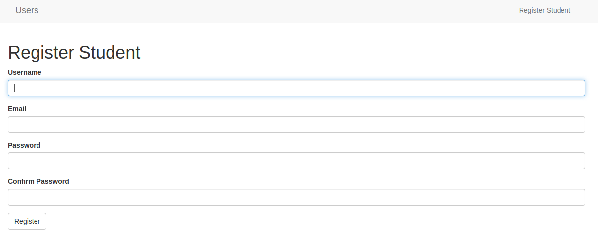
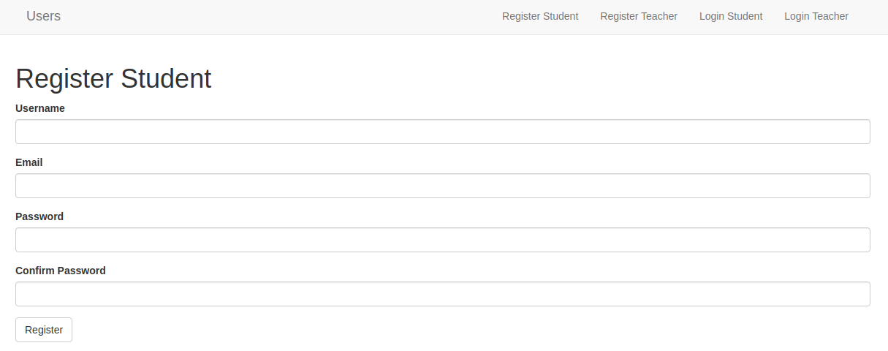

# Load Users in Different Database Tables in a Flask Application

_This article features my early struggles in understanding how to work with multiple database users. Once I learnt how to [work with joined table inheritance](joined_table_inheritance.md), I appreciated the support SQLAlchemy provides to solve this. Anyways, if you would like to read more on where I begun from, continue reading._

Imagine you have a database table of students and another database table of teachers. Let us imagine again that the application we are interested in building should be able to load all the students and all the teachers, separately. How do you go about it? 

I struggled with this problem for quite a while during my initial days of learning Flask. I knew how to load all students, and say, all their posts. However, when the need to create a teachers table came up, I fambled, and failed. Several months down the line, I revisited this concept with the  courage that I could figure it out. And this tutorial is the outcome of that effort.

## What We Will Do

1. Create a simple flask application
2. Add students to the application
3. Add teachers to the application
4. Load all students and teachers

## Getting Started

I have already created a simple application. You can browse [this GitHub repository](https://github.com/GitauHarrison/starting-a-flask-server) to learn more. We will build on it moving forward.

## Working with Web Forms

Web forms are used to collect user information from a web application. We are going to create two types of users: students and teachers. This means that we will need to create a registration form for each user type. Upon successful registration, each user should be able to log into their own account.

Flask provides us with the `flask-wtf` package that allows for the creation of webforms. We will need to install it in our virtual environment.

```python
(venv) $ pip3 install flask-wtf
```

### Create a Registration Form

Following the principle of _separation of concerns_, we will create a `forms` module which will hold all the forms our application will need. Inside `app/` subfolder, create an empty form called `forms.py`.

```python
(venv) $ touch app/forms.py
```

We will begin by creating a registration form. This form will collect the same information from both students and teachers.

`forms.py: Create a Registration Form`
```python

from flask_wtf import FlaskForm
from wtforms import StringField, PasswordField, SubmitField
from wtforms.validators import DataRequired, Length, Email, EqualTo


class RegisterForm(FlaskForm):
    username = StringField('Username', validators=[DataRequired(), Length(min=3, max=20)])
    email = StringField('Email', validators=[DataRequired(), Email()])
    password = PasswordField('Password', validators=[DataRequired()])
    confirm_password = PasswordField('Confirm Password', validators=[DataRequired(), EqualTo('password')])
    submit = SubmitField('Register')
```

`Flask-wtf` provides several fields and validators that we have used to create the registration form. The first is the `StringField` which is used to collect a string of characters. Same to the `PasswordField` . The `SubmitField` is used to submit the form. The `EqualTo` validator is used to compare the value of the password field to the value of the confirm password field. `DataRequired` ensures that the field is not empty, otherwise clicking the submit button won't work.

### Display the Registration Form

Within the `app/templates` folder, we will create a `register.html` file. This file will contain the registration form. I will use `flask-bootstrap` to create a quick form.

```html




<div class="row">
    <div class="col-sm12">
        <h1>{{ title }}</h1>
        <p>
            {{ wtf.quick_form(form) }}
        </p>
    </div>
</div>

```

In a single line of code, we are able to display the registration form. We have used the `wtf.quick_form` macro to create the form. The `wtf.quick_form` function takes in a form as an argument. We will use the `form` variable to store the form. The good thing here is that our form has all the styles needed to look good, thanks to the Bootstrap framework.

### Render the Registration Form

To see this form, we will need to create a route that will render the registration form. First, we will create a registration route that handles the registration of a student. Then  we will create a route that handles the registration of a teacher.

`routes.py: Create a Registration Route`
```python
# ...
from app.forms import RegisterForm


# ...
@app.route('/register/student', methods=['GET', 'POST'])
def register_student():
    form = RegisterForm()
    return render_template(
        'register.html',
        title='Register Student',
        form=form
        )
```

To easily access this view function, we will need to update our navigation bar in `base.html` to include a link to student registration.

`base.html: Link to Student Registration`
```html

<nav class="navbar navbar-default">
    <div class="container">
        <div class="navbar-header">
            <button type="button" class="navbar-toggle collapsed" data-toggle="collapse" data-target="#bs-example-navbar-collapse-1" aria-expanded="false">
                <span class="sr-only">Toggle navigation</span>
                <span class="icon-bar"></span>
                <span class="icon-bar"></span>
                <span class="icon-bar"></span>
            </button>
            <a class="navbar-brand" href=" # ">Users</a>
        </div>
        <div class="collapse navbar-collapse" id="bs-example-navbar-collapse-1">            
            <ul class="nav navbar-nav navbar-right">
                <li><a href=" {{ url_for('register_student') }} ">Register Student</a></li>
            </ul>                       
        </div>
    </div>
</nav>

```

If you try to access the registration page at this point, you will be greeted with a `RuntimeError` because we have not provided a secret key. All webforms require a secret key to prevent cross site scripting attacks. We will need to create a secret key in `config.py`.

`config.py: Create a Secret Key`
```python
import os


class Config(object):
    # Form
    SECRET_KEY = os.environ.get('SECRET_KEY') or 'you-will-never-guess'

```
We are sourcing the value of the `SECRET_KEY` from an environment variable. If the variable is not set, we will use the string `you-will-never-guess`. This is just a safe fallback to ensure that the application does not crash in case the `SECRET_KEY` value is missing. To add this enviroment variable, we will do so in the `.env` file. Create this file in the top-level directory of our application.

```python
(venv) $ touch .env
```

Update the `.env` file with the following content:

```text
SECRET_KEY=b'\xa4\x87\xd9%U\xa5@$\x1frs\x125\x9f\xe4:'
```

As the name suggests, this value should be secret, and hard to guess. I was able to obtain this value by running the following command in the terminal:

```python
(venv) $ python3 -c "import os; print(os.urandom(16))"
```

The next step will be to register this configuration module within the application instance.

`__init__.py: Register the Configuration Module`
```python
# ...
from config import Config

# ...
app.config.from_object(Config)

# ...
```


Now, reloading the application in your browser will display the registration form.



To register a teacher, we will need to create a route that handles the registration of a teacher. We will use the same template as the student registration route. Why so? Can't we use the same route if the template is the same? That will be discussed in subsequent sections.

`route.py: Teacher Registration Route`
```python
# ...
@app.route('/register/teacher', methods=['GET', 'POST'])
def register_teacher():
    form = RegisterForm()
    return render_template(
        'register.html',
        title='Register Teacher',
        form=form
        )
```

Add a link in the navigation bar to the teacher registration page.

`base.html: Add a Link to Teacher Registration`
```html
<!-- Previous code -->

<nav class="navbar navbar-default">
    <div class="container">
        <div class="navbar-header">
            <button type="button" class="navbar-toggle collapsed" data-toggle="collapse" data-target="#bs-example-navbar-collapse-1" aria-expanded="false">
                <span class="sr-only">Toggle navigation</span>
                <span class="icon-bar"></span>
                <span class="icon-bar"></span>
                <span class="icon-bar"></span>
            </button>
            <a class="navbar-brand" href=" # ">Users</a>
        </div>
        <div class="collapse navbar-collapse" id="bs-example-navbar-collapse-1">            
            <ul class="nav navbar-nav navbar-right">
                <li><a href=" {{ url_for('register_student') }} ">Register Student</a></li>
                <li><a href=" {{ url_for('register_teacher') }} ">Register Teacher</a></li>
            </ul>                       
        </div>
    </div>
</nav>

```

## Working With a Database

Once a student or a teacher has registered we will need to store that information in a database. This will allow the application to remember the user's information during their subsequent visit.

Let us begin by installing two packages that will allow us to work with a database.

```python
(venv) $ pip3 install flask-sqlalchemy flask-migrate
```
`Flask-sqlalchemy` is a popular Object Relational Mapper (ORM) for SqlAlchemy. Instead of using raw SQL commands to interact with the database, this package uses high-level classes, objects and methods.

`Flask-migrate`, on the other hand, is used to manage the database. Should there be any change to the database tables, then `flask-migrate` is responsible for creating and managing these migrations.

### Register Database Packages

Just like the other packages, ensure that register them in the application instance.

`__init__.py: Register the Database Packages`
```python
# ...
from flask_sqlalchemy import SQLAlchemy
from flask_migrate import Migrate


# ...
db = SQLAlchemy(app)
migrate = Migrate(app, db)

# ...
from app import models # <--- update
```

### Configure the Database

Before we can create our database, let us create some configurations that will be needed by the application in order to work with our database of choice, SQLite.

`config.py: Create the Database Configuration`
```python
import os

basedir = os.path.abspath(os.path.dirname(__file__))


class Config(object):
    # Database
    SQLALCHEMY_DATABASE_URI = os.environ.get('DATABASE_URL') or\
        'sqlite:///' + os.path.join(basedir, 'app.db')
    SQLALCHEMY_TRACK_MODIFICATIONS = False
```
SQLite is perfect for the needs of our application at the moment. It if convinient to use with applications that are small and simple. However, if we were to use this application with a larger scale application, we would want to use a database that is more suitable and robust for larger scale applications.

### Create the Database
Now we can create a `models.py` file in the `app` sub-directory to define our database.

```python
(venv) $ touch app/models.py
```
`models.py: Define the Database Model`
```python

from app import db


class Student(db.Model):
    id = db.Column(db.Integer, primary_key=True)
    username = db.Column(db.String(64), index=True, unique=True)
    email = db.Column(db.String(120), index=True, unique=True)
    password_hash = db.Column(db.String(128))

    def __repr__(self):
        return f'Student: {self.username}'

```

We have defined a `Student` model with four columns. The first column is always an `id` of type Integer. The other three columns are strings. It is recommended to not store a user's password in its original form. Rather, it should be stored as a hash, a representation of itself. This is an additional security measure in the event that the database is compromised and the users' information is expose.

### Apply the Changes Made to the Database

Since we have just defined a new model, we need to apply this change by creating a migration script for the student. On our terminal, let us run the following commands:

```python
(venv) $ flask db init

# Output
Creating directory /home/harry/software_development/python/current_projects/load_multiple_users/migrations ...  done
  Creating directory /home/harry/software_development/python/current_projects/load_multiple_users/migrations/versions
  ...  done
  Generating /home/harry/software_development/python/current_projects/load_multiple_users/migrations/script.py.mako ...  done
  Generating /home/harry/software_development/python/current_projects/load_multiple_users/migrations/alembic.ini ...  done
  Generating /home/harry/software_development/python/current_projects/load_multiple_users/migrations/README ...  done
  Generating /home/harry/software_development/python/current_projects/load_multiple_users/migrations/env.py ...  done
  Please edit configuration/connection/logging settings in
  '/home/harry/software_development/python/current_projects/load_multiple_users/migrations/alembic.ini' before
  proceeding.
```

This command will create a _migrations_ folder in the application's top-level directory. All database migrations scripts will be stored in this folder. 

Next is to create a migration script for the student. This script will contain all the details of the student table.

```python
(venv) $ flask db migrate -m "student table"

# Output
INFO  [alembic.runtime.migration] Context impl SQLiteImpl.
INFO  [alembic.runtime.migration] Will assume non-transactional DDL.
INFO  [alembic.autogenerate.compare] Detected added table 'student'
INFO  [alembic.autogenerate.compare] Detected added index 'ix_student_email' on '['email']'
INFO  [alembic.autogenerate.compare] Detected added index 'ix_student_username' on '['username']'
  Generating /home/harry/software_development/python/current_projects/load_multiple_users/migrations/versions/92f4003438
  7a_students_table.py ...  done
```

You will notice that the file `app.db`, defined in our configurations, is created in the top-levle directory. Inspecting the _migrations_ folder, you will see a new sub-folder called _versions_. This folder will contain all the migration scripts that we will create. You will notice that a script called _92f4003438
  7a_students_table.py_ has been added. The number _92f4003438
  7a_ will be different in your case.

To apply these changes, we will need to run the following command:

```python
(venv) $ flask db upgrade

# Output
INFO  [alembic.runtime.migration] Context impl SQLiteImpl.
INFO  [alembic.runtime.migration] Will assume non-transactional DDL.
INFO  [alembic.runtime.migration] Running upgrade  -> 92f40034387a, students table
(load_multiple_users) harry@harry:~/software_development/python/current_projects/lo
```

**Remember that for you to use the command `flask`, you need to be in the top-level directory of the application.**

We need to do the same for the teacher table.

`models.py: Teacher Model`
```python
# ...

class Teacher(db.Model):
    id = db.Column(db.Integer, primary_key=True)
    username = db.Column(db.String(64), index=True, unique=True)
    email = db.Column(db.String(120), index=True, unique=True)
    password_hash = db.Column(db.String(128))

    def __repr__(self):
        return f'Teacher: {self.username}'
```

Since this is a change to our database, we need to create a migration script for the teacher table.

```python
(venv) $ flask db migrate -m "teacher table"


# Output
INFO  [alembic.runtime.migration] Context impl SQLiteImpl.
INFO  [alembic.runtime.migration] Will assume non-transactional DDL.
INFO  [alembic.autogenerate.compare] Detected added table 'teacher'
INFO  [alembic.autogenerate.compare] Detected added index 'ix_teacher_email' on '['email']'
INFO  [alembic.autogenerate.compare] Detected added index 'ix_teacher_username' on '['username']'
  Generating /home/harry/software_development/python/current_projects/load_multiple_users/migrations/versions/07e7001b07
  bd_teachers_table.py ...  done
```

Then apply the changes to the database:

```python
(venv) $ flask db upgrade


# Output
INFO  [alembic.runtime.migration] Context impl SQLiteImpl.
INFO  [alembic.runtime.migration] Will assume non-transactional DDL.
INFO  [alembic.runtime.migration] Running upgrade 92f40034387a -> 07e7001b07bd, teachers table
```

That's it! We have now created a database with two tables, `Student` and `Teacher`.

### Flask Shell

Sometimes, you may want to test the application in the shell. This is where you activate the Python interpreter in the context of the application. Typically, to activate a Python interpreter, you will need to run `python3` in the terminal. However, if you want to access the database objects for example, you will need to run `flask shell`. This is made possible by the `flask shell_context_processor` function.

`multiple_users.py: Shell context processor`
```python
from app import app, db
from app.models import Student, Teacher


@app.shell_context_processor
def make_shell_context():
    return dict(
        db=db,
        Student=Student,
        Teacher=Teacher
        )
```

To test the application in the shell, run the following command:

```python
(venv) $ flask shell

# Output
Python 3.8.10 (default, Nov 26 2021, 20:14:08) 
[GCC 9.3.0] on linux
App: app [development]
Instance: /home/harry/software_development/python/current_projects/load_multiple_users/instance
```

Try accessing the `db`object:

```python
>>> db
<SQLAlchemy engine=sqlite:////home/harry/software_development/python/current_projects/load_multiple_users/app.db>
```

In a normal Python interpreter, this would not be possible:

```python
(venv) $ python3

# Output
Python 3.8.10 (default, Nov 26 2021, 20:14:08) 
[GCC 9.3.0] on linux
Type "help", "copyright", "credits" or "license" for more information.

>>> db
Python 3.8.10 (default, Nov 26 2021, 20:14:08) 
[GCC 9.3.0] on linux
Type "help", "copyright", "credits" or "license" for more information.
```

## Managing User Sessions

`Flask-login` is a flask package that allows us to manage user sessions. We need to install it in our application.

```python
(venv) $ pip3 install flask-login
```

Create a `flask-login` object in the application instance as was with the other packages.

`__init__.py: Initialize Flask-Login`
```python
# ...
from flask_login import LoginManager

# ...
login = LoginManager(app)
login.login_view = 'login'

# ...
```

### Creating a Password Hash

As mentioned earlier, it is not a good idea to store a user's password in the database. Instead, we will use a password hashing algorithm to store the password.

We will do a random test to see if we can create a password hash. In the terminal, activate the python shell in the context of the application:

```python
(venv) $ flask shell

>>> from werkzeug.security import generate_password_hash, check_password_hash
>>> hash = generate_password_hash('test')
>>> hash

# Output
'pbkdf2:sha256:260000$QT9jZ6D3a9qmEUBp$a56b0251f63aee5ace44bed2f36e21570c0e95ede52711d4449d7d929ece3f28'

>>> check_password_hash(hash, 'test')

# Output
True

>>> check_password_hash(hash, 'wrong')

# Output
False
```

The entire password hashing logic can be implemented in the `models.py` file as two functions for both `Student` and `Teacher`.

`models.py: Password Hashing`
```python
# ...
from werkzeug.security import generate_password_hash, check_password_hash

# ...

class Student(db.Model):
    # ...

    def set_password(self, password):
        self.password_hash = generate_password_hash(password)

    def check_password(self, password):
        return check_password_hash(self.password_hash, password)


class Teacher(db.Model):
    # ...

    def set_password(self, password):
        self.password_hash = generate_password_hash(password)

    def check_password(self, password):
        return check_password_hash(self.password_hash, password)
```

### Flask Login Properties

`Flask-login` expects certain properties to be implemented. There are four required items that we need to implement:

1. `is_authenticated`: This is a boolean property that indicates whether the user is authenticated (`True`) or not(`False`).
2. `is_active`: This is a boolean property that indicates whether the user is active (`True`) or not(`False`).
3. `is_anonymous`: This is a boolean property that indicates whether the user is anonymous (`True`) or not(`False`).
4. `get_id`: This is a method that returns the user's id.

`Flask-login` provides a _mixin_ class called `UserMixin` that provides these properties. We will use this mixin class to implement the properties for our `Student` and `Teacher` classes.

`models.py: User Mixin`
```python
# ...
from flask_login import UserMixin


class Student(UserMixin, db.Model):
    # ...


class Teacher(UserMixin, db.Model):
    # ...
```

### Load a User

At the moment, `Flask-login` knows nothing about databases. We need to tell it how to load a user from the database. Given a user ID, each user can be loaded from the database.

`models.py`
```python
# ...
from app import login


@login.user_loader
def load_student(id):
    return Student.query.get(int(id))


@login.user_loader
def load_teacher(id):
    return Teacher.query.get(int(id))

# ...
```

The ID passed to the function is string, so we need to convert it to an integer using the `int()` function.

### Add a User

Before a user can log in, they need to register. Let us update our registration routes to store a user's information in the database.

`routes.py: Add user to the database`
```python
from app import db
# ...


@app.route('/register/student', methods=['GET', 'POST'])
def register_student():
    form = RegisterForm()
    if form.validate_on_submit():
        student = Student(
            username=form.username.data,
            email=form.email.data
            )
        student.set_password(form.password.data)
        db.session.add(student)
        db.session.commit()
        flash('Congratulations, you are now a registered student!')
        return redirect(url_for('login_student'))
    return render_template(
        'register.html',
        title='Register Student',
        form=form
        )


@app.route('/register/teacher', methods=['GET', 'POST'])
def register_teacher():
    form = RegisterForm()
    if form.validate_on_submit():
        teacher = Teacher(
            username=form.username.data,
            email=form.email.data
            )
        teacher.set_password(form.password.data)
        db.session.add(teacher)
        db.session.commit()
        flash('Congratulations, you are now a registered teacher!')
        return redirect(url_for('login_teacher'))
    return render_template(
        'register.html',
        title='Register Teacher',
        form=form
        )
```

### Logging Users In

To begin, we will create login routes for both `Student` and `Teacher`. 

`routes.py: Login Routes`
```python
# ...
from flask import render_template, flash, redirect, url_for, request
from flask_login import login_user, logout_user, current_user, login_required
from app.forms import LoginForm
from app.models import Student, Teacher


@app.route('/login/student')
def login_student():
    if current_user.is_authenticated:
        return redirect(url_for('index'))
    form = LoginForm()
    if form.validate_on_submit():
        student = Student.query.filter_by(username=form.username.data).first()
        if student is None or not student.check_password(form.password.data):
            flash('Invalid username or password')
            return redirect(url_for('login_student'))
        login_user(student, remember=form.remember_me.data)
        return redirect(url_for('index'))
    return render_template(
        'login.html',
        title='Login Student',
        form=form
        )


@app.route('/login/teacher')
def login_teacher():
    if current_user.is_authenticated:
        return redirect(url_for('index'))
    form = LoginForm()
    if form.validate_on_submit():
        teacher = Teacher.query.filter_by(username=form.username.data).first()
        if teacher is None or not teacher.check_password(form.password.data):
            flash('Invalid username or password')
            return redirect(url_for('login_teacher'))
        login_user(teacher, remember=form.remember_me.data)
        return redirect(url_for('index'))
    return render_template(
        'login.html',
        title='Login Teacher',
        form=form
        )


@app.route('/logout/student')
def logout_student():
    logout_user()
    return redirect(url_for('login_student'))


@app.route('/logout/teacher')
def logout_teacher():
    logout_user()
    return redirect(url_for('login_teacher'))

```

If the user is authenticated, he will automatically be redirected to the `index` page. If not, the user will be required to fill in the correct credentials to access his account. I have used the `flash()` function to display a friendly user feedback if the login attempt is unsuccessful.

Remember that we have used the `login_required` decorator to protect the respective _index_ pages of users. However, with all the changes we have made, we need to update the `login.login_view` property in the application's instance to reflect the changes.

`__init__.py: Update login.login_view`
```python
# ... 

login.login_view = 'login_student'
login.login_view = 'login_teacher'
```

### Login Form

Our login form will be a simple form with two fields: `username` and `password`.

`forms.py: Login Form`
```python
class LoginForm(FlaskForm):
    username = StringField('Username', validators=[DataRequired()])
    password = PasswordField('Password', validators=[DataRequired()])
    remember_me = BooleanField('Remember Me')
    submit = SubmitField('Login')

```

### Login Template

Just like the registration template, we will use `flask-bootstrap`'s `wtf.quick_form` to create a login form. First, create an empty `login.html` file.

```python
(venv) $ touch app/templates/login.html
```

Then update it with the following code:

`login.html: Display Login Form`
```html




<div class="row">
    <div class="col-sm12">
        <h1>{{ title }}</h1>
        <p>
            {{ wtf.quick_form(form) }}
        </p>
    </div>
</div>

```

### Login Links

Add a login link for both the student and the teacher in the `base.html` file.

`base.html: Login Links`
```html

<nav class="navbar navbar-default">
    <div class="container">
        <div class="navbar-header">
            <button type="button" class="navbar-toggle collapsed" data-toggle="collapse" data-target="#bs-example-navbar-collapse-1" aria-expanded="false">
                <span class="sr-only">Toggle navigation</span>
                <span class="icon-bar"></span>
                <span class="icon-bar"></span>
                <span class="icon-bar"></span>
            </button>
            
                <a class="navbar-brand" href=" {{ url_for('index_student') }} ">Index Student</a>
            
                <a class="navbar-brand" href=" {{ url_for('index_teacher') }} ">Index Teacher</a>
            
                <a class="navbar-brand" href=" # ">Users</a>
            
        </div>
        <div class="collapse navbar-collapse" id="bs-example-navbar-collapse-1">            
            <ul class="nav navbar-nav navbar-right">
                
                    
                        <li><a href=" {{ url_for('logout_student') }} ">Logout</a></li>
                    
                        <li><a href=" {{ url_for('logout_teacher') }} ">Logout</a></li>
                    
                
                    <li><a href=" {{ url_for('register_student') }} ">Register Student</a></li>
                    <li><a href=" {{ url_for('register_teacher') }} ">Register Teacher</a></li>
                    <li><a href=" {{ url_for('login_student') }} ">Login Student</a></li>
                    <li><a href=" {{ url_for('login_teacher') }} ">Login Teacher</a></li>
                
            </ul>                       
        </div>
    </div>
</nav>

```

Notice how we have used the `if` statement to check if the user is a student or a teacher. If the user is a student, he will be redirected to the `index_student` page. If the user is a teacher, he will be redirected to the `index_teacher` page. If the user is not authenticated, he will be redirected to the `login_student` or `login_teacher` page.


### Flash Messages

To display the flash message seen earlier, we will update the `block content` with the following code:

`base.html: Flash Message`
```html

    <div class="container">
        
            
                <div class="row">
                    <div class="col-sm12">
                        
                            <div class="alert alert-success" role="alert">
                                {{ message }}
                            </div>
                        
                    </div>
                </div>
            
        

        
    </div>

```

We retrieve the flash messages from `get_flashed_messages()` function and save them in a `messages` variable. We can then loop through the messages and display them.

### Update The Homepage

At the moment, both the teacher and the student have access to the same home page. We would like to ensure that each user has access to the right home page, in the event that we may consider to use this page as a dashboard where only the current user's information is to be viewed. 

Let us update our `routes` module.

`routes.py: Home pages`
```python
# ...
from flask_login import login_required

@app.route('/home/student')
@login_required
def index_student():
    student = Student.query.first()
    return render_template(
        'index_student.html',
        title='Home Student',
        student=student
        )


@app.route('/home/teacher')
@login_required
def index_teacher():
    teacher = Teacher.query.first()
    return render_template(
        'index_teacher.html',
        title='Home Teacher',
        teacher=teacher
        )
```

We have used the `login_required` decorator to ensure that the user is authenticated before accessing the home page. Let us create these two templates. 

```python
(venv) $ touch app/templates/index_student.html app/templates/index_teacher.html
```

In these templates, we are  going display some of the user's information. Add these information to both templates, changing where appropriate. We will show you how to display a student's information below.

`index_student.html: Display Student Information`
```html



<div class="row">
    <div class="col-sm12">
        <h1>Hi, {{ student.username }}</h1>
        <p>Email: {{ student.email }}</p>
    </div>
</div>


<!-- Teacher template -->
<!-- Update the teacher's template accordingly -->
```

Remember to update all the redirect URLs from `index` to `index_student` or `index_teacher`. You should be able to see this:



Try registering a new student and a new teacher. You should be able to see their information on the home page.

## Going Further

Our application has the `errors` module. As it is, the redirect link will not work, since `/index` does not exist any more. Do you have an idea how you can improve this?