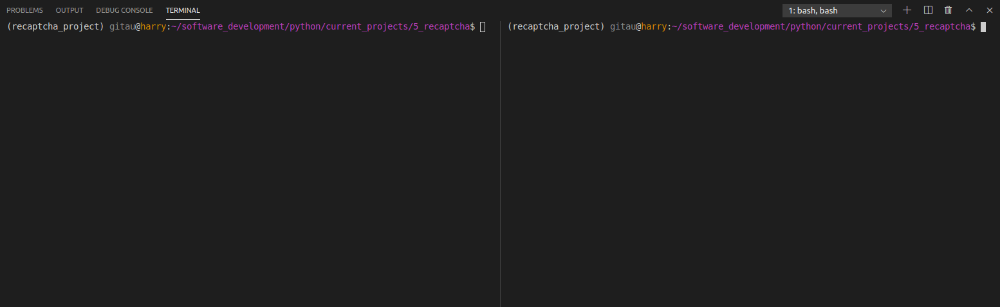
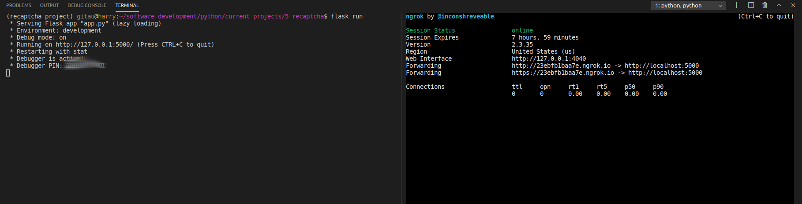
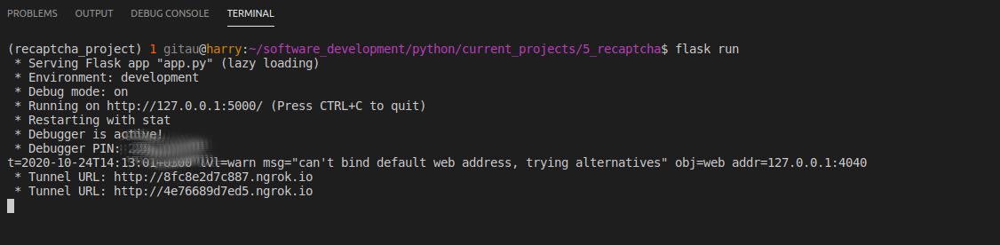

# How to Test Your Flask App During Development

Obviously, if we want to test how our application looks like on other devices while we are developing it is to check the _developer tools_ in your browser. On Chrome, you can also run `ctrl + shift + i` to open the _developers tools_.

It is also possible to access your Flask application running on localhost from another device or location for the purposees of testing. Below, I will show you how to use [pyngrok](https://pyngrok.readthedocs.io/en/latest/) package to provision a temporary public URL for your application that works on your phone or from anywhere in the world.

## Ngrok

In order to use this package, make sure that you go into your project directory and activate your virtual environment.

```python
$ cd your_project_directory
$ workon your_virtual_env
```

I have used virtualenvwrapper to activate an existing virtual environment using the `workon` command. If you do not know what virtualenvwrapper is and how to use it, learn it [here](virtualenvwrapper_setup.md).

Install pyngrok into your virtual environment:
```python
(your_virtualenv)$ pip3 install pyngrok
```
> `pyngrok` is a Python wrapper for `ngrok` that manages its own binary and puts it on your path, making ngrok readily available from anywhere on the command line and via a convenient Python API.

Run `ngrok --help` in your virtual environment to confirm that it is installed and working:

```python
(your_virtualenv)$ ngrok --help
```

## How it Works

We will make use of two terminal windows for this, both with your virtual environment activated. _If your are using VS Code, you can simpley split your terminal window to get two windows. If you are using your default Ubuntu terminal window, you may want to consider [byobu](https://www.byobu.org/), an open source text-based window manager and terminal multiplexer.._



On your first terminal, start your application, either by running a Python script or you can run `flask run` command. The important thing is your application listens to requests at http://localhost:5000.

```python
(your_virtualenv)$ flask run # start your application
```

On your second terminal, start ngrok:

```python
(your_virtualenv)$ ngrok http 5000 # or any other port you have used
```



You can open your localhost in your browser by clicking on the link in your first terminal (as seen in the image above). On the second terminal window, look at the two lines that begin with the word _Forwarding_ to know your `ngrok` URL. These two lines show the `http://` and `https://` versions of your URL. In my example above, I have _http://23ebfb1baa7e.ngrok.io_.

You will get a similar one, but the subdomain portion is going to be different each time you run `ngrok`. While the `ngrok` process is running (limited to a maximum of eight hours) any requests that are sent to this URL are immediately forwarded to your application.

Send the URL to your phone and open it in your mobile browser to see how cool ngrok is. You can also send the URL to a friend if you like, as it works from anywhere in the world.

## How to Create a Ngrok Tunnel

By now, you must be excited about all the possibilities it opens. Below, I will show you an improved workflow that allows you to access Ngrok automatically every time you start your Flask application.

To open the tunnel add the script below anywhere in your application. For my case, I have added it to `__init__.py` file:

app/__init__.py: Create ngrok tunnel
```python
def start_ngrok():
    from pyngrok import ngrok

    url = ngrok.connect(5000)
    print(' * Tunnel URL: ', url)
```

This script performs the same function as the `ngrok http 5000` command. `ngrok.connect()` function returns the public URL that was assigned to the tunnel. `start_ngrok()` function prints this URL to the terminal, from where you can copy and paste it to a phone.

We will add a `ngrok` configuration to our app such that when it is enabled, we can call the `start_ngrok()` function to get a tunnel set up. 

config.py: Creat ngrok configuration
```python
class Config:
    # previous code
    START_NGROK = os.environ.get('START_NGROK') is not None
```

Add the script below to your application instance to register your `ngrok` configuration:

app/__init__.py: Register your ngrok configuration
```python
if app.config['START_NGROK']:
    start_ngrok()
```

Since we want this variable to be set to True, such that when the application starts it creates a tunnel for us, we will update our envrionment variables to include it:

.flaskenv: Set ngrok variable to True
```python
START_NGROK=1
```

If you use the Flask reloader and enable the ngrok tunnel you will notice that two tunnels are started. This is because the reloader runs two processes: a parent process that monitors files for changes, and a child process that runs the actual server. The parent process kills and restarts the child process every time it detects changes to a source file.

It would be better if the tunnel could be created only in the parent process, which is the process that has a longer life. That would mean that a reload event would preserve the tunnel URL, since it is associated with the parent reloader process. So a nice improvement would be to make sure the START_NGROK configuration variable is always False in the child process.

We will update our configration to accommodate these scenarios such that when the main Flask process starts it will set up the tunnel. If the reloader is enabled, then a child process will be launched with WERKZEUG_RUN_MAIN=true in the environment, so there will be no second tunnel started. And every time the child process is recycled the tunnel set up in the parent process will be unaffected, so the same tunnel URL will remain valid for as long as the reloader process is running, up to a maximum of eight hours.

`config.py: Working with Flask reloader`
```python
class Config:
    # previous code
    START_NGROK = os.environ.get('START_NGROK') is not None and \
        os.environ.get('WERKZEUG_RUN_MAIN') is not 'true'
```

Now, when you run `flask run` command, you will notice that our tunnel is set up, and we can access our `ngrok` URL. We can alsoaccess the localhost URL.

