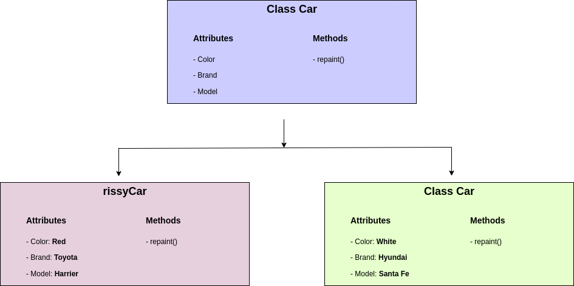

# Object-Oriented Programming in Python


Object Oriented programming (OOP) is a programming paradigm that relies on the concept of classes and objects. It is used to structure a software program into simple, reusable pieces of code blueprints (usually called classes), which are used to create individual instances of objects.

#### Table of Contents

- [Overview of Classes and Objects](#overview-of-classes-and-objects)
- [Real-life Application of OOP](#real-life-application-of-oop)
- [The Four Principles of OOP](#the-four-principles-of-object-oriented-programming)


## Overview of Classes and Objects

A class is an abstract blueprint used to create more specific, concrete objects. Classes often represent broad categories, like Car or Dog that share attributes. These classes define what attributes an instance of this type will have, like color, but not the value of those attributes for a specific object.

Classes can also contain functions, called methods available only to objects of that type. These functions are defined within the class and perform some action helpful to that specific type of object. 

Class templates are used as a blueprint to create individual objects. These represent specific examples of the abstract class, like myCar or goldenRetriever. Each object can have unique values to the properties defined in the class.

> If we have a sample class called "Car" that contains all the properties a car must have such as color, brand and model, we can create an instance of a type of car to represent a specific car.
>
> We can then set the value of the properties defined in the class to describe our car, whithout affecting other objects or the class template.
> 
> We can reuse this class to represent any number of cars.

Let us look at this example below:




The "Car" class has been used to create two car type objects, rissyCar and jeffCar. The class has provided abstract definition of what a car should have, and the objects provide the actual values specific to them.


## Real-life Application of OOP

Imagine running an education center with hundreds of students. During registration, you will need to capture all necessary information about a particular student. How would you design a simple and reusable software to model the students? 

It would be very inefficient to write unique code specific for each student as follows:

```python
ambrose = {
    name: 'Ambrose',
    age: 10,
    course: 'Scratch',
    parent: 'Esther'
}

emilly = {
    name: 'Emilly',
    age: 13,
    course: 'Python',
    parent: 'Muthui'
}

kiki = {
    name: 'Kiki',
    age: 4,
    course: 'Scratch Jr',
    parent: 'Alfred'
}
```

Above, you can see we have three objects, `ambrose`, `emilly` and `kiki` with duplicated code. Instead of repeating ourselves each time a new object is created, we can create a class that defines abstract information about a student, then instantiate an object of that class type.

```python
class Student():
    name = '<student name>'
    age = '<student age>'
    course = '<student course>'
    parent = '<parent name>'


abrose = Student('Ambrose', 10, 'Scratch', 'Esther')
emily = Student('Emilly', 13, 'Python', 'Muthui')
kiki = Student('Kiki', 4, 'Scratch Jr', 'Alfred')
```

## Building Block of OOP

There are four fundamental building blocks of object-oriented programming:

- Classes
- Objects
- Attributes
- Methods

### Example

```python
class User():
    # Instance attributes
    def __init__(self, name, email):
        self.name = name
        self.email = email
    
    # Instance method
    def career(self, occupation):
        return f'{self.name} is a {occupation}'

# Instantiate an object
kiki = User('kiki', 'kiki@email.com')

# Test the new object
print('My name is ', kiki.name, ' and my email is ', kiki.email)

# Call instance methods
print(kiki.career('Teacher'))
```

### Classes

As we have seen above, classes are essentially blueprints that define abstract ideas of an object. Individual objects are instatiated or created from this blueprint. 

### Objects

These are instances of a class, created with specific data. You can have multiple objects that use the same class.

### Attributes

These are the features of a class. They define the data that we would want an object to have. The state of an object is defined by the data in the object’s attributes fields.

### Methods

Methods are used to represent behaviours. They perform actions are might return information about an object. When individual objects are instantiated, these objects can call the methods defined in the class.


## The Four Principles of Object-oriented Programming

The four pillars of OOP in python are: 

- [Inheritance](#inheritance)
- [Encapsulation](#encapsulation)
- [Abstraction](#abstraction)
- [Polymorphism](#polymorphism)

### Inheritance

This principle allows other classes to acquire the features of other classes. In other words, one class extends its attributes and behaviours to another class. The class in which the basic attributes and behaviours are defined is called the 'parent' class or the 'base' class. The class that inherits (or acquires) the attributes and behaviours of the parent class is called the 'child' class or the 'subclass'. The essence of inheritance is to promote code reusability.


```python
class Parent():
    def __init__(self, username, email):
        self.username = username
        self.email = email

    def __repr__(self):
        return f'Parent: {self.username}'


class Child(Parent):
    pass

```

We have defined two classes: `Parent` and `Child`. The `Parent` class has the attributes `username` and `email`. This class is passed as a parameter in the `Child` class which, at the moment, has no attributes. To test how inheritance works, run the following in an active Python interpreter:

```python
$ python3

>>> parent = Parent('harry', 'harry@email.com')
>>> parent
# Output
Parent: harry

>>> parent.username, parent.email
# Output
('harry', 'harry@email.com')

>>> child = Child('muthoni', 'muthoni@email.com')
>>> child
# Output
Parent: muthoni

>>> child.username
# Output
'muthoni'
```

`parent` and `child` are objects of their respective classes. Instantiating these objects give data relevant to them. Notice that when you call the child object the output is "Parent: muthoni". This is because the child has inherited the in-built `__repr__()` function from the parent which has the string "Parent".


### Polymorphism

Polymorphism is the ability to take many(poly) forms(morphism). Polymorphism in Python allows us to define methods that do not exist in the parent class or modify these methods if they exist in the parent class.

```python
class Parent():
    def __init__(self, username, email):
        self.username = username
        self.email = email

    def __repr__(self):
        return f'Parent: {self.username}'


class Child(Parent):
    def __init__(self, username, email, age):
        super().__init__(username, email)
        self.age = age

    def __repr__(self):
        return f'Child: {self.username}, {self.age}''
```

We have modified the `__repr__()` function for the `Child` class to have its own string besides the dynamic `username` and `email` values. The `Child` class has an additional `age` attribute that does not exist in the parent. Let us see how polymorphism works.

```python
$ python

>>> parent = Parent('harry', 'harry@email.com')
# Output
Parent: harry

>>> child = Child('muthoni', 'muthoni@email.com', 3)
# Output
Child: muthoni, 3
```

Notice that the parent's `__repr__()` function has been overriden by the child's. This is because the child defined its own `__repr__()` function. Additionally, the `age` attribute is only present in the child class.


### Encapsulation


### Abstraction


