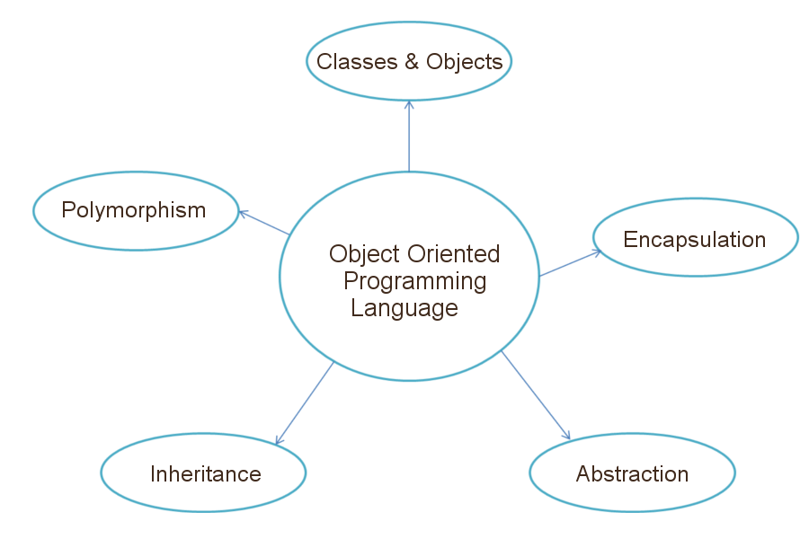
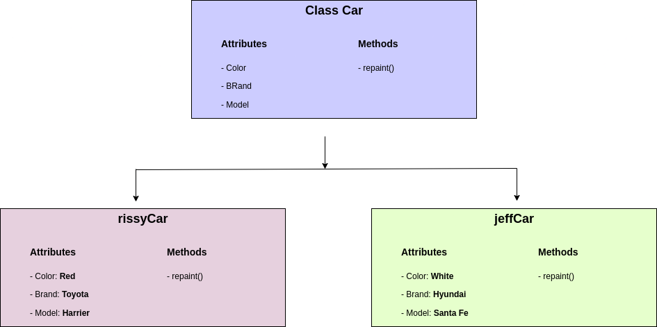

# Object-Oriented Programming in Python



Object Oriented Programming (OOP) is a programming paradigm that relies on the concept of classes and objects. It is used to structure a software program into simple, reusable pieces of code blueprints (usually called classes), which are used to create individual instances of objects.

#### Table of Contents

- [Overview of Classes and Objects](#overview-of-classes-and-objects)
- [Real-life Application of OOP](#real-life-application-of-oop)
- [The Four Principles of OOP](#the-four-principles-of-object-oriented-programming)


## Overview of Classes and Objects

A class is an **abstract** blueprint used to create more specific, concrete objects. Classes often represent broad categories, like Car or Dog that share attributes. These classes define what attributes an instance of this type will have, like color, but not the value of those attributes for a specific object.

Classes can also contain functions, called methods, available only to objects of that type. These functions are defined within the class and perform some action helpful to that specific type of object. 

Class templates are used as a blueprint to create individual objects. These represent specific examples of the abstract class, like myCar or goldenRetriever. Each object can have unique values to the properties defined in the class.

> If we have a sample class called "Car" that contains all the properties a car must have such as color, brand, and model, we can create an instance of a type of car to represent a specific car.
>
> We can then set the value of the properties defined in the class to describe our car, without affecting other objects or the class template.
> 
> We can reuse this class to represent any number of cars.

Let us look at this example below:




The "Car" class has been used to create two car type objects, rissyCar and jeffCar. The class has provided abstract definition of what a car should have, and the objects provide the actual values specific to them.


## Real-life Application of OOP

Imagine running an education center with hundreds of students. During registration, you will need to capture all necessary information about a particular student. How would you design a simple and reusable software to model the students? 

It would be very inefficient to write unique code specific for each student as follows:

```python
ambrose = {
    name: 'Ambrose',
    age: 10,
    course: 'Scratch',
    parent: 'Esther'
}

emilly = {
    name: 'Emilly',
    age: 13,
    course: 'Python',
    parent: 'Muthui'
}

kiki = {
    name: 'Kiki',
    age: 4,
    course: 'Scratch Jr',
    parent: 'Alfred'
}
```

Above, you can see we have three objects, `ambrose`, `emilly` and `kiki` with duplicated code. Instead of repeating ourselves each time a new object is created, we can create a class that defines abstract information about a student, then instantiate an object of that class type.

```python
class Student():
    name = '<student name>'
    age = '<student age>'
    course = '<student course>'
    parent = '<parent name>'


abrose = Student('Ambrose', 10, 'Scratch', 'Esther')
emily = Student('Emilly', 13, 'Python', 'Muthui')
kiki = Student('Kiki', 4, 'Scratch Jr', 'Alfred')
```

## Building Blocks of OOP

There are four fundamental building blocks of object-oriented programming:

- Classes
- Objects
- Attributes
- Methods

### Example

```python
class User():
    # Instance attributes
    def __init__(self, name, email):
        self.name = name
        self.email = email
    
    # Instance method
    def career(self, occupation):
        return f'{self.name} is a {occupation}'

# Instantiate an object
kiki = User('kiki', 'kiki@email.com')

# Test the new object
print('My name is ', kiki.name, ' and my email is ', kiki.email)

# Call instance methods
print(kiki.career('Teacher'))
```

| Classes | Objects | Attributes | Methods |
| ------- | ------- | ---------- | ------- |
| As we have seen above, classes are essentially blueprints that define abstract ideas of an object. Individual objects are instantiated or created from this blueprint.  | These are instances of a class, created with specific data. You can have multiple objects that use the same class. | These are the features of a class. They define the data that we would want an object to have. The state of an object is defined by the data in the object’s attributes fields. | Methods are used to represent behaviors. They perform actions that might return information about an object. When individual objects are instantiated, these objects can call the methods defined in the class. | 


## The Four Principles of Object-oriented Programming

The four pillars of OOP in python are: 

- [Inheritance](#inheritance)
- [Polymorphism](#polymorphism)
- [Encapsulation](#encapsulation)
- [Abstraction](#abstraction)

## Inheritance

This principle allows other classes to acquire the features of other classes. In other words, one class extends its attributes and behaviors to another class. The class in which the basic attributes and behaviors are defined is called the 'parent' class or the 'base' class. The class that inherits (or acquires) the attributes and behaviors of the parent class is called the 'child' class or the 'subclass'. The essence of inheritance is to promote code reusability.


```python
class Parent():
    def __init__(self, username, email):
        self.username = username
        self.email = email

    def __repr__(self):
        return f'Parent: {self.username}'


class Child(Parent):
    pass

```

We have defined two classes: `Parent` and `Child`. The `Parent` class has the attributes `username` and `email`. This class is passed as a parameter in the `Child` class which, at the moment, has no attributes. To test how inheritance works, run the following in an active Python interpreter:

```python
$ python3

>>> parent = Parent('harry', 'harry@email.com')
>>> parent
# Output
Parent: harry

>>> parent.username, parent.email
# Output
('harry', 'harry@email.com')

>>> child = Child('muthoni', 'muthoni@email.com')
>>> child
# Output
Parent: muthoni

>>> child.username
# Output
'muthoni'
```

`parent` and `child` are objects of their respective classes. Instantiating these objects give data relevant to them. Notice that when you call the child object the output is "Parent: muthoni". This is because the child has inherited the in-built `__repr__()` function from the parent which has the string "Parent".


## Polymorphism

Polymorphism is the ability to take many(poly) forms(morphism). Polymorphism in Python allows us to define methods that do not exist in the parent class or modify these methods if they exist in the parent class.

```python
class Parent():
    def __init__(self, username, email):
        self.username = username
        self.email = email

    def __repr__(self):
        return f'Parent: {self.username}'


class Child(Parent):
    def __init__(self, username, email, age):
        super().__init__(username, email)
        self.age = age

    def __repr__(self):
        return f'Child: {self.username}, {self.age}''
```

We have modified the `__repr__()` function for the `Child` class to have its string besides the dynamic `username` and `email` values. The `Child` class has an additional `age` attribute that does not exist in the parent. Let us see how polymorphism works.

```python
$ python

>>> parent = Parent('harry', 'harry@email.com')
# Output
Parent: harry

>>> child = Child('muthoni', 'muthoni@email.com', 3)
# Output
Child: muthoni, 3
```

Notice that the parent's `__repr__()` function has been overridden by the child's. This is because the child defined its own `__repr__()` function. Additionally, the `age` attribute is only present in the child class.


## Encapsulation

This principle promotes the need to hide data. From the word 'encapsulate', we learn that it means to 'enclose something in or as if in a capsule. Synonyms associated with encapsulate are enclosed, encase, confine, envelop, etc. I hope you get the idea. 

The creation of classes is by default encapsulation. This is because we are limiting access to data from the outside world. This data can only be accessed using the said class. The entire process of encapsulation is also called 'information hiding. 

```python
class Parent():
    def __init__(self, username, email):
        self.username = username
        self.email = email

    def __repr__(self):
        return f'Parent: {self.username}'
```

For us to access any information about a parent, we will have to use the `Parent` class. We will instantiate an object, then use it to access whatever data we want.

Besides restricting access to the class data, we can more specifically limit access to individual variables and methods to prevent accidental data modification. Whenever we are working with the class and dealing with sensitive data, providing access to all variables used within the class is not a good choice.

```python
class Parent():
    def __init__(self, username, email, phone, salary):
        self.username = username
        self.email = email
        self.phone = _phone # < ----------- single preceding underscore
        self.salary = __salary # < ------------- double preceding underscores

    def __repr__(self):
        return f'Parent: {self.username}'
```

Encapsulation offers a way for us to access the required variable(s) without providing the program full-fledged access to all variables of a class. This mechanism is used to protect the data of an object from other objects.

- **Public members**: The variables `username` and `email` are public members because they can be easily accessed within and outside the `Parent` class. 
```python
class Parent():
    def __init__(self, username, email):
        self.username = username
        self.email = email

    def __repr__(self):
        return f'Parent: {self.username}'

# On an active Python interpreter
$ python3

>>> parent = Parent('harry', 'harry@email.com')
Parent: harry

>>> parent.username
harry
```

- **Protected members**: The variable `phone` is a protected member and can only be accessed within the class and its subclasses. We know it is a protected member because it begins with a single underscore.

```python
class Parent():
    def __init__(self, username, email, phone):
        self.username = username
        self.email = email
        self._phone = phone # < ------------ protected variable

    def __repr__(self):
        return f'Parent: {self.username}'


class Child(Parent):
    def __init__(self, username, email, phone, age):
        super().__init__(username, email, phone)
        self._age = age # < ------------ protected variable


# On an active Python interpreter
$ python3

>>> child = Child('rahima', 'rahima@email.com', 123, 12)
>>> child._phone
123
```

- **Private member**: The variable `salary` is said to be private and can only be accessed within the class. It has two preceding underscores.

```python
class Parent():
    def __init__(self, username, email, salary):
        self.username = username
        self.email = email
        self.__salary = salary

    def __repr__(self):
        return f'Parent: {self.username}, {self.email}, {self.__salary}'


# On an active Python interpreter
$ python3

>>> parent = Parent('harry', 'harry@email.com', 123)
>>> parent
Parent: harry, harry@email.com, 123

>>> parent.email
harry@email.com

>>> parent.__salary
Traceback (most recent call last):
  File "oop.py", line 19, in <module>
    print(parent.__salary)
AttributeError: 'Parent' object has no attribute '__salary'
```

Notice that we can easily access the public members of the `Parent` class. But the private member `__salary` (with double preceding underscores), we get the error `AttributeError: 'Parent' object has no attribute '__salary'`. This is so despite knowing that this variable can be accessed only within the `Parent` class. 


### Accessing Private Variables

How can we access a private variable? We will look at three ways:

- [Using public methods](#using-public-methods)
- [Name mangling](#name-mangling)
- [Getter and setter methods](#getter-and-setter-methods)

### Using public methods

Here, we can define an instance method that will have access to the private variable. Remember, we said that a private variable can only be accessed within its class.

```python
class Parent():
    def __init__(self, username, email, phone):
        self.username = username
        self.email = email
        self.__phone = phone

    def __repr__(self):
        return f'Parent: {self.username}, {self.email}, {self.__phone}'

    def show_phone(self):
        print(f'Parent phone number is ', self.__phone)

# On an active Python interpreter
$ python3

>>> parent = Parent('harry', 'harry@email.com', 123)
>>> parent.show_phone()
Parent phone number is  123
```

The method `show_phone()` in an instance method of the `Parent` class. In it, we pass the private variable `__phone`.


### Name mangling


To 'mangle' means to destroy or to severely damage by tearing or crushing. Other words used to mean mangle include mutilate, crush, disfigure, etc. In OOP, name mangling is used to cleverly overcome the restriction of encapsulation.

```python
class Parent():
    def __init__(self, username, email, phone):
        self.username = username
        self.email = email
        self.__phone = phone

    def __repr__(self):
        return f'Parent: {self.username}, {self.email}, {self.__phone}'


# On an active Python interpreter
$ python3

>>> parent = Parent('harry', 'harry@email.com', 123)
>>> parent
Parent: harry, harry@email.com, 123

>>> parent.email
harry@email.com

>>> parent._Parent_phone
123
```
Typically, name mangling involves adding a preceding underscore to a class name and then appending the double underscore private variable to it to gain access to the variable's data. The format used is:

```python
object._classname__privateVariable
```

Above, we have run `parent._Parent__phone` to gain access to a parent's private phone number.

### Getter and setter methods

Proper encapsulation in python is normally implemented using getters and setters. Getter methods access data while setter methods are used to modify the data in private members.

```python
class Parent():
    def __init__(self, username, email, phone):
        self.username = username
        self.email = email
        self.get_phone = phone

    def __repr__(self):
        return f'Parent: {self.username}, {self.email}, {self.get_phone}'

    @property
    def get_phone(self):
        return self.__get_phone

    @get_phone.setter
    def get_phone(self, phone):
        self.__get_phone = phone

# On an active Python interpreter
$ python3

>>> parent = Parent('harry', 'harry@email.com', 123)
>>> parent.get_phone
123

# New phone value
>>> parent.get_phone = 100
>>> parent
Parent: harry, harry@email.com, 100
```

### Getter Method

When defining the `Parent` class, we add two special methods, both of which have similar names. The first method has a decorator called `@property`. Whenever this decorator is used, we know that it is an accessor or a getter method. It is used to access the value of the private variable `phone`.

```python
@property
    def get_phone(self):
        return self.__get_phone
```

You might be wondering how `phone` has become private yet when defining the class attributes, we defined it as public (without underscores). Well, intentionally, when you want to encapsulate data using getter and setter methods, it is recommended that you pass class attributes as public members. Within the getter method (in our case it is the method `get_phone`), the returned value has two leading underscores. This makes it private. 

> It is important to note that the value `get_phone` among the class attributes is not an assignment operation (`self.get_phone = phone`). Rather, we are calling our getter method so that it makes the `phone` variable private.


### Setter Method

Now that `phone` is private with the help of our getter method, we can focus on setting its value. A setter method uses a decorator whose name is similar to the getter method, then append the word `setter`. The method name is also similar to the getter method.

```python
@get_phone.setter
    def get_phone(self, phone):
        self.__get_phone = phone
```

Again, the naming of the setter method is similar to that of the getter method. We know that it is a setter method because (1) it has the `setter` decorator, (2) we are assigning `phone` to `__get_phone`, our getter method. This method takes additional arguments compared to that of the getter method.

In an active Python interpreter, you will notice that the value of `phone` can only be accessed using the getter method which has been set using the setter method. It is only possible to alter the value of `phone` using the `get_phone` setter method. 


### Deleter Method

It is also possible to delete the value of a private member. All that needs to be done is to define a `deleter` method.

```python
@get_phone.deleter
    def get_phone(self):
        del self.__get_phone


# In an active Python interpreter
$ python3

>>> del parent.get_phone
>>> parent
AttributeError: 'Parent' object has no attribute '_Parent__get_phone'
```

The deletion format is `del object.deleterMethod`.

## Abstraction

Abstraction is used to hide the internal functionality of a process from the users. The users only interact with the basic implementation of the function, but the inner working is hidden. For example, we mostly know that to increase the volume of a TV using a remote control, all we need to do is press the "+" button and the volume will go up. We do not know HOW the volume goes up, because that process has been hidden from us.

In Python, an abstract class can be considered a blueprint for other classes. It allows one to create a set of methods that MUST be created within any child classes built from the abstract class.

```python
from abc import ABC, abstractmethod


class Parent(ABC):
    @abstractmethod
    def about_me(self):
        print('I am Harry')


class Child(Parent):
    def about_me(self):
        print('I am Muthoni')


# In an active Python interpreter
$ python3

>>> child = Child()
>>> child.about_me()
I am Muthoni
```

We begin by first importing the ABC from the Abstract Base Class (ABC) because Python does not provide abstract classes. ABC works by decorating methods of the base class as abstract. A method becomes abstract when decorated with the keyword `@abstractmethod`. This method MUST then be used by all child classes.

In our example above, the `Parent` class defines an abstract method called `about_me` with its own custom `print()` statement. The `Child` class inherits the `Parent` class and overrides the `print()` statement with its own. If the child class tries not to use the defined abstract method, then an error is raised.

```python
from abc import ABC, abstractmethod


class Parent(ABC):
    @abstractmethod
    def about_me(self):
        pass


class Child(Parent):

    def something_else(self):
        print('I am Muthoni Gitau')


# In an active Python interpreter
$ python3

>>> child = Child()
>>> child.something_else()
TypeError: Can't instantiate abstract class Child with abstract methods about_me
```
The `Child` class is required to have its implementation of the abstract method.
