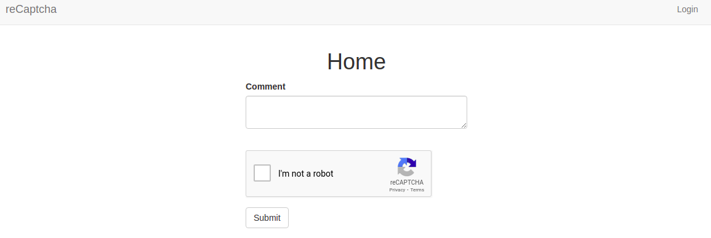

# Integrate Google reCaptcha into your Flask App

reCAPTCHA is a free service from Google that helps protect websites from spam and abuse. A “CAPTCHA” is a turing test to tell human and bots apart. It is easy for humans to solve, but hard for “bots” and other malicious software to figure out. By adding reCAPTCHA to a site, you can block automated software while helping your welcome users to enter with ease.


## Overview

To start using reCAPTCHA, you need to sign up for an API key pair for your site. The key pair consists of a site key and secret key. The site key is used to invoke reCAPTCHA service on your site or mobile application. The secret key authorizes communication between your application backend and the reCAPTCHA server to verify the user's response. The secret key needs to be kept safe for security purposes.

### Things You Will Do

1. [Create a simple web form](#create-a-simple-web-form)
2. [Integrate Google reCaptcha](#integrate-google-recaptcha)

## Create a Simple Web Form

Since reCAPTCHA is used to protect web forms, we need to create one to test it. I have already built a basic flask application. You can find the source code in the GitHub repository [start a flask server](https://github.com/GitauHarrison/starting-a-flask-server). Otherwise, learn how you can create your own flask project from scratch in [this tutorial](start_flask_server.md).


Flask has an extension that makes it possible to create web forms. The extension is called [Flask-WTF](https://pypi.org/project/Flask-WTF/). We need to install in our application.

```python
(venv)$ pip3 install Flask-WTF
```

Ensure that you have activated your virtual environment before running the command. If you are not aware of how to create and activate a virtual environment, run this command in your terminal:

```python
$ mkvirtualenv venv
```
The command not only creates a virtual environment, but it also activates it. Learn how you can set up your virtual environment to use the `virtualenvwrapper` extension [here](virtualenvwrapper_setup.md).

### Configuration

To protect forms againist a nasty attack called CSRF, we need to add a secret key to our application. The secret key is used to sign the form data. We will need to create two files:


1. `config.py`: This file contains the secret key configuration.
2. `.env`: This file contains the value of the secret key.

Both files reside in the root directory of the project.

```python
(venv)$ touch config.py .env
```
We will source the value of the secret key from existing environment variables.

`config.py`: Secret key configuration

```python
import os


class Config(object):
    SECRET_KEY = os.environ.get('SECRET_KEY') or 'you-will-never-guess'

```
This value is contained in the `.env` file. So, we need to update it.

`.env`: Secret key value
```text
SECRET_KEY=b'\xe5\x8b\xc7\xd9\x7f\xfc\xe0s\x07\x0f\xbf\xc8\x1b\xd1\xda\xfb'
```
As the name suggests, the secret key should be kept secret, and only the maintainers of the application should know it. I am able to generate this difficult to guess value by running the following command in the terminal:

```python
(venv)$ python3 -c "import os; print(os.urandom(24))"
```

If this value, which is being sourced from an environment variable, is not available, then I have provided a default value. This ensures that the application does not crash when the secret key is not available.

We will then need to register this configuration in the application's instance.

`app/__init__.py`: Secret key configuration
```python
# ...
from config import Config

app = Flask(__name__)
app.config.from_object(Config)

# ...
```

### Define Form Fields

Now we can create our form. First, let us create a `forms.py` file in the `app/` subfolder. This file will be used to define the structure of our form.

```python
(venv)$ cd app/
(venv)$ touch forms.py
```

Then we need to update it to define the fields we want in our form.

`app/forms.py`: Create a form

```python
from flask_wtf import FlaskForm
from wtforms import StringField, SubmitField
from wtforms.validators import DataRequired


class CommentForm(FlaskForm):
    body = TextAreaField('Comment', validators=[DataRequired()])
    submit = SubmitField('Submit')

```
We are using Python classes to define our form. This form will have only the `body` and `submit` fields. At the end of the day, we will add a reCAPTCHA field to this form. This new field will be placed between the `body` field and the submit button. The idea is that the user will be able to submit a comment, but we will also validate the reCAPTCHA field.

### Display the Form

Since our application currently has an `index.html` file within the `templates/` folder, we can take advantage of it to display our form.

`app/templates/index.html`: Display the form
```html




<div class="row">
    <div class="col-md-12 text-center">
        <h1>{{ title }}</h1>
    </div>  
</div>
<div class="row">
    <div class="col-sm-4">
        <!-- Empty column -->
    </div>
    <div class="col-sm-4">
        {{ wtf.quick_form(form) }}
    </div>
    <div class="col-sm-4">
        <!-- Empty column -->
    </div>
</div>

```
Flask-bootstrap package provides the `wtf.quick_form()` method to quickly create our form. The `form` argument is the name of the form we want to display.

### Render the Form

The `routes` module currently has the `index()` view function. Since it is the one used to render the `index.html` file, we can use it to render our form.

`app/routes.py`: Render the form
```python
from app import app
from flask import render_template
from app.forms import CommentForm


@app.route('/', methods=['GET', 'POST'])
@app.route('/index', methods=['GET', 'POST'])
def index():
    form = CommentForm()
    return render_template(
        'index.html',
        title='Home',
        form=form)
```
Start the flask server in your terminal by running the following command:

```python
(venv)$ flask run
```
Navigate to the URL `http://localhost:5000/` in your browser to see the form.


## Integrate Google reCaptcha

In order to integrate Google reCAPTCHA in our app, we need to register a site and get an API key pair. Google provides four types of reCAPTCHA.

1. reCAPTCHA v3
2. reCAPTCHA v2
3. Invisible reCAPTCHA
4. reCAPTCHA Android

>reCAPTCHA v3 validates requests with a score whilst v2 validates request with the "I am not a robot" checkbox.

>The Invisible reCAPTCHA does not need the user to click on a check box instead it is called upon when a user clicks on a button on a site.

For now, we will make use of reCAPTCHA v2 to validate requests in our app. If you do not have a [Google Account](https://accounts.google.com/signup/v2/webcreateaccount?flowName=GlifWebSignIn&flowEntry=SignUp), you need to create one. 

### Things You Need To Do

1. Visit [reCaptcha Home Page](https://www.google.com/recaptcha/about/)
2. Click on [Admin Console](https://www.google.com/recaptcha/admin/create)
3. Fill in your details
* Label: provide any name that will be easy for you to remember
* Choose _reCAPTCHA v2_
* Domains: if you have an actual domain, add it here. If you are using localhost, consider adding: **127.0.0.1**
* Check all boxes
* Submit your information


Upon creation, you will get the registered site API keys. We will add these two keys to our `config.py` file:

`config.py:` reCaptcha Keys

```python
class Config(object):
    # previous configurations

    # reCAPTCHA configuration
    RECAPTCHA_PUBLIC_KEY = os.environ.get('RECAPTCHA_PUBLIC_KEY')
    RECAPTCHA_PRIVATE_KEY= os.environ.get('RECAPTCHA_PRIVATE_KEY')
```

Note that you need to name your variables as RECAPTCHA_PUBLIC_KEY and RECAPTCHA_PRIVATE_KEY. Any other names would give you an error. Again, notice how we are sourcing this values from environment variables.

You will then need to add the reCaptcha js file in `base.html` as done below:

`app/templates/base.html`: Add reCaptcha js file

```html
<!-- Scripts Section -->


    <!-- reCaptcha Integration -->
    <script src='https://www.google.com/recaptcha/api.js' async defer></script>

```

Since reCaptcha is part of our from, we need to update our `form.py` file to include reCaptcha:

`app/form.py`: Add reCaptcha field
```python
# ...
from flask_wtf.recaptcha import RecaptchaField


class CommentForm(FlaskForm):
    comment = TextAreaField('Comment', validators=[DataRequired()])
    recaptcha = RecaptchaField()
    submit = SubmitField('Post')

```

And that is it!! You have reCaptcha as part of your application.



You can update the strength of your reCaptcha in the settings.


### Update Project Dependencies

With all that work, remember to update your `requirements.txt` file to include all the dependancies you have used while building this feature.

```python
(venv)$ pip3 freeze > requirements.txt
```