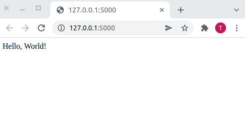
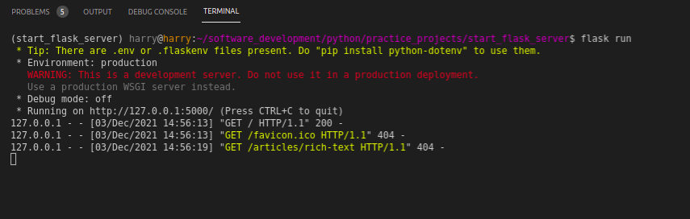
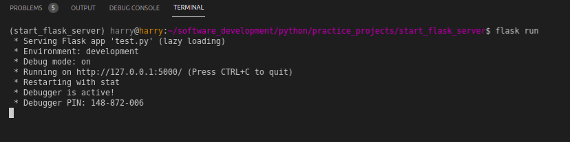
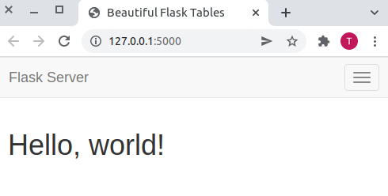
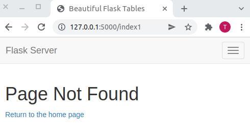

# Starting a Flask Server

Before we can start a Flask server, we need to understand what Flask is. [Flask](https://flask.palletsprojects.com/en/2.0.x/) is a micro-framework for the web. A framework is a collection of code (software) that can be used to build web applications. As a developer, you don't need to start from scratch when you can make good use of tools designed to help you with your projects.

The 'micro' in Flask may be a bit misleading, but the good folks at Flask have taken their time to clarify this:

> “Micro” does not mean that your whole web application has to fit into a single Python file (although it certainly can), nor does it mean that Flask is lacking in functionality. The “micro” in microframework means Flask aims to keep the core simple but extensible. Flask won’t make many decisions for you, such as what database to use. Those decisions that it does make, such as what templating engine to use, are easy to change. Everything else is up to you, so that Flask can be everything you need and nothing you don’t.

## Creating a Flask Application

We need to create an application before we can start a Flask server. The application is the main object that holds all the information about the web application we want to build. 

You can browse the project on GitHub [here](https://github.com/GitauHarrison/starting-a-flask-server).

### Project Strucutre

Principally, I will employ the concept of _seperation of concerns_ when building our flask application. What this principle means is that we will categories our application into modules. We will have several modules that will be responsible for different parts of our application. For example, we will have a module that will be responsible for the routes, and another module that will be responsible for the errors.

Using the command line, let us create this application structure:

```python
project_name
    | --- test.py
    | --- config.py
    | --- requirements.txt
    | --- .gitignore
    | --- .flaskenv
    | --- app/
            | --- __init__.py
            | --- routes.py
            | --- errors.py
            | --- templates/
                     | --- base.html
                     | --- index.html
            | --- static/
                    | --- css/
                            | --- main.css
                    | --- js/
                    | --- img/
```

```python
mkdir project_name # Create the project directory
cd project_name # Change to the project directory
touch requirements.txt config.py  # Create all the files in the top-level directory
mkdir app # Create the app sub directory in the current directory
touch app/__init__.py app/routes.py app/errors.py # Create the files in the app directory

# Create the templates and static sub-directories and their contents
```

The `.gitignore` file is used to ignore the files that we don't want to be tracked by `git`. Find out what Python files you wont need to be tracked by `git` by looking at the [gitignore](https://github.com/github/gitignore/blob/master/Python.gitignore) file.

### Create and Activate a Virtual Environment

During the development of this simple Flask application, we will need to install a few packages. We will create and activate a virtual environment. Virtual environments help isolate the needs of your application from that of your system. It also helps isolate one project's needs from another. 

```python
mkvirtualenv flask_project # Create a virtual environment

# Output:

(flask_project) $ 
```

I am using the virtual environment `flask_project` to develop this application. The command `mkvirtualenv` is used to both _create_ and _activate_ a virtual environment for me. All the project's dependencies will be installed in this virtual environment.

If you are not aware of what the `virtualenvwrapper` is and would like to use it during your development, you can find out more about it [here](virtualenvwrapper_setup.md).

### Install Dependencies

One package will definitely need to install is Flask. We will do so using the `pip` package manager in our terminal:

```python
(flask_project) $ pip install flask
```

### Create Application Instance

Within our `__init__.py` file, we will create an instance of the Flask application. We will also import the `Flask` class from the `flask` module.

`__init__.py: Create application instance`

```python
from flask import Flask


app = Flask(__name__)

from app import routes, errors
```

### Create Routes

Routes direct us to a resource we may request. Each route is built using a view functin. The view function is responsible for returning the response to the request. For now, let us simply return a string, the classic 'Hello, World'.

`route.py: Create routes`
```python
from app import app


@app.route('/')
@app.route('/index')
def index():
    return 'Hello, World!'

```

### Create Entry Point for the Application

When we start our Flask server, we need to tell it what place to start from. This point will act as an entry point to our application.

`test.py: Create entry point for the application`
```python
from app import app
```

### Add Environment Variables

Flask expects certain environent variables to be set. These run time environment are needed by Flask to run. I created a file called `.flaskenv` which we will use to set these environment variables.

`.flaskenv: Set environment variables`
```python
FLASK_APP=test.py
FLASK_ENV=development
FLASK_DEBUG=1
```

### Run the Application

With the environment variables set, we can now run our application. In the terminal, we can run the following command:

```python
(flask_project) $ flask run
```

Navigate to the http://127.0.0.1:5000/ in your browser. You should see the following output:



You probably have also noted that in your terminal that there is a soft warning.



This is because when we started our Flask server, the environent variables we set were not read. To ensure that these runtime variable are available on startup, we will need another extension called `python-dotenv`. Let us install this extension:

```python
(flask_project) $ pip install python-dotenv
```

Stop the Flask server by pressing `Ctrl + C` in your terminal. Then restart the server using `flask run`. All the environment variables should now be set.




### Improve Application Design

Our application is looking so flat at the moment. We can improve its design by installing the `flask-bootstrap` package to help us create a beautiful and responsive web application.

```python
(flask_project) $ pip install flask-bootstrap
```

Instantiate the `bootstrap` variable from the `flask_bootstrap` package.

```python
from flask import Flask
from flask_bootstrap import Bootstrap # < ---- update

app = Flask(__name__)

boostrap = Bootstrap(app) # < ---- update

from app import routes, errors

```


### Working With Templates

Templates are basicaly HTML files which we will use to display content. We will use the `jinja2` templating engine to render our templates. At the moment, we have `index.html` and `base.html` templates. The `base.html` template is the parent template for all the other templates (currently we have only `index.html`). It will define all the base features of our application.

`base.html: Parent template`
```html


<!-- Link all style files here -->

    {{  super() }}
    <link rel="stylesheet" type="text/css" href="{{ url_for('static', filename='css/main.css') }}">


<!-- The title of our application is defined here -->

    
        {{ title }} - Flask Server
    
        Welcome to Flask Server
    


<!-- This is the navbar -->

<nav class="navbar navbar-default">
    <div class="container">
        <div class="navbar-header">
            <button type="button" class="navbar-toggle collapsed" data-toggle="collapse" data-target="#bs-example-navbar-collapse-1" aria-expanded="false">
                <span class="sr-only">Toggle navigation</span>
                <span class="icon-bar"></span>
                <span class="icon-bar"></span>
                <span class="icon-bar"></span>
            </button>
            <a class="navbar-brand" href=" # ">Flask Server</a>
        </div>
        <div class="collapse navbar-collapse" id="bs-example-navbar-collapse-1">            
            <ul class="nav navbar-nav navbar-right">
                <li><a href=" # ">Documentation</a></li>
            </ul>                       
        </div>
    </div>
</nav>


<!-- Contents of all our pages will go here -->

    <div class="container">
        
    </div>


<!-- All scripts will go here -->

    {{  super() }}
    


```
Take your time to go through this template. There are several new things that I have used that you may not be familiar with. One addition that I would like to point out is in the `title` block. I have used a conditional statement to find out if the view function that will render `index.html` has a `title` variable. If it does, then we will use that title. If not, we will use the default title.

### Template Inheritance

Our `index.html` template is a child of the `base.html` template. We can use the `extends` keyword to inherit the parent template.

`index.html: Child template`
```html



<div class="row">
    <div class="col-md-12">
        <h1>Hello, world!</h1>
    </div>  
</div>

```

### Rendering Templates

Our view function `index()` will render the `index.html` template. We can use the `render_template` function to render a template.

```python
from app import app
from flask import render_template


@app.route('/')
@app.route('/index')
def index():
    return render_template('index.html')

# Try to see the differnce between the two lines below
return render_template('index.html')
```

If you reload your Flask server, you should see the following output:



## Error Handling

If you try to access the URL http://127.0.0.1:5000/index1, you will get a `404 Not Found` error. This is because we have not created a view function for the URL `/index1`. 

To handle this error, I will update our `errors` module

`errors.py: Error Handling`
```python
from app import app, db
from flask import render_template


@app.errorhandler(404)
def not_found(error):
    return render_template('404.html'), 404

```

I have used the `app.errorhandler` decorator to register the error handlers. We need to render the 404 and 500 error templates (You can add more). In the terminal, let us run the following command:

```python
(flask_project) $ app/templates/404.html
```

This will create empty `404.html` and `500.html` templates. We will populate them as follows:

`404.html: 404 Not Found`
```html



<div class="row">
    <div class="col-md-12">
        <h1>Page Not Found</h1>
        <p>
            <a href="/index">Return to the home page</a>
        </p>
    </div>  
</div>

```

You should have a nicer looking page with a link to the home page.



### Update Project Dependancies

Once you are done, we can update our `requirements.txt` file. This file contains all the dependencies that we have installed. Anyone who wished to install the application will need to install the same dependencies.

```python
(flask_project) $ pip freeze > requirements.txt
```

## Going Further

This is a good starting point for your Flask learning. You can build on this project by adding more routes, templates, and view functions. You can even learn how to use webforms and a database with Flask. Things you can do:

* Learn how to work with Flask webforms
* Add a database to your Flask application