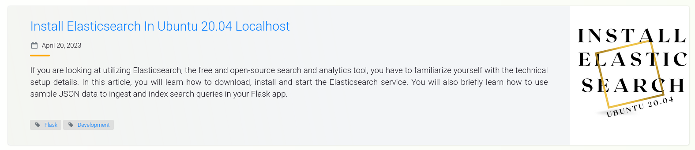

# Add Tags To Your Flask Blog Posts



Tags are a simple classification system that can be used in a blog post. A tag can be applied to multiple blog posts and, similary, multiple blog posts can be related to one another outside their category. For example, a blog may have a tag called "Flask". People interested in reading posts related to "Flask" only can click on this link and they will find relevant posts. This article shows how to build the project from scratch. However, if you would like to skip to the Tags section, you can begin from [Working With A Database](#working-with-a-database). 

### Table Of Contents

- [Requirements](#requirements)
- [Building The Initial GUI Project](#building-the-initial-gui-project)
    - [Project Structure](#project-structure)
    - [Start The Flask Server](#start-the-flask-server)
    - [Web Forms](#web-forms) 
    - [Web Form Configuration](#web-form-configuration)
    - [Facelift](#facelift)
    - [Display User Data](#display-user-data)
- [Working With A Database](#working-with-a-database)
    - [Database Configuration](#database-configuration)
    - [Define Your Models](#define-your-models)
    - [Create An Association Table](#create-an-association-table)
    - [Apply Your Changes](#apply-your-changes)
- [Filtering Data Using Tags](#filtering-data-using-tags)
    - [Add Tags To Your Blog Post](#add-tags-to-your-blog-post)
    - [View Blog Posts Based On Select Tags](#view-blog-posts-based-on-select-tags)


## Requirements

Before you can begin implementing this feature, you will need the following:

- Python installed in your machine
- Flask knowledge
- Familiarity with working with a database


## Building The Initial GUI Project

If you are on Ubuntu or any of Linux distributions, you do not have to worry about having Python in your machine. It comes with it right out of the box. However, if you are on Windows, you may need to check it first, and install it if you do not have it. The most recommended way to develop this application on Windows is by using the [Windows Subsystem for Linux](https://github.com/GitauHarrison/notes/blob/master/non_technical_articles/wsl.md).

The completed project can be found in the GitHub repository [tags for your blog posts in flask](https://github.com/GitauHarrison/tags-for-your-blog-posts-in-flask). The project in the repository uses Tailwind CSS rather than Bootstrap.


### Project Structure

Let us utilize this project structure while building the application:

```python
folder
    | --- config.py
    | --- main.py
    | --- requirements.txt
    | --- .flaskenv
    | --- .gitignore
    | --- .env
    | --- .env-template
    | --- app/
            | --- routes.py
            | --- __init__.py
            | --- models.py
            | --- forms.py
            | --- errors.py
            | --- templates/
                        | --- base.html
                        | --- index.html
                        | --- tags.html
```

Following the principle of _seperation of concerns_, each application's function will be classified in a module of its own. You can use your text editor's GUI to create the project's structure, or Linux commands in your terminal. An example is `touch main.py` which creates an empty file called `main.py`.


### Start The Flask Server

With the structure in place, we will need to configure the application to begin utilizing Flask and relevant Flask packages. The first thing we will need to do is to create and activate a virtual environment.

```python
$ python3 -m venv venv
$ source venv/bin/activate

# Terminal changes to:
(venv)$
```

The first command used `venv` to create a virtual environment called `venv` (you can call this anything you want). The second command activates the virtual environment you have just created. You will see a folder called _venv_ in the root directory of your project.

What is a virtual environment and why use it? 

> "A virtual environment is a Python environment such that the Python interpreter, libraries and scripts installed into it are isolated from those installed in other virtual environments, and (by default) any libraries installed in a “system” Python, i.e., one which is installed as part of your operating system"

Imagine a scenario where you installed Flask V1 to your global Python library. Later on, there is an update to Flask and you end up installing Flask V2 which may be having some breaking changes. When you try to run your intial project with Flask V2, both of which are present in your global Python environment, you are most likely to get all sorts of errors.

A virtual environment is used to isolate the needs of one project from another and also helps to decluster our global Python environemnt. This way, we are able to run applications smoothly. An alternative method of working with virtual environments is by using [virtualenvwrapper](virtualenvwrapper_setup.md). It is an enhancement to the way we can work with virtual environements. For instance, the command `mkvirtualenv venv` not only creates but activates a virtual environemnt called `venv` for us.

With the virtual environment active, we can install the following packages:

```python
(venv)$ pip3 install flask flask-sqlalchemy flask-migrate flask-wtf flask-moment flask-bootstrap python-dotenv email-validator
```

Next, we will need to create an instance of Flask:

```python
# app/__init__.py

from flask import Flask


app = Flask(__name__)


from app import routes, models, errors

```

To ensure that everything works, we can test out if the application can render something on a page:

```python
# app/routes.py

from app import app

@app.route('/')
@app.route('/index')
def index():
    return 'Hello, world!'

```

Above, we want the string "Hello, world!" to be returned when we navigate to either `/` or `/index` URLs. The Flask server expects certain environment variables to be set before serving the relevant content. To make our work easier, we will define all environment variables in `.flaskenv`. These variables are needed prior to the Flask server starting.

```python
FLASK_APP=main.py
FLASK_ENV=development
FLASK_DEBUG=True
```

The Flask server will need to know where to start from. Remember, we created a Flask instance in `__init__.py`. This file is used as an instance to the application. We need to find a way to point to this file. Let us update the `main.py` file so that it can act as an entry-point file by pointing to the application's instance.

```python
# main.py

from app import app
```

At this point, we are now ready to fire up the Flask server. Run the command below to start the server.

```python
(venv)$ flask run
```

For the command to work, ensure you are in the root directory of the project. You will see the localhost URL http://127.0.0.1:5000 in your terminal. Paste it in your favorite browser. You should see the text "Hello, world!" returned. This means that everything works as expected. If you encountered an error, kindly review the steps to get here once more.


### Web Forms

To post data, it is convenient to use form. This way, a user will know what data they need to post. Below, we are going to define one.

```python
# app/forms.py


from flask_wtf import FlaskForm
from wtforms import StringField, SubmitField, SelectMultipleField, TextAreaField
from wtforms.validators import DataRequired, Email, Length


class PostForm(FlaskForm):
    """Form to add a blog post"""
    username = StringField(
        'Username', validators=[DataRequired()], render_kw={"placeholder": "muthoni"})
    email = StringField(
        'Email', validators=[DataRequired(), Email()], 
        render_kw={"placeholder": "muthoni@email.com"})
    title = StringField(
        'Title', validators=[DataRequired()], 
        render_kw={"placeholder": "Tags System"})
    body = TextAreaField(
        'Body',
        validators=[DataRequired(), Length(min=0, max=140)],
        render_kw={"placeholder": "Say something ..."})
    tags = SelectMultipleField(
        'Tag Name',
        validators=[DataRequired()],
        choices=[
            ('Python', 'Python'),
            ('Flask', 'Flask'),
            ('Database', 'Database')
        ])
    submit = SubmitField('Post')

```

The form above is called a `PostForm()`. It has the `username`, `email`, `title` `body` and `tags` field. The `tags` field used `SelectMultipleField` to allow for the selection of more than one user input.

To ensure that this form gets displayed, we will need to update our `index.html` file. We have another file called `base.html` which we can use to define styles and layouts we want applied and reused across all other templates, hence the name "base". Let us first begin my defining these reusable styles and layouts.

```html
<!-- templates/base.html -->




    
        {{ title }}
    
        Tags System
    



    <nav>
        <ul>
            <li>
                <a href="{{ url_for('index') }}">Home</a>
            </li>
        </ul>
    </nav>



    <div class="container">
        
            
                
                    <div class="alert alert-success">
                        {{ message }}
                    </div>
                
            
        

        <!-- Child templates -->
        
    </div>



    {{  super() }}
    {{ moment.include_moment() }}
    


```

I have added a "flash" message which will be useful in letting a user know of the status of an action they have taken. Blocks have been used to layout the different reusable pats of the application. The block `app_content` will be used by child templates to define their own template-specific content. We can display our web form in `index.html`.

```html
<!-- templates/index.html -->





<div class="row text-center">
  <div class="col-md-12">
    <h1>{{ title }}</h1>
    <p>
      Use the form below to post something and add tags to your post. 
      Currently, there are {{ num_posts }} posts.
    </p>
  </div>
</div>
  <div class="row">
      <div class="col-md-4"></div>
        <div class="col-md-4">
            <!-- Form -->
            <p>
              {{ form.username.label }} <br>
              {{ form.username() }} <br>
              
                <span style="color: red;">{{ error }}</span>
              
            </p>
            <p>
              {{ form.email.label }} <br>
              {{ form.email() }} <br>
              
                <span style="color: red;">{{ error }}</span>
              
            </p>
            <p>
              {{ form.title.label }} <br>
              {{ form.title() }} <br>
              
                <span style="color: red;">{{ error }}</span>
              
            </p>
            <p>
              {{ form.body.label }} <br>
              {{ form.body() }} <br>
              
                <span style="color: red;">{{ error }}</span>
              
            </p>
            <p>
              {{ form.tags.label }} <br>
              {{ form.tags() }} <br>
              
                <span style="color: red;">{{ error }}</span>
              
            </p>
            <p>{{ form.submit() }}</p>
            <!-- End -->
        </div>
      <div class="col-md-4"></div>
  </div>


```

The templates currently defines Bootstrap-specific styling that we have not yet intialized. We will do so in the [Facelift](#facelift) below. To see these templates, we have to render them. This is usually done in the `routes` module.

```python
# app/routes: Render the post form

from flask import render_template
from app.forms import PostForm
from app import app

@app.route('/', methods=['GET', 'POST'])
@app.route('/index', methods=['GET', 'POST'])
def index():
    form = PostForm()
    return render_template(
        'index.html',
        title='Post Something',
        form=form)

```

The only change made is the use of `render_template()` function from Flask. This function takes the template name, a form variable and an optional template title.


### Web Form Configuration

Web forms are a very sensitive building block of any web application. Users use it to post data, some of which is personal such as passwords and credit card details. Given the sensitivity of a web form, Flask expects us to set a SECRET_KEY. This key will be used by the web form to protect it from a nasty attack called Cross Site Request Forgery (CSRF). Without it, we will get a `RuntimeError: A secret key is required to use CSRF.` 

We have a module called `config`. We shall be using it to define the application's configureation. Let us head over to the `config.py` file and update it with the following changes:

```python
# config.py: Define application configurations

import os


class Config(object):
    SECRET_KEY = os.environ.get('SECRET_KEY') or 'difficult-key'

```

We need to ensure that the application is able to read these configuration. We, therefore, will register this module in the application's instance.

```python
# app/__init__.py: Register configurations

from flask import Flask
from config import Config


app = Flask(__name__)
app.config.from_object(Config)


from app import routes, models, errors

```

If you refresh your web page, you will get the `Template Not Found: jinja2.exceptions.TemplateNotFound: bootstrap/wtf.html` error from the debugger. 


### Facelift

To get rid of the error and ensure the Bootstrap-specific styles are applied, we will need to initialize a `bootstrap` variable in the application's instance.

```python
# app/__init__.py: Initialize bootstrap

from flask import Flask
from flask_bootstrap import Bootstrap
from config import Config


app = Flask(__name__)
app.config.from_object(Config)

bootstrap = Bootstrap(app)


from app import routes, models, errors

```

At this stage, you should be able to see your Index page displayed, albeit with minimal styling. 


You can agree with me that the design leaves something to be desired. Below, let us add some enhancements to the user interface.

```html
<!-- templastes/base.html -->



<!-- The title of our application is defined here -->

    
        {{ title }} - Tags
    
        Tag System
    


<!-- This is the navbar -->

<nav class="navbar navbar-default">
    <div class="container">
        <div class="navbar-header">
            <button type="button" class="navbar-toggle collapsed" data-toggle="collapse" data-target="#bs-example-navbar-collapse-1" aria-expanded="false">
                <span class="sr-only">Toggle navigation</span>
                <span class="icon-bar"></span>
                <span class="icon-bar"></span>
                <span class="icon-bar"></span>
            </button>
            <a class="navbar-brand" href=" {{ url_for('index') }} ">Tags System</a>
        </div>
        <div class="collapse navbar-collapse" id="bs-example-navbar-collapse-1">            
            <ul class="nav navbar-nav navbar-right">                
                <li><a href=" https://github.com/GitauHarrison/tags-for-your-blog-posts-in-flask " target="_blank">GitHub</a></li>
            </ul>                       
        </div>
    </div>
</nav>




<div class="container">
    <!-- Flash messages -->
    
        
            <div class="alert alert-info">
                
                    {{ message }}
                
            </div>
        
    
    
    <!-- Contents of all our pages will go here -->
    
</div>



<!-- All scripts will go here -->

    {{  super() }}
    

```

The base template now has some proper style and the navigation bar seem a lot more refined than before. We can also style the `PostForm()` using Bootstrap.

```html
<!-- templates/index.html: Style web form using Bootstrap -->





<div class="row text-center">
  <div class="col-md-12">
    <h1>{{ title }}</h1>
    <p>
      Use the form below to post something and add tags to your post. 
      Currently, there are {{ num_posts }} posts.
    </p>
  </div>
</div>
  <div class="row">
      <div class="col-md-4"></div>
        <div class="col-md-4">
            <!-- Form -->
            <p> {{ wtf.quick_form(form) }} </p>
            <!-- End -->
        </div>
      <div class="col-md-4"></div>
  </div>


```
Bootstrap provides the `quick_form()` function to quickly display a form with all its fields. All that is needed from us is to pass the `form` variable (or whatever else you called it) to it.


### Display User Data

We can utilize some dummy post data to test how each user's post will look like. 

```python
# app/routes.py: Render user post

from flask import render_template
from app.forms import PostForm
from app import app

@app.route('/', methods=['GET', 'POST'])
@app.route('/index', methods=['GET', 'POST'])
def index():
    form = PostForm()
    posts = [
        {
            'author': {'username': 'Muthoni', 'email': 'muthoni@email.com'},
            'title': 'Hair',
            'body': 'I love my long hair',
            'tags': ['fashion', 'grooming']
        },
        {
            'author': {'username': 'gitau', 'email': 'gitau@email.com'},
            'title': 'Vienna',
            'body': 'I\'d love to be in the city of Vienna some day. I will.',
            'tags': ['travel', 'workout']
        }
    ]
    return render_template(
        'index.html',
        title='Post Something',
        form=form,
        posts=posts)

```

The `posts` variable contains a list of dummy user data I have hard-coded. It is passed to the templates so that individual data can be accessed.

```html
<!-- templates/index.html: Display user post -->





<div class="row text-center">
  <div class="col-md-12">
    <h1>{{ title }}</h1>
    <p>
      Use the form below to post something and add tags to your post. 
      Currently, there are {{ num_posts }} posts.
    </p>
  </div>
</div>
  <div class="row">
      <div class="col-md-4"></div>
        <div class="col-md-4">
            <!-- Form -->
            <p> {{ wtf.quick_form(form) }} </p>
            <!-- End -->
        </div>
      <div class="col-md-4"></div>
  </div>
  <div class="row">
    <div class="col-3"></div>
    <div class="col-6">
      
        <table class="table table-hover">
            <tr>
              <td>
                <strong>{{ post.title }}</strong> <br>
                {{ post.author.username }} said: <br>
                {{ post.body }} <br>
                
                  {{ tag }} | 
                
              </td>
            </tr>
        </table>
      
    </div>
    <div class="col-3"></div>
  </div>


```
The Jinja2 templating engine allows us to loop through the `posts` variable to access a user's details, including what they said and their associated tags. Notice that for me to attach relevant tags to each post, I have to loop through the list of each posts' tags as `post.tags`. `tags` is the key used to access the list of tags in each post.


In case you are wondering what `email` is used for, it will come in handy later when we want to associate an avatar with each user's post. We will generate an avatar for each user based on their email addresses.


## Working With A Database


### Database Configuration


### Define Your Models


### Create An Association Table


### Apply Your Changes


## Filtering Data Using Tags

### Add Tags To Your Blog Post

### View Blog Posts Based On Select Tags