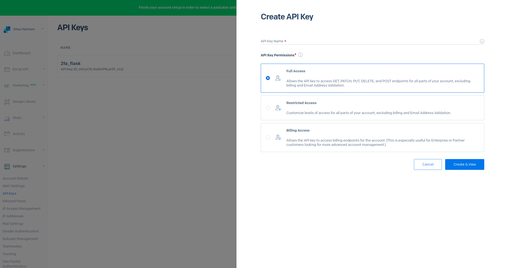
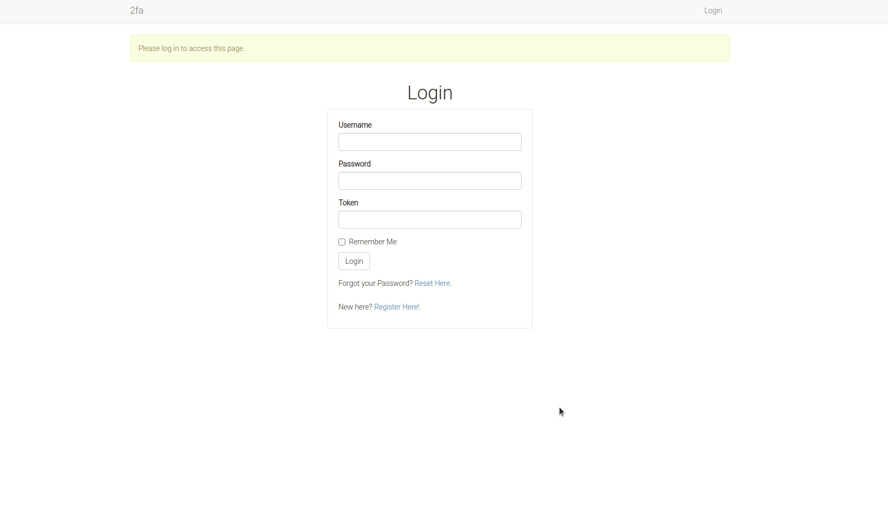
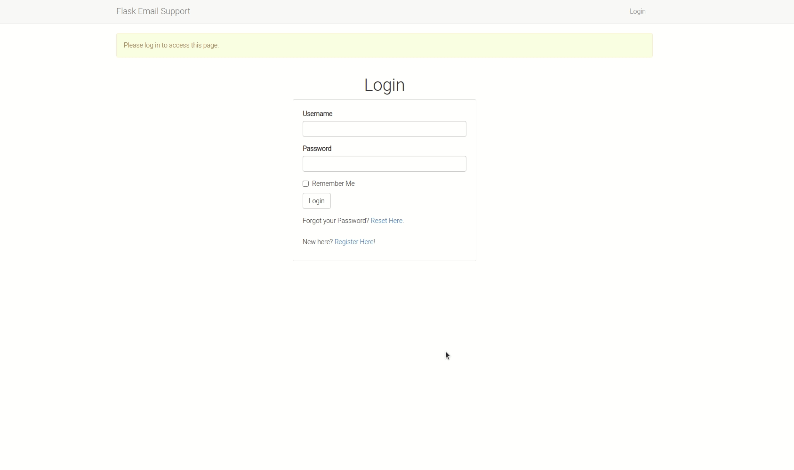
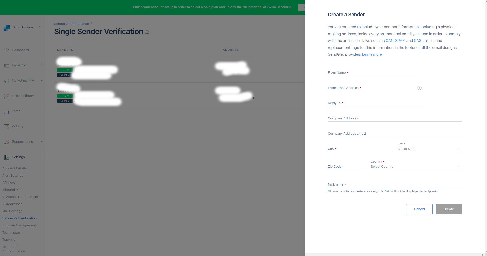
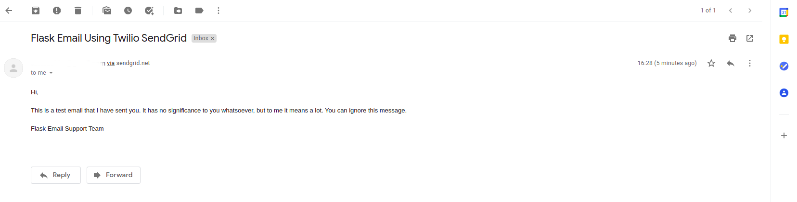

# How to Send and Receive Emails from You Flask App using Twilio SendGrid

[SendGrid](http://sendgrid.com/) is a communication platform for transactional and marketing email. The goal of using SendGrid is technically delivering an exceptional email experience since email is the backbone of a business' customer engagement. In this tutorial, I will show you how you can build a Flask application and integrate Twilio SendGrid APIs.

### What we will do:

1. Create a SendGrid account
2. Build a Flask application
3. Integrate Flask mail 
4. Integrate Twilio SendGrid

### Create a SendGrid account

* Create a [free account](https://signup.sendgrid.com/) now
* Log into your account
* Select _Settings_ then click on [API Keys](https://app.sendgrid.com/settings/api_keys)
* Create a new API Key by clicking on the blue button



* Give the API Key a name
* Ensure you select _Full Access_
* Click _Create and View_ button

Copy the API Key and save it somewhere safe. You will need it later.

### Build a Flask Application



Build this application in Flask. The mandatory user authentication process can be optional for now. To get you started, consider to use this structure:

```python
sendgrid_project
    | ----------- sendgrid.py
    | ----------- config.py
    | ----------- .env
    | ----------- .env-template
    | ----------- .gitignore
    | ----------- .flaskenv
    | ----------- requirements.txt
    | ----------- app/
                   | ----------- routes.py
                   | ----------- forms.py
                   | ----------- __init__.py
                   | ----------- models.py
                   | ----------- emails.py.py
                   | ----------- errors.py
                   | ----------- templates/
                                    | ----------- home.html
                                    | ----------- base.html
                                    | ----------- register.html
                                    | ----------- login.html
                                    | ----------- password_reset_request.html
                                    | ----------- password_reset.html
                                    | ----------- emails/
                                                    | ----------- password_reset.html
                                                    | ----------- password_reset.txt
                    | ----------- static/
                                    | ----------- styles.css
```

Use the commands `mkdir` and `touch` in your terminal to quickly create this structure

```
# Create an empty directory
$ mkdir sendgrid_project

# Create an empty file inside an existing directory
$ touch sendgrid_projcet/config.py
```

Activate your virtual environment:

```python
$ mkvirtualenv # I am using a virtualenvwrapper
```

Next, install packages that will be used in the project:

* flask
* flask-sqlalchemy
* flask-migrate
* flask-mail
* flask_bootstrap
* flask-wtf
* flask-login
* email-valiator
* pyjwt
* pyngrok

```python
(venv)$ pip3 install flask flask-migrate # add the rest here
```

Add the installed packages in `requirements.txt` file:

```python
(venv)$ pip3 freeze > requirements.txt
```

Complete the application as seen in this [GitHub repository](https://github.com/GitauHarrison/how-to-add-email-support-in-a-flask-app).

Noteworthy, the files in `app/templates/email` carry the message that will be sent to a user's email. This email message has a password reset link which will redirect a user to another page of the application where they can reset their password. This link has an expiration period after which it will become invalid.

Also, it should be noted the application does send errors to the admin of the application whenever there is an internal server error. This email bears the message of the error so the admin can see the actual cause problem.

### Testing How to Send Password Reset Email Locally



* Register a user using a valid and working email, for example _johndoe@gmail.com_. You should be able to access this email. 
* Log in to your app to make sure your credentials actually work.
* Log out of the app by clickig _Logout_ link at the top-right of the navbar
* Click on _Reset Password_ link
* Add the registered user's email
* Open the user's email to find the password reset request email
* Click on the expirable link in the email
* Type in your new password and confirm it
* Click _Reset Password_ button
* Click on the _Login_ link
* Enter your new password

You should be able to log in. From your terminal, you should have seen how the email authentication works. 

### Sending Emails Using Twilio SendGrid

Now that you know how to send emails using Flask Mail, you can do the same for applications that are on production. If you host this application, say in Heroku, you will note that the password reset feature does not work. You have no errors, but still it does not work. This is because the email service we are using does not work on production. And that is where Twilio SendGrid comes it.

In this section, I am going to show you how to send emails using Twilio SendGrid. The method I will use below will not work on a production software.

You have already signed up for Twilio SendGrid and you have your API Key with you. We will make use of this email module we have set up to work with Twilio SendGrid.

First, let us update the `config.py` file to use SendGrid configurations:

`config.py: Set SendGrid environment variables`

```python
# Current Email configurations
MAIL_SERVER = os.environ.get('MAIL_SERVER')
MAIL_PORT = int(os.environ.get('MAIL_PORT') or 25)
MAIL_USE_TLS = os.environ.get('MAIL_USE_TLS') is not None
MAIL_USERNAME = os.environ.get('MAIL_USERNAME')
MAIL_PASSWORD = os.environ.get('MAIL_PASSWORD')
ADMINS = ['your-email@example.com']

# SendGrid's email configurations
MAIL_SERVER = os.environ.get('MAIL_SERVER')
MAIL_PORT = int(os.environ.get('MAIL_PORT') or 25)
MAIL_USE_TLS = os.environ.get('MAIL_USE_TLS') is not None
MAIL_USERNAME = os.environ.get('MAIL_USERNAME')
MAIL_PASSWORD = os.environ.get('SENDGRID_API_KEY')
MAIL_DEFAULT_SENDER = os.environ.get('MAIL_DEFAULT_SENDER')

```

To use SendGrid's SMTP Service, you have to properly update your configurations. 

* The mail server will be `smpt.sendgrid.net`
* The mail port should be 587 (or 25)
* TLS must be enabled
* For your username, do not use your _email address_, rather you must use the word "apikey"

This is how your `.env` file will look like:

```python
MAIL_SERVER='smtp.sendgrid.net'
MAIL_PORT='587'
MAIL_USE_TLS='True'
MAIL_USERNAME='apikey'
SENDGRID_API_KEY='add-your-api-key-here'
MAIL_DEFAULT_SENDER='a-valid-and-working-email-address'
```

In the current application, you will need to update all instances of the variable `ADMINS` to `MAIL_DEFAULT_SENDER`. 

Then run your flask shell:

```python
(venv) flask shell

# Output
Python-dotenv could not parse statement starting at line 1
Python 3.8.5 (default, Jan 27 2021, 15:41:15) 
[GCC 9.3.0] on linux
App: app [development]
Instance: /home/harry/email_support_in_flask/instance
>>> app

# Output
<Flask 'app'>
```
What does the `flask shell` command do? The purpose of the flask shell command is to start the Python interpreter  in the context of the application. Take this example:

```python
(venv)$ python # this starts the python intepreter

# Output
Python 3.8.5 (default, Jan 27 2021, 15:41:15) 
[GCC 9.3.0] on linux
Type "help", "copyright", "credits" or "license" for more information.
>>> app
Traceback (most recent call last):
  File "<stdin>", line 1, in <module>
NameError: name 'app' is not defined
>>> 
```

Python does not recognize the `app` instance unless it is explicitly imported. From the `flask shell`example above, you will notice that the Python interpreter recongized the `app` instance. This is all defined in the application entry file `sendgrid.py` at the project's top-level directory.

With your Python interpreter open using the `flask shell` command, we will import `flask_mail` to send out an example email. 

```python
>>> from app import mail
>>> from flask_mail import Message

>>> msg = Message('Sending Email Using Twilio SendGrid', recipients=['a-working-recipient-email-address'])
>>> msg.body = 'Hi, \n\n This is a test email that I have sent you. It has no significance to you whatsoever, but to me it means a lot. You can ignore this message. \n\nFlask Email Support Team'
>>>msg.html = '<p>Hi, <br><br> This is a test email that I have sent you. It has no significance to you whatsoever, but to me it means a lot. You can ignore this message. <br><br>Flask Email Support Team</p>'

>>>mail.send(msg)
```

You will get the error:

```python
# ...
AssertionError: The message does not specify a sender and a default sender has not been configured
```

To fix this error, you need to configure your account to specify a [Sender Identity](https://sendgrid.com/docs/for-developers/sending-email/sender-identity/). We will use the _Single Sender Verification_ which is a fast way to verify your Sender Identity when you don’t have access to the DNS settings for your domain. 

* From your [SendGrid Dashboard](https://app.sendgrid.com/), select _Settings_
* Click on [Sender Authentication](https://app.sendgrid.com/settings/sender_auth). You will see _Single Sender Verification_ section
* Click  on [Verify Single Sender](https://app.sendgrid.com/settings/sender_auth/senders/new) button.
* Create a new Sender by clicking on the blue button. You will see the form below:



* Provide valid and working email addresses for _From Email Address_ and _Reply To_ form fields. You can fill in placeholder data in the other fields.

That's how you specify a sender identity. Note that this is used for test purposes only. _With a trial account you can send 100 emails per day forever._

In your `.env` file, update the `MAIL_DEFAULT_SENDER` variable to be the same as the one you have set up just now in your Sender Identity.

Exit the Python interpreter above by pressing `Ctrl + Z`. Run `flask shell` to start all over again.

```python
>>> from app import mail
>>> from flask_mail import Message

>>> msg = Message('Sending Email Using Twilio SendGrid', recipients=['any-working-recipient-email-address'])
>>> msg.body = 'Hi, \n\n This is a test email that I have sent you. It has no significance to you whatsoever, but to me it means a lot. You can ignore this message. \n\nFlask Email Support Team'
>>>msg.html = '<p>Hi, <br><br> This is a test email that I have sent you. It has no significance to you whatsoever, but to me it means a lot. You can ignore this message. <br><br>Flask Email Support Team</p>'

>>>mail.send(msg)
```

Hopefully everything goes well and you have received the test email in your inbox.


