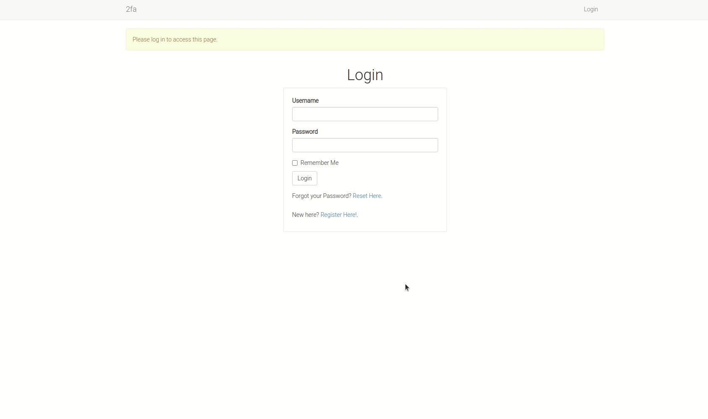
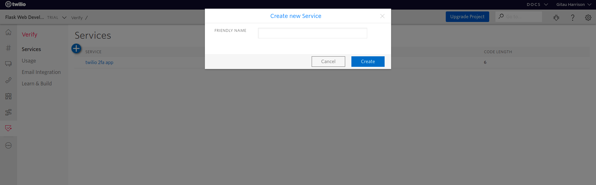
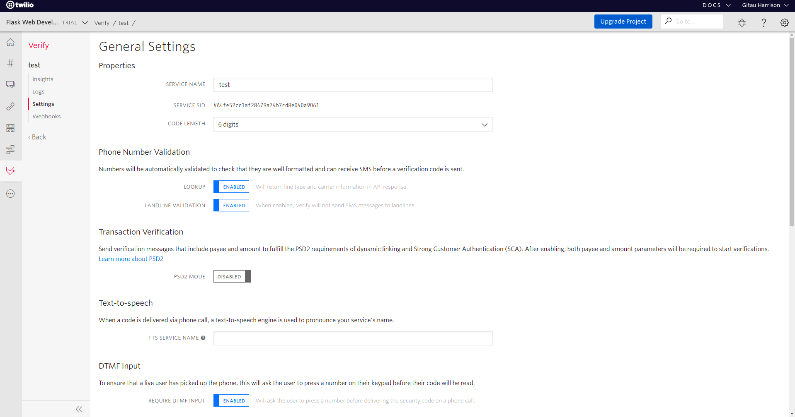
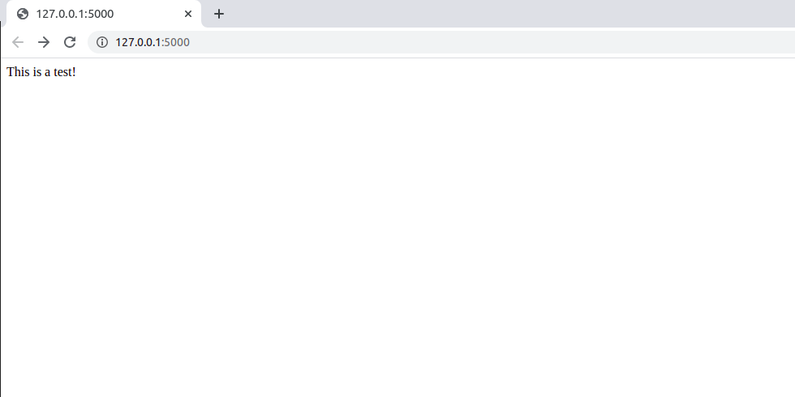
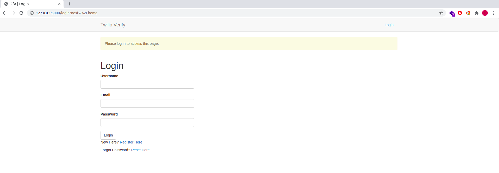
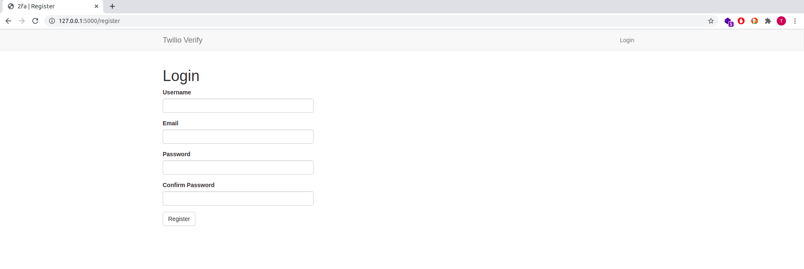

# Two-factor Authentication Using Twilio Verify in Flask

There are a couple of ways to use two-factor authentication in a flask application. In [another article](2fa_flask.md), I showed how you can enable mandatory two-factor authentication where users of an app have to key in a time-based one-time password that is sent to a TOTP app in their smartphone. In this article, we will make two-factor authentication optional. Whenever a user enables this feature, a code will be sent to their phone through sms. They will use that code to authenticate themselves.

[Twilio Verify](https://www.twilio.com/verify) is a service that allows your application to send verification codes to users of your application through SMS or phone call.



What we will do:

1. Create a flask app with user login features
2. Add a profile page
3. Integrate Twilio Verify

Kindly note that you will need these before you proceed:

* A working phone number
* A Twilio account. Create a [free account](https://www.twilio.com/try-twilio?promo=WNPWrR) now.
* Python 3.5+

### Service Setup

Once you have an account, 
* Navigate to [Twilio Console](https://www.twilio.com/console). 
* From the far-left menu bar, click "All Products and Services"
* Find and click on [Verify](https://www.twilio.com/console/verify/services)
* Create a new service by clicking on the blue button



* Give it a friendly name and click "Create"
* You will be given a _Service ID_



I have shown you the _Service ID_. However, this should be secret. I am not worried about it because I will discard it in no time.

* Besides the _Service ID_, you will also need your _Twilio Account SID_ and _Auth Token_ which are found in the [Twilio Console](https://www.twilio.com/console).

Copy all these somewhere because you will need them for your project.

### Flask App with User Login

This project assumes you know a bit about Flask and Python. If you are new, you will need to start [here](personal_blog.md).

#### Project Structure

We will use this structure:

```python
project_folder
    |------- .flaskenv
    |------- .env
    |------- .env.template
    |------- config.py
    |------- twilio_verify.py
    |------- requirements.txt
    |------- .gitignore
    |------- app/
              |------- __init__.py
              |------- routes.py
              |------- models.py
              |------- forms.py
              |------- errors.py
              |------- email.py
              |------- static/
                        |------- images/
                        |------- css/styles.css
              |------- templates/
                        |------- base.html
                        |------- home.html
                        |------- login.html
                        |------- register.html
                        |------- 404.html
                        |------- 500.html
                        |------- reset_password_request.html
                        |------- reset_password.html
                        |------- user.html
                        |------- verify_2fa.html
                        |------- edit_profile.html
                        |------- enable_2fa.html
                        |------- disable_2fa.html
                        |------- email/
                                   |----- reset_password.html
                                   |----- reset_password.txt

```

You can create this structure using the `mkdir` and `touch` terminal commands:

```python
$ mkdir project_folder # creates an empty directory called project_folder
$ touch project_folder/config.py # creates an empty config.py file inside project_folder
```

Once you have completed creating this project structure, move into _project_folder_:

```python
$ cd project_folder
```

#### Create Virtual Environment

Virtual environments allow you to isolate the project requirements from that of your Operating System. You need to create and activate it:

```python
$ mkvirtualenv twilio_verify 
```

I have used the `virtualenvwrapper` to manage my virtualenv workflow. If you do not know what it is, learn more [here](virtualenvwrapper_setup.md).

This application will use these dependencies:

* [flask](https://flask.palletsprojects.com/en/1.1.x/)
* [flask-sqlalchemy](https://flask-sqlalchemy.palletsprojects.com/en/2.x/)
* [flask-boostrap](https://pythonhosted.org/Flask-Bootstrap/)
* [flask-login](https://flask-login.readthedocs.io/en/latest/)
* [flask-wtf](https://flask-wtf.readthedocs.io/en/stable/)
* [flask-mail](https://pythonhosted.org/Flask-Mail/)
* [flask-migrate](https://flask-migrate.readthedocs.io/en/latest/)
* [python-dotenv](https://pypi.org/project/python-dotenv/)
* [pyjwt](https://pyjwt.readthedocs.io/en/stable/)
* [pyngrok](https://pypi.org/project/pyngrok/)
* [email-validator](https://pypi.org/project/email-validator/)

To install all of them at once, run:

```python
(twilio_verify)$ pip3 install flask flask-sqlalchemy flask-bootstrap # Add all the other dependencies within this same line
```

To work with Twilio Verify, you will also need to install the Twilio Helper Library for Python:

```python
(twilio_verify)$ pip3 install "twilio>=6.17.0"
```

From your root directory (project_folder), update your `requirements.txt` to contain all the installed dependencies:

```python
(twilio_verify)$ pip3 freeze > requirements.txt
```

#### Build Initial Project

Let us make sure that the structure shown at the beginning of the article works by building a minimalist application:

`__init__.py: Create application instance`
```python
from flask import Flask

app = Flask(__name__)

from app import routes, models, errors
```

We have created an instance of our flask application

`routes.py: Handle app routeing`

```python
from app import app


@app.route('/', methods=['GET', 'POST'])
@app.route('/home', methods=['GET', 'POST'])
def home():
    return 'This is a test!'

```

The application should eventually display "This is a test".

`app.py: Create entry point to the applicaiton`

```python
from app import app

```

Flask expects this file at the top-level directory.

`.flaskenv: Flask Environment Variables`

```python
FLASK_APP=app.py
FLASK_ENV=development
FLASK_DEBUG=True
```

Flask will use these variables to fire up our server. It will be a development server with Flask's hot auto-reload enabled.

We can now fire up our Flask server from the terminal:

```python
(twilio_verify)$ flask run
```

You should see this:



#### Database Configuration

Our application will allow new users to register and current users to login. Let us implement this now. This information will be hosted by our SQLite database. 

`config.py: Database configuration`

```python
import os

basedir = os.path.abspath(os.path.dirname(__file__))

class Config(object):
    SQLALCHEMY_DATABASE_URI = os.environ.get('DATABASE_URL') or \
        'sqlite:///' + os.path.join(basedir, 'app.db')
    SQLALCHEMY_TRACK_MODIFICATIONS = False
```

Configure a path to our database and disable a feature of Flask-sqlalchemy that we do not need, which is to signal the application every time a change is about to be made in the database.

`__init__.py: Initialize database`

```python
# ...
from flask_sqlalchemy import SQLAlchemy
from flask_migrate import 
from config import Config

app = Flask(__name__)
app.config.from_object(Config)
db = SQLAlchemy(app)
migrate = Migrate(app, db)

# ...
```
`flask-sqlalchemy` is an extension that provides a Flask-friendly wrapper to the popular [SQLAlchemy](http://www.sqlalchemy.org/) package. This package is an ORM which allows applications to manage a database using high-level entities such as classes, objects and methods instead of tables and SQL.

`flask-migrate` will allow us to make changes to our database by handling migratrion.

`models.py: Database schema to for a user`

```python
from app import db

class User(db.Model):
    id = db.Column(db.Integer, primary_key=True)
    username = db.Column(db.String(64), index=True, unique=True)
    email = db.Column(db.String(120), index=True, unique=True)
    password_hash = db.Column(db.String(128))

    def __repr__(self):
        return '<User: {}>'.formart(self.username)
```

With the database schema and configuration set up, let us apply those changes:

```python
(twilio_verify)$ flask db init

# Output

Creating directory /home/harry/verify_twilio/migrations ...  done
  Creating directory /home/verify_twilio/migrations/versions ...  done
  Generating /home/harry/verify_twilio/migrations/script.py.mako ...  done
  Generating /home/harry/verify_twilio/migrations/alembic.ini ...  done
  Generating /home/harry/verify_twilio/migrations/README ...  done
  Generating /home/harry/verify_twilio/migrations/env.py ...  done
  Please edit configuration/connection/logging settings in
  '/home/harry/verify_twilio/migrations/alembic.ini' before proceeding.
```

A _migratitons_ repository will be created in the top-level directory. In it, there is a _versions_ sub-folder which will soon hold all the changes we make to our database.

```python
(twilio_verify)$ flask db migrate -m 'user table'

# Output

INFO  [alembic.runtime.migration] Context impl SQLiteImpl.
INFO  [alembic.runtime.migration] Will assume non-transactional DDL.
INFO  [alembic.autogenerate.compare] Detected added table 'user'
INFO  [alembic.autogenerate.compare] Detected added index 'ix_user_email' on '['email']'
INFO  [alembic.autogenerate.compare] Detected added index 'ix_user_username' on '['username']'
  Generating
  /home/harry/software_development/python/practice_projects/verify_twilio/migrations/versions/9d3452db7add_user_table.py ...  done
```

A migration script called `...user_table.py` has been created in _versions_ sub-folder.

To apply the changes we have made, we will run:

```python
(twilio_verify)$ flask db upgrade

# Output

INFO  [alembic.runtime.migration] Context impl SQLiteImpl.
INFO  [alembic.runtime.migration] Will assume non-transactional DDL.
INFO  [alembic.runtime.migration] Running upgrade  -> 9d3452db7add, user table
```

These are the steps we will follow every time we want to make changes to our database.

#### User Login

User login will involve finding an existing user in the database and retrieving that information. Flask provides `flask-login` which is responsible for handling all user login needs. 

Right of the back, it is not recommended to store a user's password in the database. Rather, a long representation of itself which is hard to guess is often used. This is called password hashing. [Werkzeug](http://werkzeug.pocoo.org/) provides `generate_password_hash` and `check_password_hash` to handle password hashing.

We will update our models to accommodate this feature.

`models.py: Password hashing`

```python
# ...
from flask_login import UserMixin
from werkzeug.security import generate_password_hash, check_password_hash

class User(UserMixin, db.Model):
    # ...

    def set_password(self, password):
        self.password_hash = generate_password_hash(password)

    def check_password(self, password):
        return check_password_hash(self.password_hash, password)
```

Keywords such as `is_authenticated`, `is_active`, `is_anonymous`, `get_d` are normally used to work with a user's login session. To implement them, we need to import the _mixin_ class from `flask-login` and pass it to our `User` model. Thereafter, we add password hashing.

However, `flask-login` knows nothing about a user. We need to help it know which user has been connected to the application by configuring a user loader function that can be called to load a user using a user's given ID.

`models.py: User loader`

```python
# ...
from app import login


@login.user_loader
def load_user(id):
    return User.query.get(int(id))

```

To complete the login view function, we will create a route called `/login`.

`routes.py: User login`

```python
# ...
from flask import render_template, redirect, url_for, flash, request
from werkzeug.urls import url_parse
from flask_login import login_user, current_user
from app.forms import LoginForm

@app.route('/login', methods=['GET', 'POST'])
def login():
    if current_user.is_authenticated:
        return redirect(url_for('login'))
    form = LoginForm()
    if form.validate_on_submit():
        user = User.query.filter_by(username=form.username.data).first()
        if user is None or not user.check_password(form.password.data):
            flash('Invalid username or password')
            return redirect(url_for('login'))
        login_user(user, remember=form.remember_me.data)
        next_page = request.args.get('next')
        if not next_page or url_parse(next_page).netloc != '':
            next_page = url_for('home')
        return redirect(next_page)
    return render_template('login.html',
                           title='Login',
                           form=form
                           )
```

We need to create the `LoginForm`

```python
from flask_wtf import FlaskForm
from wtforms import StringField, PasswordField, SubmitField
from wtforms.validators import DataRequired, Email, EqualTo, ValidationError


class LoginForm(FlaskForm):
    username = StringField('Username', validators=[DataRequired()])
    email = StringField('Email', validators=[DataRequired(), Email()])
    password = PasswordField('Password', validators=[DataRequired()])
    submit = SubmitField('Login')

```

Flask expects that we set a `SECRET_KEY` which will be used to protect our web forms against a nasty attack called  [CSRF](https://en.wikipedia.org/wiki/Cross-site_request_forgery). This should be done in the config file.

`config.py: Set SECRET_KEY`

```python
# ...

class Config(object):
    SECRET_KEY = os.environ.get('SECRET_KEY') or 'extremely-difficult-to-guess'
    # ...
```

Here is the login template. We will use `flask-bootstrap` to quickly create one.

`login.html: Login template`

```html




    <div class="row">
        <div class="col-md-4">
            <h1>Login</h1>
        </div>
    </div>
    <div class="row">
        <div class="col-md-4">
            {{ wtf.quick_form(form) }}
        </div>
    </div>
    <div class="row">
        <div class="col-md-4">
            <p>New Here? <a href="{{ url_for('register') }}">Register Here</a></p>
            <p>Forgot Password? <a href="#">Reset Here</a></p>
        </div>
    </div>


```

We are importing the base template using the keyword `extends` but it does not exist yet. Let us update it below:

`base.html: Base template`

```html


<!-- Title Section -->

    
        2fa | {{ title }}
    
        Flask Auth
    


<!-- Head Section -->

    {{ super() }}
    <!-- Add your own image -->
    <link rel="icon" type="image/png" href="{{url_for('static', filename = 'images/<choice-image.ext>')}}">
    <link rel="preconnect" href="https://fonts.gstatic.com">
    <link href="https://fonts.googleapis.com/css2?family=Roboto:wght@300&display=swap" rel="stylesheet">


<!-- Link Styles -->

    {{ super() }}
    <link type="text/css" rel="stylesheet" href="{{ url_for('static', filename = 'css/styles.css') }}">


<!-- Navbar Section -->

<nav class="navbar navbar-default">
    <div class="container">
        <div class="navbar-header">
            <button type="button" class="navbar-toggle collapsed" data-toggle="collapse" data-target="#bs-example-navbar-collapse-1" aria-expanded="false">
                <span class="sr-only">Toggle navigation</span>
                <span class="icon-bar"></span>
                <span class="icon-bar"></span>
                <span class="icon-bar"></span>
            </button>
            <a class="navbar-brand" href="{{ url_for('home') }}">Twilio Verify</a>
        </div>
        <div class="collapse navbar-collapse" id="bs-example-navbar-collapse-1">            
            <ul class="nav navbar-nav navbar-right">  
                
                    <li><a href=" {{ url_for('login') }} ">Login</a></li>
                                                      
                <li><a href=" {{ url_for('logout') }} ">Logout</a></li>
                
            </ul>                       
        </div>
    </div>
</nav>


<!-- Main Content Goes Here -->

    <div class="container">
        
            
                
                    <div class="alert alert-warning" role="alert"> {{ message }} </div>
                
            
        

        
        
        
    </div>

```

To log a user out, we will create a separate route:

`route.py: Log out a user`

```python
# ...
from flask_login import logout_user


@app.route('/logout')
def logout():
    logout_user()
    return redirect(url_for('home'))

```

To require users to login in order to access the home page, we will use `@login_required` decorator. But first, we need our application to know what view function handles logins.

`__init__.py: Register login required view function`

```python
# ...
from flask_login import LoginManager
from flask_botstrap import Bootstrap

login = LoginManager(app)
login.login_view = 'login'
bootstrap = Bootstrap(app)

```

Pass the `@login_required` decorator to the home page.

`routes.py: Require login to access home page`

```python
from flask_login import login_required

@app.route('/', methods=['GET', 'POST'])
@app.route('/home', methods=['GET', 'POST'])
@login_required
def home():
    return render_template('home.html',
                           title='Home',
                           )
```


#### User Registration
 
Next, we well create a route that handles user registration:

`routes.py: User registration`

```python
# ...
from app import db
from app.forms import RegisterForm


@app.route('/register', methods=['GET', 'POST'])
def register():
    if current_user.is_authenticated:
        return redirect(url_for('home'))
    form = RegisterForm()
    if form.validate_on_submit():
        user = User(username=form.username.data, email=form.email.data)
        user.set_password(form.password.data)
        db.session.add(user)
        db.session.commit()
        flash('You have successfully registerd. Login to continue')
        return redirect(url_for('login'))
    return render_template('register.html', 
                           title='Register',
                           form=form
                           )

```

Here is the registration form:

`forms.py: Create registration form`

```python
# ...
from app.models import User


class RegisterForm(FlaskForm):
    username = StringField('Username', validators=[DataRequired()])
    email = StringField('Email', validators=[DataRequired(), Email()])
    password = PasswordField('Password', validators=[DataRequired()])
    confirm_password = PasswordField('Confirm Password',
                                     validators=[DataRequired(),
                                                 EqualTo('password')])
    submit = SubmitField('Register')

    def validate_username(self, username):
        user = User.query.filter_by(username=username.data).first()
        if user is not None:
            raise ValidationError('Please use a different username')

    def validate_email(self, email):
        user = User.query.filter_by(email=email.data).first()
        if user is not None:
            raise ValidationError('Please use a different email address')

```

The register template will look like this:

`register.html: Display registration template`

```html




    <div class="row">
        <div class="col-md-4">
            <h1>Register</h1>
        </div>
    </div>
    <div class="row">
        <div class="col-md-4">
            {{ wtf.quick_form(form) }}
        </div>
    </div>


```
