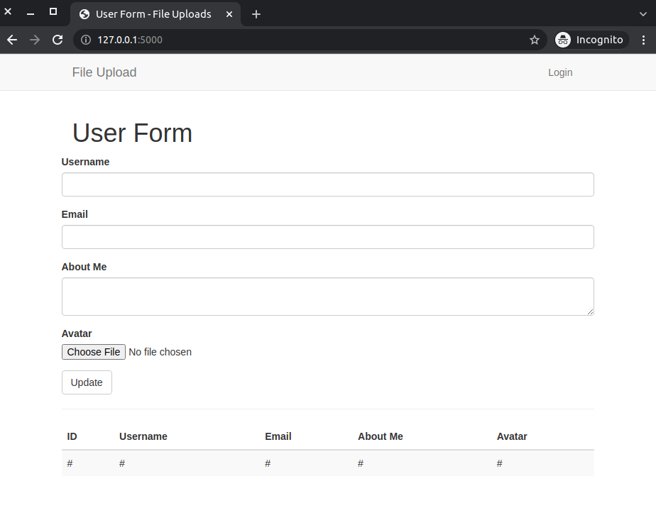

# Add Uploaded Files to Your Flask Database

It is common to see applications that allow users to add and update their avatars. This, obviously, is not the only way users can upload images to an application. During this article, I will show you how you can allow users to upload images to their accounts. These images will be accessed by quering the database used by the application.

## What We Will Do

1. Create a simple application
3. Allow users to upload images to their accounts
4. Display all users and their images in the application

## Create a Simple Application

I have already created simple flask application. You can find it in [this repository](https://github.com/GitauHarrison/starting-a-flask-server). Working with Flask is fairly simple and straightforward. If you are interested in learning how to create a simple flask application, you can learn [here](https://github.com/GitauHarrison/notes/blob/master/start_flask_server.md).

## Working with Web Forms

Forms allow an application to collect information from a user. The information is then used to create a new object in the database. More often than not, this is a very common feature of web applications.

Flask provides us a simple way to create web forms. To begin, we will first need to install the [Flask-WTF](https://pypi.python.org/pypi/Flask-WTF) package in our virtual environment.

```python
(file_upload) $ pip install flask-wtf
```

Following the _principle of separation of concerns_, I will go ahead and create a `forms` modile in our application instance. This module will contain the form classes that we will use to collect information from the user. I will begin by creating an empty `forms.py` file.

```python
(file_upload) $ touch app/forms.py
```

### SECRET_KEY Token

Flask expects a `SECRET_KEY` variable to be defined in the `app.config` file. This is used to generate the `csrf_token` for the form. The key is necessary to prevent cross-site request forgery. I will create a `SECRET_KEY` variable in the `app.config` file.

`config.py: Add secret key`
```python
import os


class Config(object):
    # Form
    SECRET_KEY = os.environ.get('SECRET_KEY') or 'you-will-never-guess'
```

The `SECRET_KEY` variable is first sourced from an environment variable. If the environment variable is not defined, then the `SECRET_KEY` is set to `you-will-never-guess`. This is a fallback value to ensure that our application does not crash.

As the name suggests, the value of this variable is secret. When committing the application to version control, you should not commit the `SECRET_KEY` value. The `.env` file is normally used to store sensitive information such as keys and passwords. This file should be created in the top-level directory.

```python
(file_upload) $ touch .env
```

Update the `.env` file with the following information:

```python
SECRET_KEY=b'\x97]\xe8\x86\xc6"\xc2\xc9\xea<\\+ \x04~@'
```

The value of the `SECRET_KEY` variable should be as difficult to guess as possible. I was able to generate this value using the following command in the terminal:

```python
(file_upload)$ python3 -c 'import os; print(os.urandom(16))'
```

The application has no idea of this configuration, so we need to tell it by registering it in the application instance.

`__init__.py: Register secret key`
```python
from flask import Flask
from flask_bootstrap import Bootstrap
from config import Config

app = Flask(__name__)
app.config.from_object(Config)

boostrap = Bootstrap(app)

from app import routes, errors

```

### Define Form

With all the necessary web forms configuration set, I will then create a `UserForm` class in the `forms` module. It will define all the fields that we will need in our form.

`forms.py: UserForm`
```python
from flask_wtf import FlaskForm
from wtforms import StringField, SubmitField, TextAreaField
from wtforms.validators import DataRequired, Length, Email
from flask_wtf.file import FileField, FileAllowed, FileRequired


class UserForm(FlaskForm):
    username = StringField('Username', validators=[DataRequired(), Length(min=2, max=20)])
    email = StringField('Email', validators=[DataRequired(), Email()])
    about_me = TextAreaField('About Me', validators=[DataRequired()])
    avatar = FileField('Avatar', validators=[FileRequired(), FileAllowed(['jpg', 'png'], 'Images only!')])
    submit = SubmitField('Update')

```

The most crucial field in the form is the `avatar` field. This field is defined using the `FileField` class. This field will allow a user to upload an image. The `FileAllowed` validator will ensure that the file uploaded is an image. If any other file type is uploaded, the form will refuse to accept that data and display the message "Images only!".

### Display Form

Our `index.html` file will be used to display the form I have defined above. At the moment, this application makes use of `flask-bootstrap`. I will use this package to quickly display a rather nice looking form.

`index.html: Display Form`
```html




    <div class="row">
        <div class="col-md-12">
            <h1> {{ title }} </h1>
    </div>
    <div class="row">
        <div class="col-md-6">
            {{ wtf.quick_form(form) }}
        </div>
    </div>
    <hr>
    <div class="row">
        <div class="col-sm-12">
            <table class="table table-striped">
                <thead>
                    <tr>
                        <th>ID</th>
                        <th>Username</th>
                        <th>Email</th>
                        <th>About Me</th>
                        <th>Avatar</th>
                    </tr>
                </thead>
                <tbody>
                     <tr>
                        <td>#</td>
                        <td>#</td>
                        <td>#</td>
                        <td>#</td>
                        <td>#</td>
                    </tr>
                </tbody>
            </table>
        </div>
    </div>

```

I will want to show all the users in the database in a table. Later on, the `body` section of the table will be populated with the data from the database. Meanwhile, I have used `#` as a placeholder for the data.

The `form` variable in `wtf.quick_form()` will be defined in the view function that will render this page.

### Render Form

I will make use of the existing `index()` view function to render the form. 

`index.html: Render Form`
```python
from app import app
from flask import render_template
from app.forms import UserForm


@app.route('/', methods=['GET', 'POST'])
@app.route('/index', methods=['GET', 'POST'])
def index():
    form = UserForm()    
    return render_template(
                           'index.html',
                           form=form,
                           title='User Form',
                           )
```

You should be able to see this:




## Add A Database to Flask

If you try to use the form and click 'Update', you will notice that there is nothing happening. It will be nice that the form sends the user data to a database which will then allow us to retrieve whatever we want. To do so, we will create a `models` module in our application instance. This module will contain the `User` model.

```python
(file_upload) $ touch app/models.py
```

Once more, we will install another application to allow us work with databases. This is the beauty of Flask in that it is not opinionated about what should be used. Instead, it allows, and actually encourages, you to use whatever you want.

`flask-sqlalchemy` is one such package that I will make use of. It is an Object Relational Mapper (ORM) that allows us to work with databases. Instead of working with raw SQL commands, it allows us to work with high-level classes and methods that are mapped and translated to SQL commands. I will install it in my virtual environment.

```python
(file_upload)$ pip3 install flask-sqlalchemy
```

Once we have created a `User` model, we need to generate a migration script and apply those changes. This is not done automatically when the model is created. I will have to do this every time I make any change to the `User` model. Flask provides the ```flask-migrate``` package to do this. I will also install it in my virtual environment.

```python
(file_upload)$ pip3 install flask-migrate
```

### Database Configuration

Flask expects certain configuration variables to be set in the application instance.The variables will be used to access our database. I will add two varialbes to the `config.py` file.

```python
import os

basedir = os.path.abspath(os.path.dirname(__file__)) # < --- update


class Config(object):
    # ...

    # Database
    SQLALCHEMY_DATABASE_URI = os.environ.get('DATABASE_URL') or \
        'sqlite:///' + os.path.join(basedir, 'app.db')
    SQLALCHEMY_TRACK_MODIFICATIONS = False

```

We first begin by storing the database in our top level directory. We will then use the `DATABASE_URL` environment variable to connect to the database. If the variable is not set, we will use the `sqlite` database on the computer's disk and call it `app.db`.

We do not want the application to keep notifying me of any change that has happened to the database. Setting the `SQLALCHEMY_TRACK_MODIFICATIONS` variable to `False` solves this.


### Register the Packages in the Application Instance

We need to create instances of `flask-sqlalchemy` and `flask-migrate` in our application instance.

`__init__.py: Register the Packages`
```python
# ...
from flask_sqlalchemy import SQLAlchemy
from flask_migrate import Migrate

# ...
db = SQLAlchemy(app)
migrate = Migrate(app, db)

from app import routes, errors, models # < --- update

```

### Create `User` Model

Our form collects a user's username, email, about me and an avatar. Therefore, our `User` model should have columns that correspond to these fields.

`models.py: User model`

```python
from app import db


class Admin(db.Model):
    id = db.Column(db.Integer, primary_key=True)
    username = db.Column(db.String(64), index=True, unique=True)
    email = db.Column(db.String(120), index=True, unique=True)
    about_me = db.Column(db.String(140))
    avatar = db.Column(db.String(140))

```

Something of interest is the fact that the `avatar` column is a string. This is because we will be storing the path to the image in the database. This path will be a string. Typically, images and other files such as `.mp4` and `.mp3` are normally stored in binary format. 

It is still possible to store the actual file in the database. This will mean that the `avatar` column will be defined as `avatar = db.Column(LargeBinary())`. Things to consider when storing files in the database are:

- The file size
- The security of the file
- The cost of storing the file in the database

Typical production databases cost money. As your database grows, you will need to pay for the storage and the cost of storing the file in the database. If the file in the `avatar` column is too large, it means that you will incure higher costs. On the other hand, a user can deliberately upload a large file. This file may end up crashing our application, so it is very necessary to enure that the file size is set to a standard. Finally, an attacker can maliciously upload an executable file which will trick our application to believe that it is actually a genuine program file. In such an event, you will want to protect your application against such attacks by sanitizing the file names.

Before I implement any of these concerns when storing files in the database, I will create and update the `User` model. Run the commands below in the terminal to being the database migrations:

```python
(file_upload)$ flask db init
```

This creates a _migration_ repository in the top level directory of the project. SQLite database, that I have resorted to using here is normally stored in a computer's disk. Every change and every update to he database will be stored in the computer disk. These files and the _migrations_ folder need to be commited to version control since they will now be part of the applcation.

To create a migration script, run the following command:

```python
(file_upload)$ flask db migrate -m "user table"

# Output
INFO  [alembic.runtime.migration] Context impl SQLiteImpl.
INFO  [alembic.runtime.migration] Will assume non-transactional DDL.
INFO  [alembic.autogenerate.compare] Detected added table 'admin'
INFO  [alembic.autogenerate.compare] Detected added index 'ix_admin_email' on '['email']'
INFO  [alembic.autogenerate.compare] Detected added index 'ix_admin_username' on '['username']'
  Generating /home/harry/software_development/python/current_projects/db_file_upload/migrations/versi
  ons/e7a88735908f_user_table.py ...  done
```
Notice that a new file called `xxx-user-table.py` has been created in the _versions_ sub-directory of the _migrations_ folder. This file contains the SQL commands that will be executed when the migration is applied.

Finally, to apply those changes, we need to run `flask db upgrade`.

```python
(file_upload)$ flask db upgrade

# Output
INFO  [alembic.runtime.migration] Context impl SQLiteImpl.
INFO  [alembic.runtime.migration] Will assume non-transactional DDL.
INFO  [alembic.runtime.migration] Running upgrade  -> e7a88735908f, user table
```

The changes we have made to our ```User``` model are now applied to the database. Notice that there is `app.db` file created in the top-level directory of the project. This file contains the database.