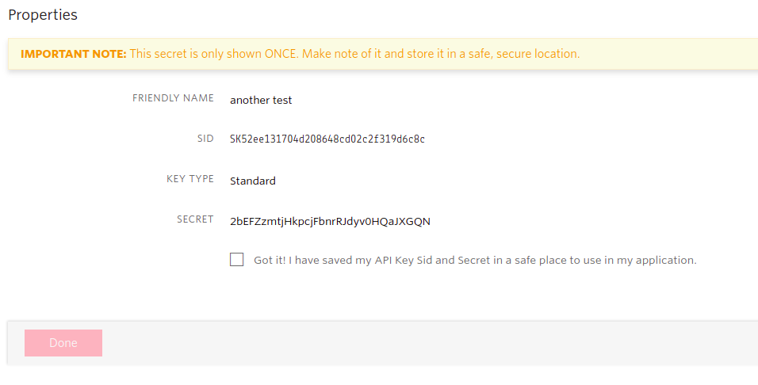
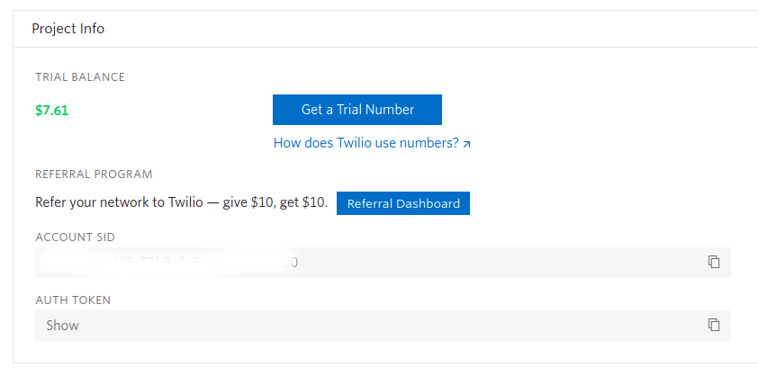
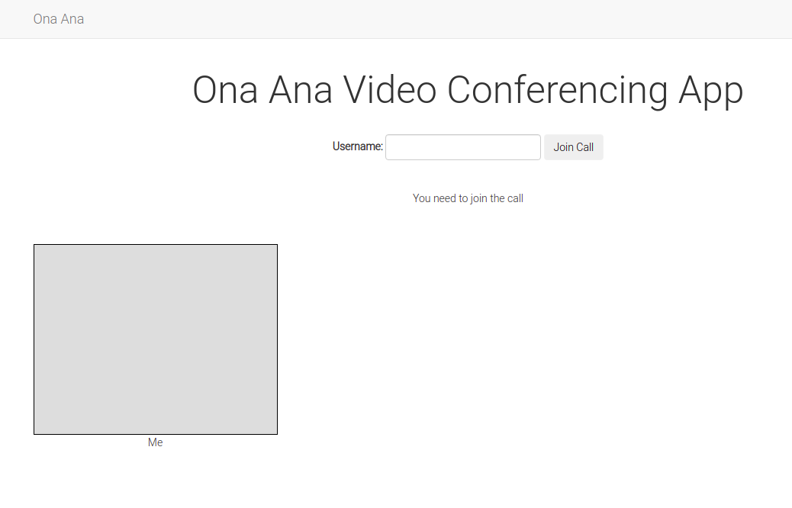
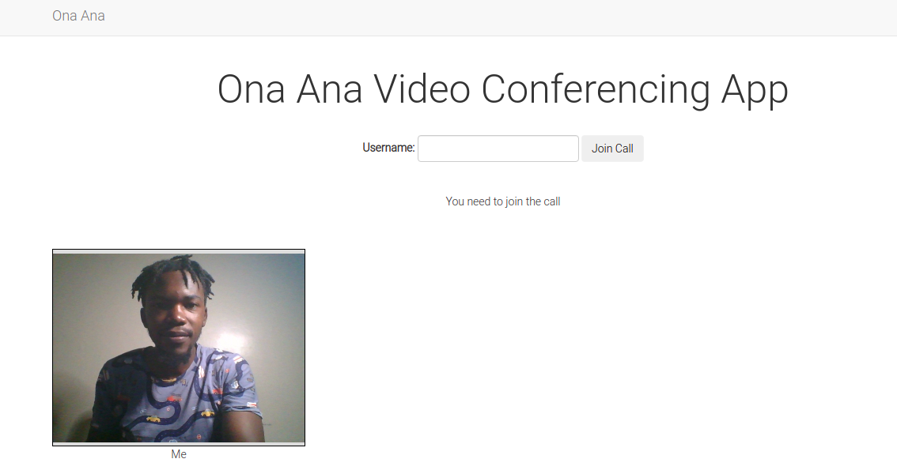

# Build a Video Conference Application Using Flask and Twilio


The Covid-19 pandemic has forced many businesses to close shop and ask their employees to work from home. Almost everyone was forced into remote work. The use of video calling applications (such as Zoom and Google Meet among others) rose as more and more people began embracing this new norm. In this article, I will show you how to build similar video calling applications that offer satisfactory levels and quality of features.

## Project Requirements

There are a number of things we need in order to build our project:
* A Twilio account. Create a [free Twilio account](https://www.twilio.com/try-twilio?promo=WNPWrR) now.
* A web browser compatible with the Twilio Programmable Video JavaScript library. Check your browser among [this list](https://www.twilio.com/docs/video/javascript).
* Python 3.6 and above.
* This project makes use of `Ngrok`. Ngrok provides public URLs that redirect to the application. If you do not know what it is or how to use it, refer to the reference section at the end of this article.

Once you have an account with Twilio:
* Click [Console Dashboard](https://www.twilio.com/console), 
* Click [Settings](https://www.twilio.com/console/project/settings) then,
* Click [API Keys](https://www.twilio.com/console/project/api-keys)
* Create your project API Key by clicking on the Red Plus(+) button. You will be provided with API Key SID and API Key Secret. 
* Click 'Create API Key' button to save.


Note that when you save your keys, the API Secret Key will never be shown again. Make sure to save it somewhere else safe because you will need to use it. This is what you will get:



Typically, these keys should be kept secret. I not worried showing you these keys because soon I will generate another pair. 

* Additionally, you will need your _Account SID_ from the [Twilio console](https://twilio.com/console)




Make sure you save these keys somewhere safe. We will need them later in the application.

## Project Dependencies

Before we can begin working with any python package for this project, it is recommended that you install them within an activated virtual environment. Run the command below in your terminal to create and activate one:

```python
$ mkvirtualenv video_app # I am using a virtualenvwrapper

# Output
(video_app)$
```

Virtual environments help us isolate our machine's Operating System from those needed by the many projects we may build. Install the following dependencies in your virtual environment:

* flask
* twilio
* python-dotenv
* pyngrok
* flask-bootstrap
* flask_wtf

Run:

```python
(video_app)$ pip3 install flask pyngrok twilio python-dotenv flask-bootstrap flask-wtf 
```

## Project Structure

Use the terminal commands `mkdir` and `touch` to create the project structure below. For example:

```python
(video_app)$ mkdir video_app # this create an empty directory
(video_app)$ touch video_app/config.py # this creates an empty config file in video_app directory
```


To begin with, we will save all the application's dependencies in `requirements.txt` as follows:

```python
(video_app)$ pip3 freeze > requirements.txt
```

## Page Layout

The `home.html` page will inherit base styles and layout from `base.html` as seen below:

```html
<!--base.html-->



<!-- Head image goes here -->

    {{ super() }}
    
    <!-- Google Fonts -->
    <link rel="preconnect" href="https://fonts.gstatic.com">
    <link href="https://fonts.googleapis.com/css2?family=Roboto:wght@300&display=swap" rel="stylesheet">
    
    <!-- Head image -->
    <link rel="icon" type="image/png" href="{{ url_for('static', filename = 'img/video-call.png') }}">


<!-- Title Section -->

    
        Ona Ana | {{ title }}
    
        Sample Video Call App
    


<!-- Import styles -->

    {{ super() }}
    <link rel="stylesheet" type="text/css" href="{{ url_for('static', filename = 'css/styles.css') }}">



<!-- Navbar Section -->

<nav class="navbar navbar-default">
    <div class="container">
        <div class="navbar-header">
            <button type="button" class="navbar-toggle collapsed" data-toggle="collapse" data-target="#bs-example-navbar-collapse-1" aria-expanded="false">
                <span class="sr-only">Toggle navigation</span>
                <span class="icon-bar"></span>
                <span class="icon-bar"></span>
                <span class="icon-bar"></span>
            </button>
            <a class="navbar-brand" href="#">Ona Ana</a>
        </div>
        <div class="collapse navbar-collapse" id="bs-example-navbar-collapse-1">                                   
        </div>
    </div>
</nav>


<!-- Blog Content Goes Here -->

    <div class="container">
        
        
        
    </div>


<!-- Scripts Section -->

    {{ super() }}
    
    <!-- Twilio JS -->
    <script src="//media.twiliocdn.com/sdk/js/video/releases/2.3.0/twilio-video.min.js"></script>
    
    <!-- Custom JS -->
    <script type="text/javascript" src=" {{ url_for('static', filename='js/app.js') }} "></script>



<!-- home.html -->




    <div class="row">
        <div class="col-md-12 text-center">
            <h1>Ona Ana Video Conferencing App</h1>
        </div>
    </div>
    <div class="row">
        <div class="col-md-12 my_form">
            <!-- Join/Leave Actions -->
            <form class="form-inline">
                <div class="form-group">
                    <label class="mb-2 mr-sm-2" for="username">Username: </label>
                    <input class="form-control mb2 mr-sm-2" type="text" name="username" id="username">                    
                </div>
                <button class="btn" id="join_leave">Join Call</button>
            </form>
        </div>
    </div>
    <div class="row">
        <div class="col-md-12">
            <!-- Participants Count -->
            <p id="count">You need to join the call</p>
        </div>
    </div>
    <div class="row">
        <div class="col-md-12">
            <!-- Video Feed -->
            <div id="video_container" class="video_container">
                <div id="local" class="participant"><div></div><div>Me</div></div>
                <!-- More participants will be added dynamicly -->
            </div>
        </div>
    </div>
     

```

Flask's `url_for` has been used to help generate the correct URL for `styles.css` and `app.js` files. We also need the official release of the _twilio-video.js_ library. All these files are added to the base template and are inherited by the home template using the keyword `extends`.

We will update the style of our application in `styles.css` as seen below:

```css
.video_container {
    margin-top: 20px;
    width: 100%;
    display: flex;
    flex-wrap: wrap;
    text-align: center;
    
}
.participant {
    margin-bottom: 5px;
    margin-right: 5px;
}
.participant div:first-child {
    width: 320px;
    height: 250px;
    background-color: #ddd;
    border: 1px solid black;
}
.participant video {
    width: 100%;
    height: 100%;
}


/* Optional General Styling */
.title, .my_form, #count{
    text-align: center;
    padding-bottom: 20px;
    padding-top: 20px;
}
.btn{
    border: 1px solid #F2F2F2;
    color: black;
}
h1{
    font-size: 50px;
}
body{
    font-family: 'Roboto', sans-serif;

}
```

Flask-bootstrap makes use of the class `container`. So that we do not overide the default styles associated with this class, I have created a new class called `video_container`. This way, there is no conflict. If you have noted, this is the same class I have passed to the video feed `div` in the home template.

`.participant div:first-child` class applies to all first child elements of `div`s that have the class `participant`. We are limiting the size of the video to 320 by 250 pixels. To make this video noticable, we pass a background color to it and also define a border around it.

## Starting the Flask Server

With the templates in place, we need to complete the application so that we can started the flask server. Let us create an application instance and create object of the packages we have imported.

`app/__init__.py: Create application instance`
```python
from flask import Flask
from flask_bootstrap import Bootstrap
from config import Config

app = Flask(__name__)
app.config.from_object(Config)

bootstrap = Bootstrap(app)


def start_ngrok():
    from pyngrok import ngrok

    url = ngrok.connect(5000)
    print('*Tunnel: ', url)


if app.config['START_NGROK']:
    start_ngrok()

from app import routes

```
We have created an instance of `flask-bootstrap` which we installed earlier. We are also setting our application to download and run `ngrok`, a service that provides free public URLs to help access our application, which is currently running on [localhost](http://127.0.0.1:5000/), from another device. Everytime we start th flask server, `ngrok` will also start and generate useful URLs for us.

We have imported configurations to our flask instance but it does not exist yet. Let us define our application's configurations. 

`config.py: Load environment variables`
```python
import os
from dotenv import load_dotenv

load_dotenv()


class Config(object):
    START_NGROK = os.environ.get('START_NGROK') is not None
    SECRET_KEY = os.environ.get("SECRET_KEY") or 'you-will-never-guess'

    TWILIO_ACCOUNT_SID = os.environ.get("TWILIO_ACCOUNT_SID")
    TWILIO_API_KEY_SID = os.environ.get("TWILIO_API_KEY_SID")
    TWILIO_API_KEY_SECRET = os.environ.get("TWILIO_API_KEY_SECRET")

```

Remember at the beginning of this article we saved some keys that we promised to use. `python-dotenv` package will be used to load these keys from environent variables. 

Let us update `.env` file we created ealier to hold these secret keys.

`.env: Secret application configurations`
```python
TWILIO_ACCOUNT_SID='add-your-account-sid'
TWILIO_API_KEY_SID='add-your-api-key-sid'
TWILIO_API_KEY_SECRET='add-your-api-secret'
```

It is good practice to use `os.environ.get()` method to load these keys rather than passing them directly to variables in the `config.py` file. These keys should not be committed to version control. To guide users who might be interested in our project from a version control site like GitHub, we will update the `.env-template` file to show what keys they will need before running this application.


`.env-template: Show needed configurations`
```python
TWILIO_ACCOUNT_SID=
TWILIO_API_KEY_SID=
TWILIO_API_KEY_SECRET=
```

Our application instance imports the routes module. We need to update this module to render the home page.

`app/routes.py`
```python
from app import app
from flask import render_template


@app.route('/')
@app.route('/home')
def home():
    return render_template('home.html', title='Home')

```

Flask will need to know the application's entry point. So, in `app.py`, we will add this code:

`app.py: Application entry point`
```python
from app import app
```

Just before we start the flask server, let us pass Flask's environment variables:

`.flaskenv: Pass Flask's environment variables`
```python
FLASK_APP=app.py
FLASK_ENV=development
FLASK_DEBUG=True
START_NGROK=1
```

We are on a development server, and it is okay to enable Flask's auto-reload feature that is quite useful when debugging. Now, we can start the flask server from the terminal"

```python
(video_app)$ flask run
```

This is what we have at the moment:



## Display Video Feed

First, let us display our own video feed. We will add this to the first child of the div that has class `local`.

`js/app.js: Display own video feed`

```js
function addLocalVideo() {
    Twilio.Video.createLocalVideoTrack().then(track => {
        let video = document.getElementById('local').firstChild;
        video.appendChild(track.attach());
    });
};

addLocalVideo();
```

You should be able to see your own video feed after calling the `addLocalVideo` function.



The video gets attached to the first `div` whose parent has the ID `local`. We have set this `div` to be empty (if you look carefully at the home template). This is because the video feed will be attached here.


## Generate Access Token

The fact that you have built an application which can access a user's camera and microphone raises the issue of security. Thankfully, Twilio takes security seriously. Before any user can join the call, we need our application to verify that the user is allowed and the application must generate an access token for them. This is done in the Python server. The `.env` secrets will be required.

`app/routes.py: Generate access token`

```python
from twilio.jwt.access_token import AccessToken
from twilio.jwt.access_token.grants import VideoGrant
from flask import request, abort

@app.route('/login', methods=['POST'])
def login():
    username = request.get_json(force=True).get('username')
    if not username:
        abort(401)
    token = AccessToken(
        app.config['TWILIO_ACCOUNT_SID'],
        app.config['TWILIO_API_KEY_SID'],
        app.config['TWILIO_API_KEY_SECRET'],
        identity=username
    )
    token.add_grant(VideoGrant(room='My Room'))
    return {'token': token.to_jwt().decode()}

```

Our current form of authentication will only involve the use of `username`, but more robust applications will require better user authentication. 

Basically, we are getting the user's identity in a JSON payload. We check that the `username` is not empty, otherwise we abort and return a [`401 Unauthorized`](https://httpstatuses.com/401) error. The `AccessToken` helper class is used to generate the token before attaching a video grant to a room called `My Room`. Read more from the [Twilio Programmable Video JavaScript SDK documentation](https://www.twilio.com/docs/video/javascript-getting-started). The token is returned as a JSON payload in this format:

```python
{
    'token': 'token-will-go-here'
}
```

An application can work with more than one video room and decide which video room a user can enter.

