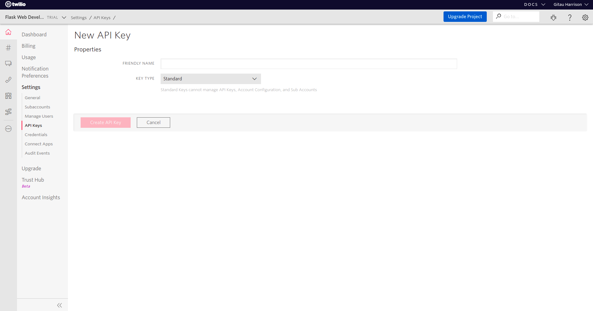
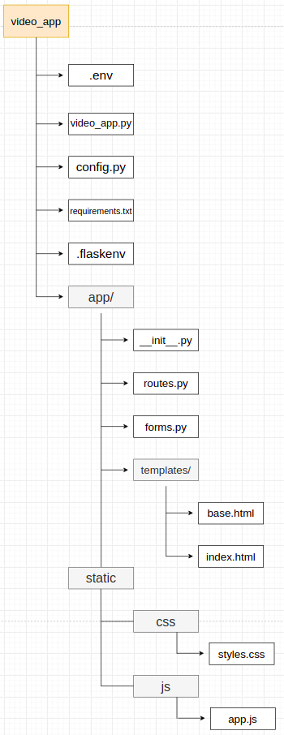

# Build a Video Conference Application Using Flask and Twilio

The Covid-19 pandemic has forced many businesses to close shop and ask their employees to work from home. Almost everyone was forced into remote work. The use of video calling applications (such as Zoom and Google Meet among others) rose as more and more people began embracing this new norm. In this article, I will show you how to build similar video calling applications that offer satisfactory levels and quality of features.

## Project Requirements

There are a number of things we need in order to build our project:
* A Twilio account. Create a [free Twilio account](https://www.twilio.com/try-twilio?promo=WNPWrR) now.
* A web browser compatible with the Twilio Programmable Video JavaScript library. Check your browser among [this list](https://www.twilio.com/docs/video/javascript).
* Python 3.6 and above.
* This project makes use of `Ngrok`. Ngrok provides public URLs that redirect to the application. If you do not know what it is or how to use it, refer to the reference section at the end of this article.

Once you have an account with Twilio:
* Click [Console Dashboard](https://www.twilio.com/console), 
* Click [Settings](https://www.twilio.com/console/project/settings) then,
* Click [API Keys](https://www.twilio.com/console/project/api-keys)
* Create your project API Key by clicking on the Red Plus(+) button. You will be provided with API Key SID and API Key Secret. 
* Click 'Create API Key' button to save.

Note that when you save your keys, the API Secret Key will never be shown again. Make sure to save it somewhere else safe because you will need to use it.



## Project Dependencies

Before we can begin working with any python package for this project, it is recommended that you install them within an activated virtual environment. Run the command below in your terminal to create and activate one:

```python
$ mkvirtualenv video_app # I am using a virtualenvwrapper

# Output
(video_app)$
```

Virtual environments help us isolate our machine's Operating System from those needed by the many projects we may build. Install the following dependencies in your virtual environment:

* flask
* twilio
* python-dotenv
* pyngrok
* flask-bootstrap
* flask_wtf

Run:

```python
(video_app)$ pip3 install flask pyngrok twilio python-dotenv flask-bootstrap flask-wtf 
```

## Project Structure

Use the terminal commands `mkdir` and `touch` to create the project structure below. For example:

```python
(video_app)$ mkdir video_app # this create an empty directory
(video_app)$ touch video_app/config.py # this creates an empty config file in video_app directory
```



To begin with, we will save all the application's dependencies in `requirements.txt` as follows:

```python
(video_app)$ pip3 freeze > requirements.txt
```

## Page Layout
