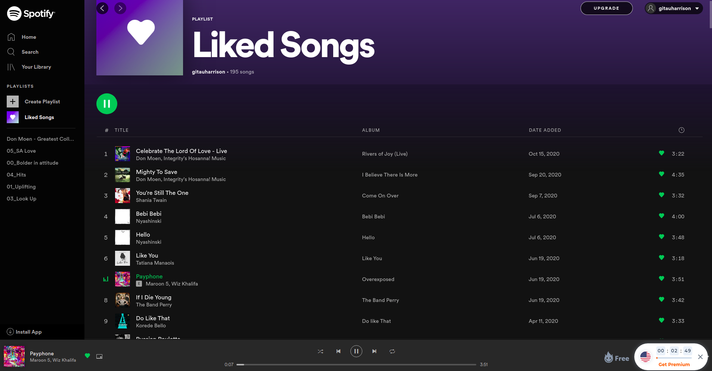
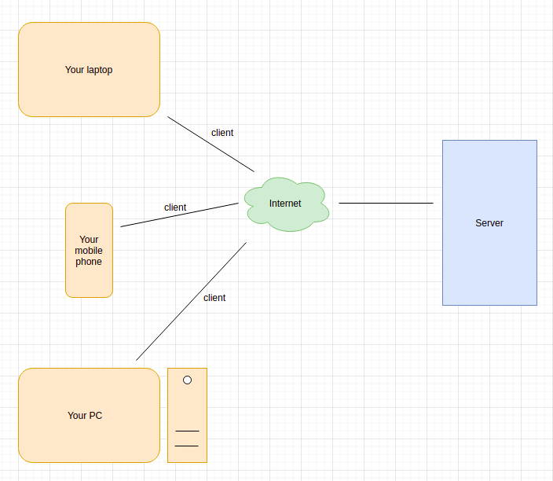
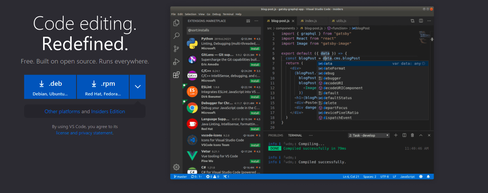
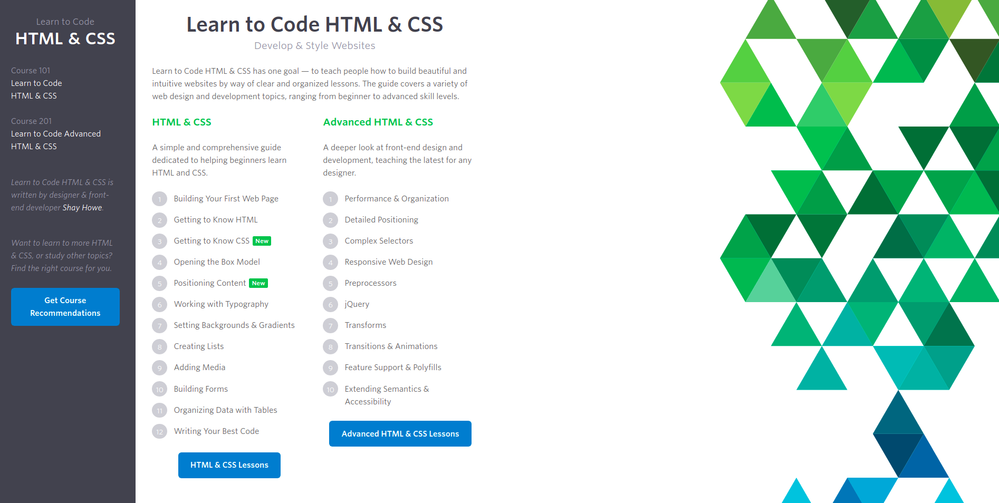
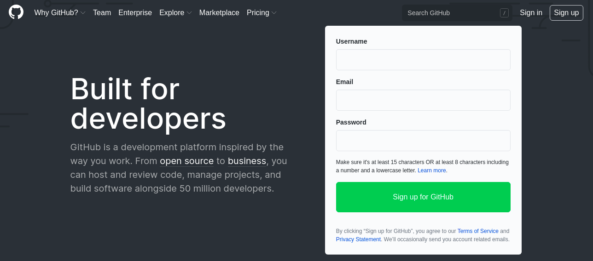
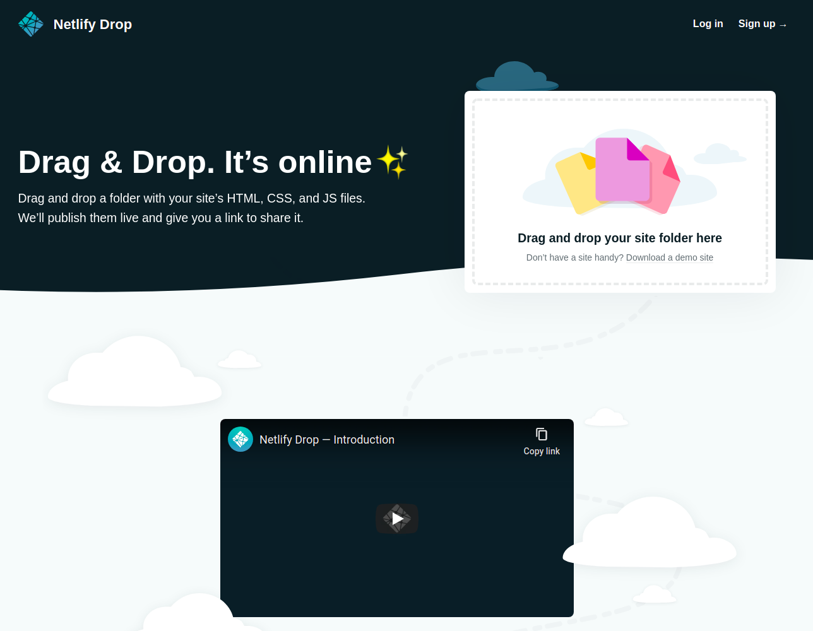

# Web Development

### Overview
From a very general point of view, web development can be defined as all the actions associated with developing websites for the internet. This includes things [web design](https://en.wikipedia.org/wiki/Web_design), web content development, client-side and server-side scripting and network security configurations, among other things. 

In a broader sense, web development includes all the actions, updates and operations required to build and maintain and manage a website to ensure that its performance, user experience and speed are satisfactory. Basically, it is the creation of dynamic web applications.

Examples of web applications are social networking sites such as [FaceBook](https://www.facebook.com/), music listening sites such [Spotify](https://www.spotify.com/), online purchasing sites such as [Amazon](https://www.amazon.com/) among many others. Can you identify some on your own?

The process of building a web application is a journey. During this web development series, I will be walking you through on how you can start creating your own web applications all the way through to making them available and accessible to other people.

### Understanding the Basics

There are two broad divisions to web development:
* **Fron-end development**: This is also referred to as the [client-side](https://en.wikipedia.org/wiki/Client_(computing)) development.
* **Back-end development**: This is also referred to as the [server-side](https://en.wikipedia.org/wiki/Server_(computing)) development.

##### Fron-end Web Development

Front-end developement referes to displaying what a user sees when they load a web application. Front-end is made possible using HTML, CSS and JavaScript.

HTML (Hyper Text Markup Language) is the standard markup language for creating web applications. It is used to describe the **structure** of a web page.

CSS (Cascading Style Sheets) is used to set the rules that specify how we will style a web page. So, it's main function (as you can see from its full name) is to style a web page.

JavaScript is a [scripting language](https://cs.lmu.edu/~ray/notes/scriptinglangs/) which adds functionality and iteractivity to websites. While HTML can create web pages and CSS can customize the pages, they both make static web applications(they won't do anything). And this is where JavaScript comes in. It can listen to user events such as button clicks, key presses or even whenever a user hovers the mouse on an item on a web page, making the page more interactive.

##### Back-end Web Development

Back-end controls what goes on behind the scenes of a web application. Back-ends often use databases to generate the front-end.

For example, the very first time you want to listen to your music on Spotify, you have to sign up and log in. On successful login, you are automatically presented with your home page which will contain options for you to select songs you would like to listen to. Question: What happened such that as soon as you clicked the log in button you were redirected to your music homepage where you can see recommendations of songs to listen to? And if that is not enough, how come these recommendations keep changing every time? Does a Spotify employee pre-logs into your account and push recommendations to your home page? Definitely not! A script on the Spotify back-end is resposible for your successful log in and the mentioned recommendations.

Back-end scripts can be written in many different programming languages and frameworks, such as:

1. Python
2. Java
3. PhP

Among many others. 

My goal in the subsequent sections is to help you learn full-stack web development primarily using Python and Flask. With full-stack I mean you are familiar and very much capable of building both the front-end and the back-end of a web application.

### Getting Started

It is very important that you learn and master the front-end side of building a web application. I will not focus so much on the front-end part of web development creation. However, I will help you learn how to combine both the front-end and the back-end to create something full-stack.

##### Things you need to learn

1. Choose a Text Editor
2. HTML and CSS
3. Git and GitHub 
4. Hosting of Static Web Applications

##### Choose a Text Editor

A text Editor is the tool you will use to write you code and edit it. There are several available text editors. For the purposes of this tutorial, I will recommed [Visual Studio Code](https://code.visualstudio.com/). You will need to download it and install it depending on the kind of operating system you have. Here is the [download link](https://code.visualstudio.com/download). 

Visual Studio Code also supports extensions which let you add support for various programming languages and also provide debuggers to support your development workflow.

##### Learn HTML and CSS

In this regard, I highly recommend that you look at https://learn.shayhowe.com/. There is a series called _Learn to Code HTML & CSS_. This series will walk you through a very systematic and beautifully structured learning progress as you learn the front-end part of web application. 

As soon as you are done with _Learn to Code HTML & CSS_, consider to look at [Learn to Code AdvancedHTML & CSS](https://learn.shayhowe.com/advanced-html-css/). This takes a deeper look at front-end design and development. 

##### Learn Git and GitHub

`git` is a free, open-source version control software, which basically means that it allows you to track your content. Say you begin to work on a project today. We will call this verision of the project _version1_. Then after one week, you decide to make changes to the very same project, maybe add or delete a few items here and there. This new update become _Version2_ of the project. 

This type of work is what `git` is meant for. It basically is a content tracker.

As soon as you have completed making every verison of your project, you need to save it somewhere for ease of access and also to allow for sharing with anyone who is interested in taking part in the your project or someone who just wants to see what you have been doing. 

Real life projects generally have multiple developers working in parallel. So a version control system like Git is needed to ensure there are no code conflicts between the developers.

There are three most popular Git hosting services. They are GitHub (Owned by Microsoft), GitLab (Owned by GitLab) and BitBucket. We will use [GitHub](https://github.com/) as our hosting service.

###### Why Git and GitHub

1. It helps you track changes in the code to your project. When multiple people collaborate on a project, it’s hard to keep track revisions — who changed what, when, and where those files are stored. GitHub takes care of this problem by keeping track of all the changes that have been pushed to the repository.

2. Contribute to Open-source projects: If you want to contribute, you just fork a project, make your changes and then send them a pull request.

3. Documentations: Help sections and guides have articles for nearly any topic related to git that you can think of.

4. Showcase your work: As earlier mentioned, you can share your project hosted on GitHub with anyone who want to see what you have been doing. 

Learn more about `git` and GitHub [here](https://medium.com/@mvthanoshan9/ubuntu-a-beginners-guide-to-git-github-44a2d2fda0b8). For the official guide on how to use git and GitHub, consider reading the [official documentation](https://docs.github.com/en/free-pro-team@latest/github/getting-started-with-github/quickstart).

##### Hosting of Static Web Applications

[Netlify](https://app.netlify.com/drop) offers a free hosting service which will allow you to host your completed projects. As soon as you are done with a web application, you can drag the root folder to netlify and it will automatically host your application. You will be provided with a custom URL (which you can edit, by the way) to share your project with others.

##### Conclusion

Phew! Those are a ton! But, take your time. Go over them and you will have a solid base on which to begin your full-stack web development journey. 

Notably, I am recommending a self-teaching approach here. None of the above mentioned items are going to be covered here. You will need to make a personal effort to learn them on your own. 

As soon as you are done with these, I will be glad to see your outcome. Please share your completed front-end static web pages with me in the comments section below. If you have any questions regarding how to get started, feel free to reach out anytime.

### Full Stack Projects Using Python And Flask

These are some of the projects you will learn how to build. By the end of each one of them, you will have a far solid understanding and thus you can begin to build your very own.

1. [Personal Blog](personal_blog.md)
2. [Reat-time Chat Application](realtime_chat_app.md)